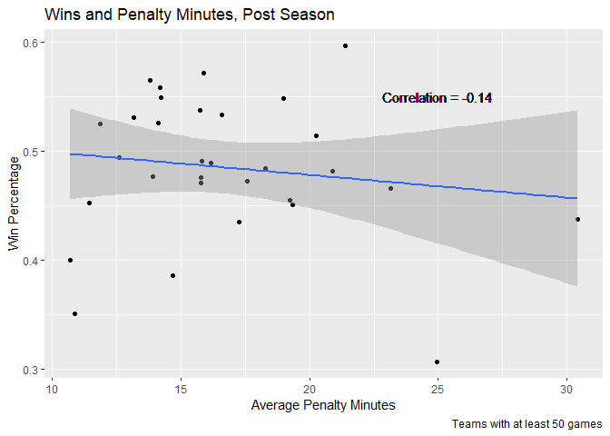

Joshua Burrows Project 1: The NHL API
================

true

This tutorial explains how to access and summarize the data from the
National Hockey League’s APIs.

The following packages were used to create this tutorial: `assertthat`,
`knitr`, `tidyverse`, `rmarkdown`, `httr`, and `jsonlite`.

# The `getNHL()` Function

The NHL has two separate APIs: records and stats. Both can be queried
using the `getNHL()` function. This function is built from a few other
functions. I will begin by discussing these building blocks.

# The NHL Records API

The following building block functions are used to get data from the
records API.

## Get Data

The `getRecTable()` function grabs a table from the records API. It
takes that table’s extension as input.

``` r
recBaseURL <- "https://records.nhl.com/site/api"

# Return the requested table from records API
getRecTable <- function(table){
  
  if(!is.string(table)){
    stop("Input must be a character string")
  }
  
  recFullURL <- paste0(recBaseURL, "/", table) 
  info <- recFullURL %>% GET() %>% content("text", encoding = "UTF-8") %>% fromJSON(flatten = "TRUE")
  info <- info[[1]] %>% as_tibble()
  
  return(info)
  
}
```

## Filter Data

The `filterTable()` filters records data by either franchise name or
franchise id number.

Because franchise name and franchise id number have different
identifiers on different API endpoints, `filterTable()` includes
`nameName` and `idNumName` arguments. In practice, the user won’t have
to worry about these arguments; they are behind the scenes components of
`getNHL()`.

``` r
filterTable <- function(table, nameName = NULL, idNumName = NULL, name = NULL, idNum = NULL){
  
  # if neither filter condition specified, return full table
  if((is.null(name) & is.null(idNum))){
    return(table)
  }
  
  # must specify a search condition 
  if((is.null(nameName) & is.null(idNumName))){
    stop("in order to filter, either nameName or idNumName must be specified")
  } 
  
  # should search by only one condition at a time
  if((!is.null(name) & !is.null(idNum))){
    stop("search by either name or idNum, not both")
  }
  
  # either nameName or idNumName is required 
  if((!is.null(name) & is.null(nameName))){
    stop("if name is specified, nameName must be specified")
  }
  
  if((!is.null(idNum) & is.null(idNumName))){
    stop("is idNum is specified, idNumName must be specified")
  }
  
  # filter 
  if(!is.null(name)){
    if(name == "all"){ 
        return(table)
    } else{
        team <- table %>% filter(table[[nameName]] == name)
        if(length(team[[nameName]]) == 0){
          stop("not a vaild team name")
        } else{
            return(team)
          }
      } 
  }
    
  if(!is.null(idNum)){
    if(idNum == "all"){
        return(table)
    } else{
        team <- table %>% filter(table[[idNumName]] == idNum)
        if(length(team[[idNumName]]) == 0){ 
          stop("Not a valid team idNum")
        } else{
            return(team)
          }
      } 
  } 
  
}
```

## Query Records Endpoints

`getNHL()` is able to query five records endpoints. It does so by
calling one of the five functions below. Each of these makes use of
`getRecTable()` and `filterTable()`. Since those functions do most of
the work, these five are relatively short.

``` r
# get franchise info
franchise <- function(name = NULL, idNum = NULL){

  franchises <- getRecTable("franchise") 
  
  filterTable(franchises, nameName = "teamCommonName", idNumName = "id", name, idNum) 
  
}
```

``` r
# get franchise team totals
teamTotals <- function(name = NULL, idNum = NULL){
  
  teamTotals <- getRecTable("franchise-team-totals") 
  
  filterTable(teamTotals, nameName = "teamName", idNumName = "franchiseId", name, idNum) 
  
} 
```

``` r
# get season records for a given franchise
season <- function(name = NULL, idNum = NULL){
  
  seasonRecords <- getRecTable("franchise-season-records") 
  
  filterTable(seasonRecords, nameName = "franchiseName", idNumName = "franchiseId", name, idNum) 
  
} 
```

``` r
# get goalie records 
goalie <- function(name = NULL, idNum = NULL){
  
  goalieRecords <- getRecTable("franchise-goalie-records")
  
  filterTable(goalieRecords, nameName = "franchiseName", idNumName = "franchiseId", name, idNum)
  
} 
```

``` r
# get skater records
skater <- function(name = NULL, idNum = NULL){
  
  skaterRecords <- getRecTable("franchise-skater-records") 
  
  filterTable(skaterRecords, nameName = "franchiseName", idNumName = "franchiseId", name, idNum) 
  
}
```

# The NHL Stats API

Now I will turn to the building block functions that are used to get
data from the stats API.

## Get Data

`getNHL()` is able to query eight modifiers from the Teams endpoint of
the stats API. The job of `getStatsTable()` is to grab the data from
each of the eight modified endpoints. Its length is mainly due to
checking for error conditions.

`getStatsTable()` takes the modifier as input as well as `seasonId` and
`idNum`, which are additional conditions for some of the endpoints.

``` r
statsBaseURL <- "https://statsapi.web.nhl.com/api/v1/teams"

getStatsTable <- function(modifier = NULL, seasonId = NULL, idNum = NULL){
  
  # no modifier 
  if(is.null(modifier)){
    
    if((!is.null(seasonId) | !is.null(idNum))){
      stop("search by seasonId and/or idNum requires appropriate modifier")
    }
    
    base <- statsBaseURL %>% GET() %>% content("text") %>% fromJSON(flatten = TRUE)
    base <- base[[2]] %>% as_tibble()
    return(base)
  }
    
  # MODIFIER 
  # team.roster 
  if(modifier == "team.roster"){
    
    if((!is.null(seasonId) | !is.null(idNum))){
      stop("search by seasonId and/or idNum not compatible with modifier team.roster")
    }
    
    mod = "?expand=team.roster"
  } 
  
  # MODIFIER 
  # person.names 
  if(modifier == "person.names"){
    
    if((!is.null(seasonId) | !is.null(idNum))){
      stop("search by seasonId and/or idNum not compatible with modifier person.names")
    }
    
    mod = "?expand=person.names" 
  }
  
  # MODIFIER 
  # team.schedule.next 
  if(modifier == "team.schedule.next"){
    
    if((!is.null(seasonId) | !is.null(idNum))){
      stop("search by seasonId and/or idNum not compatible with modifier team.schedule.next")
    }
    
    mod = "?expand=team.schedule.next"
  } 
  
  # MODIFIER 
  # team.schedule.previous 
  if(modifier == "team.schedule.previous"){
    
    if((!is.null(seasonId) | !is.null(idNum))){
      stop("search by seasonId and/or idNum not compatible with modifier team.schedule.previous")
    }
    
    mod = "?expand=team.schedule.previous"
  }
  
  # MODIFIER 
  # team.stats
  if(modifier == "team.stats"){
    
    if((!is.null(seasonId) | !is.null(idNum))){
      stop("search by seasonId and/or idNum not compatible with modifier team.stats")
    }
    
    mod = "?expand=team.stats"
  }
  
  # MODIFIER 
  # team.roster&season
  if(modifier == "team.roster&season"){
    
    if(!is.null(idNum)){
      stop("search by idNum not compatible with modifier team.roster&season")
    }
    
    if(is.null(seasonId)){
      stop("team.roster&season modifier requires search by seasonId") 
    }
    
    if(nchar(seasonId) != 8){
      stop("seasonId must be of format 20142015")
    }
    
    mod = paste0("?expand=team.roster&season=", seasonId)
  }
  
  # MODIFIER 
  # teamId
  if(modifier == "teamId"){
    
    if(!is.null(seasonId)){
      stop("search by seasonId not compatible with modifier teamId")
    }
    
    if(!is.null(idNum)){
      idCheck <- strsplit(idNum, split = "")[[1]]
      for(i in idCheck){
        if((!(i %in% c("1", "2", "3", "4", "5", "6", "7", "8", "9", "0", ",")))){
          stop("idNum must be of format 1,2,3")
        }
      }
    }
    
    mod = paste0("?teamId=", idNum)
  }
  
  # MODIFIER 
  # statsSingleSeasonPlayoffs 
  if(modifier == "statsSingleSeasonPlayoffs"){
    
    if((!is.null(seasonId) | !is.null(idNum))){
      stop("search by seasonId and/or idNum not compatible with modifier statsSingleSeasonPlayoffs")
    }
    
    mod <- "?stats=statsSingleSeasonPlayoffs"
  }
  
  # create URL and return 
  statsFullURL <- paste0(statsBaseURL, "/", mod)
  
  full <- statsFullURL %>% GET() %>% content("text") %>% fromJSON(flatten = TRUE)
  full <- full[[2]] %>% as_tibble()
  
  return(full)
}
```

## Query Teams Endpoint

Often, the Teams endpoint returns a list that contains other lists. When
this happens, flattening is required. Flattening is the process of
un-nesting these nested lists to return a more user friendly object.
`teamStats()` does this job.

The modifier called team.stats returns an object with so many
sub-objects that flattening it all into one 2D table creates a confusing
and unwieldy data frame. So `teamStats()` doesn’t try to do this.
Instead, a list of data frames is returned.

This is a long function, so check out the comments to keep your
bearings.

``` r
teamStats <- function(modifier = NULL, seasonId = NULL, idNum = NULL){
  
  # if no modifier is present
  if(is.null(modifier)){
    base <- getStatsTable()
    return(base)
  }

  # get data 
  stats <- getStatsTable(modifier = modifier, seasonId = seasonId, idNum = idNum)
  
  # MODIFIER 
  # team.roster
  if(modifier == "team.roster"){
    
    # get col to flatten
    roster <- stats[["roster.roster"]] 
    
    # append team names to keep track of who plays for who
    for(i in 1:length(roster)){
      roster[[i]]$name <- stats[["name"]][[i]]
    }
    
    # flatten roster info
    roster <- do.call(rbind, roster)
    statsFlatten <- left_join(roster, stats, by = "name", suffix = c("roster", "base")) %>% select(-c("roster.roster"))
    
    return(statsFlatten)
  } 
  
  # MODIFIER
  # person.names
  # appears to be the same as the unmodified endpoint 
  if(modifier == "person.names"){
    return(stats) 
  } 
  
  # MODIFIER
  # team.schedule.next 
  if(modifier == "team.schedule.next"){
    
    # get col to flatten
    dates <- stats[["nextGameSchedule.dates"]]
    
    # create names col to track data by team
    # create list of teams that have a next game scheduled 
    datesNonNull <- list()
    for(i in 1:length(dates)){
      if(!is.null(dates[[i]])){
        dates[[i]]$name <- stats[["name"]][[i]]
        datesNonNull <- cbind(datesNonNull, dates[i])
      }
    }
    
    # flatten datesNonNull
    for(i in 1:length(datesNonNull)){
      datesNonNull[[i]] <- cbind(datesNonNull[[i]], datesNonNull[[i]][["games"]]) %>% select(-c("games")) 
      
      datesNonNull[[i]][["events"]] <- 
        datesNonNull[[i]][["events"]][[1]][1][[1]]
      
      datesNonNull[[i]][["matches"]] <- 
        datesNonNull[[i]][["matches"]][[1]][1][[1]]
    } 
    
    # put dates info in one tibble 
    datesVert <- tibble() 
    for(i in 1:length(datesNonNull)){
      datesVert <- rbind(datesVert, datesNonNull[[i]]) 
    } 
    
    # join flattened data with full data set 
    schedule <- left_join(stats, datesVert, by = "name", suffix = c(".main", ".nextGame")) %>% select(-c("nextGameSchedule.dates"))
    
    return(schedule) 
  } 
  
  # MODIFIER
  # team.schedule.previous
  if(modifier == "team.schedule.previous"){
    
    # grab col to flatten
    dates <- stats[["previousGameSchedule.dates"]]
    
    # create names column to track data by team
    # create list of teams that have a next game scheduled 
    datesNonNull <- list()
    for(i in 1:length(dates)){
      if(!is.null(dates[[i]])){
        dates[[i]]$name <- stats[["name"]][[i]]
        datesNonNull <- cbind(datesNonNull, dates[i])
      }
    }
    
    # flatten datesNonNull
    for(i in 1:length(datesNonNull)){
      datesNonNull[[i]] <- cbind(datesNonNull[[i]], datesNonNull[[i]][["games"]]) %>% select(-c("games")) 
      
      datesNonNull[[i]][["events"]] <- 
        datesNonNull[[i]][["events"]][[1]][1][[1]]
      
      datesNonNull[[i]][["matches"]] <- 
        datesNonNull[[i]][["matches"]][[1]][1][[1]]
    } 
    
    # create venue.id col where it doesn't exist 
    for(i in 1:length(datesNonNull)){
      if(is.null(datesNonNull[[i]][["venue.id"]])){
        datesNonNull[[i]][["venue.id"]] <- NA
      }
    }
    
    # put dates info in one tibble 
    datesVert <- tibble() 
    for(i in 1:length(datesNonNull)){
      datesVert <- rbind(datesVert, datesNonNull[[i]]) 
    } 
  
    # join flattened data with full data set 
    schedule <- left_join(stats, datesVert, by = "name", suffix = c(".main", ".previousGame")) %>% select(-c("previousGameSchedule.dates"))
    
    return(schedule) 
  } 
  
  # MODIFIER
  # team.stats
  if(modifier == "team.stats"){ 
    
    # create empty list to contain final results
    final <- list()
    
    # include data from the base endpoint 
    final$teamOverview <- stats %>% select(-c("teamStats"))
    
    # get col to flatten
    teamStats <- stats[["teamStats"]]
    
    # empty tibbles to contain flattened data 
    statsOverview <- tibble()
    statsValues <- tibble()
    statsRanks <- tibble()
    
    # flatten 
    for(i in 1:length(teamStats)){
      teamStats[[i]]$name <- stats[["name"]][[i]]
      
      statsOverview <- rbind(statsOverview, teamStats[[i]])
      
      statsValues <- rbind(statsValues, teamStats[[i]][["splits"]][[1]][1, ]) 
      
      statsRanks <- rbind(statsRanks, teamStats[[i]][["splits"]][[1]][2, ])
    }
    
    # values table should be numeric 
    for(i in 1:(ncol(statsValues) - 2)){
      statsValues[[i]] <- as.double(statsValues[[i]])
    }
    
    # fill in final list 
    statsOverview <- statsOverview %>% select(-c("splits"))
    final$statsOverview <- statsOverview
    final$statsValues <- statsValues
    final$statsRanks <- statsRanks
    
    return(final)
  } 
  
  # MODIFIER
  # team.roster&season
  if(modifier == "team.roster&season"){
    
    # get col to flatten 
    roster <- stats[["roster.roster"]]
    
    # add team names to keep track of who plays for who 
    for(i in 1:length(roster)){
      roster[[i]]$name <- stats[["name"]][[i]]
    }
    
    # flatten 
    roster <- do.call(rbind, roster)
    
    # combine and return 
    statsFlatten <- left_join(roster, stats, by = "name", suffix = c("roster", "base")) %>% select(-c("roster.roster"))
    
    return(statsFlatten)
  }
  
  # MODIFIER
  # teamId
  # getStatsTable does all that is needed here 
  if(modifier == "teamId"){
    return(stats) 
  }
  
  # MODIFIER
  # statsSingleSeasonPlayoffs
  # appears to be the same as the unmodified endpoint
  if(modifier == "statsSingleSeasonPlayoffs"){
    return(stats)
  }
  
  stop("modifier must be one of: team.roster, person.names, team.schedule.next, team.schedule.previous, team.stats, team.roster&season, teamId, statsSingleSeasonPlayoffs")
}
```

# Wrapper Function: `getNHL()`

Until now, we have been looking at behind the scenes building blocks.
The star of the show is `getNHL()`.

`getNHL()` allows the user to query both the records API and the stats
API. It is a wrapper function that works by calling other functions, but
the user won’t have to worry about its behind the scenes components.

`getNHL()` has six arguments, but you never use all six at once:

  - API: “records”
      - recTable: the desired records endpoint  
      - name: filter by franchise name  
      - idNum: filter by franchise id  
  - API: “stats”
      - modifier: the desired modifier  
      - idNum: for the teamId modifier  
      - seasonId: for the team.roster\&season modifier

<!-- end list -->

``` r
getNHL <- function(API, recTable = NULL, name = NULL, idNum = NULL, modifier = NULL, seasonId = NULL){
  
  if(!(API %in% c("records", "stats"))){
    return(warning("API must be either records or stats"))
  }
  
  if(API == "records"){
    
    if(recTable == "franchise"){
      tab <- franchise(name = name, idNum = idNum)
      return(tab)
    }
    
    if(recTable == "franchise-team-totals"){
      tab <- teamTotals(name = name, idNum = idNum)
      return(tab)
    }
    
    if(recTable == "franchise-season-records"){
      tab <- season(name = name, idNum = idNum)
      return(tab) 
    }
    
    if(recTable == "franchise-goalie-records"){
      tab <- goalie(name = name, idNum = idNum)
      return(tab) 
    }
    
    if(recTable == "franchise-skater-records"){
      tab <- skater(name = name, idNum = idNum)
      return(tab) 
    }
    
    stop("recTable must be one of: franchise, franchise-team-totals, franchise-season-records, franchise-goalie-records, franchise-skater-records")
  
  }
  
  if(API == "stats"){
   tab <- teamStats(modifier = modifier, seasonId = seasonId, idNum = idNum)
   return(tab)
  }
}
```

## Examples

Below are a few queries to demonstrate how `getNHL()` is used.

``` r
getNHL(API = "records", recTable = "franchise") %>% head()
```

    ## # A tibble: 6 x 6
    ##      id firstSeasonId lastSeasonId
    ##   <int>         <int>        <int>
    ## 1     1      19171918           NA
    ## 2     2      19171918     19171918
    ## 3     3      19171918     19341935
    ## 4     4      19191920     19241925
    ## 5     5      19171918           NA
    ## 6     6      19241925           NA
    ## # ... with 3 more variables:
    ## #   mostRecentTeamId <int>,
    ## #   teamCommonName <chr>,
    ## #   teamPlaceName <chr>

``` r
getNHL(API = "records", recTable = "franchise-team-totals", name = "Carolina Hurricanes")
```

    ## # A tibble: 2 x 30
    ##      id activeFranchise firstSeasonId
    ##   <int>           <int>         <int>
    ## 1    23               1      19971998
    ## 2    24               1      19971998
    ## # ... with 27 more variables:
    ## #   franchiseId <int>,
    ## #   gameTypeId <int>,
    ## #   gamesPlayed <int>,
    ## #   goalsAgainst <int>,
    ## #   goalsFor <int>, homeLosses <int>,
    ## #   homeOvertimeLosses <int>,
    ## #   homeTies <int>, homeWins <int>,
    ## #   lastSeasonId <int>, losses <int>,
    ## #   overtimeLosses <int>,
    ## #   penaltyMinutes <int>,
    ## #   pointPctg <dbl>, points <int>,
    ## #   roadLosses <int>,
    ## #   roadOvertimeLosses <int>,
    ## #   roadTies <int>, roadWins <int>,
    ## #   shootoutLosses <int>,
    ## #   shootoutWins <int>,
    ## #   shutouts <int>, teamId <int>,
    ## #   teamName <chr>, ties <int>,
    ## #   triCode <chr>, wins <int>

``` r
getNHL(API = "records", recTable = "franchise-season-records", idNum = 15) 
```

    ## # A tibble: 1 x 57
    ##      id fewestGoals fewestGoalsAgai~
    ##   <int>       <int>            <int>
    ## 1    25         189              167
    ## # ... with 54 more variables:
    ## #   fewestGoalsAgainstSeasons <chr>,
    ## #   fewestGoalsSeasons <chr>,
    ## #   fewestLosses <int>,
    ## #   fewestLossesSeasons <chr>,
    ## #   fewestPoints <int>,
    ## #   fewestPointsSeasons <chr>,
    ## #   fewestTies <int>,
    ## #   fewestTiesSeasons <chr>,
    ## #   fewestWins <int>,
    ## #   fewestWinsSeasons <chr>,
    ## #   franchiseId <int>,
    ## #   franchiseName <chr>,
    ## #   homeLossStreak <int>,
    ## #   homeLossStreakDates <chr>,
    ## #   homePointStreak <int>,
    ## #   homePointStreakDates <chr>,
    ## #   homeWinStreak <int>,
    ## #   homeWinStreakDates <chr>,
    ## #   homeWinlessStreak <int>,
    ## #   homeWinlessStreakDates <chr>,
    ## #   lossStreak <int>,
    ## #   lossStreakDates <chr>,
    ## #   mostGameGoals <int>,
    ## #   mostGameGoalsDates <chr>,
    ## #   mostGoals <int>,
    ## #   mostGoalsAgainst <int>,
    ## #   mostGoalsAgainstSeasons <chr>,
    ## #   mostGoalsSeasons <chr>,
    ## #   mostLosses <int>,
    ## #   mostLossesSeasons <chr>,
    ## #   mostPenaltyMinutes <int>,
    ## #   mostPenaltyMinutesSeasons <chr>,
    ## #   mostPoints <int>,
    ## #   mostPointsSeasons <chr>,
    ## #   mostShutouts <int>,
    ## #   mostShutoutsSeasons <chr>,
    ## #   mostTies <int>,
    ## #   mostTiesSeasons <chr>,
    ## #   mostWins <int>,
    ## #   mostWinsSeasons <chr>,
    ## #   pointStreak <int>,
    ## #   pointStreakDates <chr>,
    ## #   roadLossStreak <int>,
    ## #   roadLossStreakDates <chr>,
    ## #   roadPointStreak <int>,
    ## #   roadPointStreakDates <chr>,
    ## #   roadWinStreak <int>,
    ## #   roadWinStreakDates <chr>,
    ## #   roadWinlessStreak <int>,
    ## #   roadWinlessStreakDates <chr>,
    ## #   winStreak <int>,
    ## #   winStreakDates <chr>,
    ## #   winlessStreak <int>,
    ## #   winlessStreakDates <chr>

``` r
getNHL(API = "stats", modifier = "team.roster") %>% head()
```

    ##   jerseyNumber person.id
    ## 1           19   8471233
    ## 2           35   8471239
    ## 3           76   8474056
    ## 4           21   8475151
    ## 5           33   8476368
    ## 6           28   8476923
    ##    person.fullName
    ## 1     Travis Zajac
    ## 2   Cory Schneider
    ## 3      P.K. Subban
    ## 4    Kyle Palmieri
    ## 5 Fredrik Claesson
    ## 6   Damon Severson
    ##              person.link position.code
    ## 1 /api/v1/people/8471233             C
    ## 2 /api/v1/people/8471239             G
    ## 3 /api/v1/people/8474056             D
    ## 4 /api/v1/people/8475151             R
    ## 5 /api/v1/people/8476368             D
    ## 6 /api/v1/people/8476923             D
    ##   position.name position.type
    ## 1        Center       Forward
    ## 2        Goalie        Goalie
    ## 3    Defenseman    Defenseman
    ## 4    Right Wing       Forward
    ## 5    Defenseman    Defenseman
    ## 6    Defenseman    Defenseman
    ##   position.abbreviation
    ## 1                     C
    ## 2                     G
    ## 3                     D
    ## 4                    RW
    ## 5                     D
    ## 6                     D
    ##                name id            link
    ## 1 New Jersey Devils  1 /api/v1/teams/1
    ## 2 New Jersey Devils  1 /api/v1/teams/1
    ## 3 New Jersey Devils  1 /api/v1/teams/1
    ## 4 New Jersey Devils  1 /api/v1/teams/1
    ## 5 New Jersey Devils  1 /api/v1/teams/1
    ## 6 New Jersey Devils  1 /api/v1/teams/1
    ##   abbreviation teamName locationName
    ## 1          NJD   Devils   New Jersey
    ## 2          NJD   Devils   New Jersey
    ## 3          NJD   Devils   New Jersey
    ## 4          NJD   Devils   New Jersey
    ## 5          NJD   Devils   New Jersey
    ## 6          NJD   Devils   New Jersey
    ##   firstYearOfPlay  shortName
    ## 1            1982 New Jersey
    ## 2            1982 New Jersey
    ## 3            1982 New Jersey
    ## 4            1982 New Jersey
    ## 5            1982 New Jersey
    ## 6            1982 New Jersey
    ##                   officialSiteUrl
    ## 1 http://www.newjerseydevils.com/
    ## 2 http://www.newjerseydevils.com/
    ## 3 http://www.newjerseydevils.com/
    ## 4 http://www.newjerseydevils.com/
    ## 5 http://www.newjerseydevils.com/
    ## 6 http://www.newjerseydevils.com/
    ##   franchiseId active        venue.name
    ## 1          23   TRUE Prudential Center
    ## 2          23   TRUE Prudential Center
    ## 3          23   TRUE Prudential Center
    ## 4          23   TRUE Prudential Center
    ## 5          23   TRUE Prudential Center
    ## 6          23   TRUE Prudential Center
    ##            venue.link venue.city
    ## 1 /api/v1/venues/null     Newark
    ## 2 /api/v1/venues/null     Newark
    ## 3 /api/v1/venues/null     Newark
    ## 4 /api/v1/venues/null     Newark
    ## 5 /api/v1/venues/null     Newark
    ## 6 /api/v1/venues/null     Newark
    ##   venue.id venue.timeZone.id
    ## 1       NA  America/New_York
    ## 2       NA  America/New_York
    ## 3       NA  America/New_York
    ## 4       NA  America/New_York
    ## 5       NA  America/New_York
    ## 6       NA  America/New_York
    ##   venue.timeZone.offset
    ## 1                    -4
    ## 2                    -4
    ## 3                    -4
    ## 4                    -4
    ## 5                    -4
    ## 6                    -4
    ##   venue.timeZone.tz division.id
    ## 1               EDT          18
    ## 2               EDT          18
    ## 3               EDT          18
    ## 4               EDT          18
    ## 5               EDT          18
    ## 6               EDT          18
    ##   division.name division.nameShort
    ## 1  Metropolitan              Metro
    ## 2  Metropolitan              Metro
    ## 3  Metropolitan              Metro
    ## 4  Metropolitan              Metro
    ## 5  Metropolitan              Metro
    ## 6  Metropolitan              Metro
    ##          division.link
    ## 1 /api/v1/divisions/18
    ## 2 /api/v1/divisions/18
    ## 3 /api/v1/divisions/18
    ## 4 /api/v1/divisions/18
    ## 5 /api/v1/divisions/18
    ## 6 /api/v1/divisions/18
    ##   division.abbreviation conference.id
    ## 1                     M             6
    ## 2                     M             6
    ## 3                     M             6
    ## 4                     M             6
    ## 5                     M             6
    ## 6                     M             6
    ##   conference.name
    ## 1         Eastern
    ## 2         Eastern
    ## 3         Eastern
    ## 4         Eastern
    ## 5         Eastern
    ## 6         Eastern
    ##         conference.link
    ## 1 /api/v1/conferences/6
    ## 2 /api/v1/conferences/6
    ## 3 /api/v1/conferences/6
    ## 4 /api/v1/conferences/6
    ## 5 /api/v1/conferences/6
    ## 6 /api/v1/conferences/6
    ##   franchise.franchiseId
    ## 1                    23
    ## 2                    23
    ## 3                    23
    ## 4                    23
    ## 5                    23
    ## 6                    23
    ##   franchise.teamName
    ## 1             Devils
    ## 2             Devils
    ## 3             Devils
    ## 4             Devils
    ## 5             Devils
    ## 6             Devils
    ##          franchise.link
    ## 1 /api/v1/franchises/23
    ## 2 /api/v1/franchises/23
    ## 3 /api/v1/franchises/23
    ## 4 /api/v1/franchises/23
    ## 5 /api/v1/franchises/23
    ## 6 /api/v1/franchises/23
    ##              roster.link
    ## 1 /api/v1/teams/1/roster
    ## 2 /api/v1/teams/1/roster
    ## 3 /api/v1/teams/1/roster
    ## 4 /api/v1/teams/1/roster
    ## 5 /api/v1/teams/1/roster
    ## 6 /api/v1/teams/1/roster

``` r
getNHL(API = "stats", modifier = "team.schedule.previous") %>% head()
```

    ## # A tibble: 6 x 68
    ##      id name  link.main abbreviation
    ##   <int> <chr> <chr>     <chr>       
    ## 1     1 New ~ /api/v1/~ NJD         
    ## 2     2 New ~ /api/v1/~ NYI         
    ## 3     3 New ~ /api/v1/~ NYR         
    ## 4     4 Phil~ /api/v1/~ PHI         
    ## 5     5 Pitt~ /api/v1/~ PIT         
    ## 6     6 Bost~ /api/v1/~ BOS         
    ## # ... with 64 more variables:
    ## #   teamName <chr>,
    ## #   locationName <chr>,
    ## #   firstYearOfPlay <chr>,
    ## #   shortName <chr>,
    ## #   officialSiteUrl <chr>,
    ## #   franchiseId <int>, active <lgl>,
    ## #   venue.name.main <chr>,
    ## #   venue.link.main <chr>,
    ## #   venue.city <chr>,
    ## #   venue.id.main <int>,
    ## #   venue.timeZone.id <chr>,
    ## #   venue.timeZone.offset <int>,
    ## #   venue.timeZone.tz <chr>,
    ## #   division.id <int>,
    ## #   division.name <chr>,
    ## #   division.nameShort <chr>,
    ## #   division.link <chr>,
    ## #   division.abbreviation <chr>,
    ## #   conference.id <int>,
    ## #   conference.name <chr>,
    ## #   conference.link <chr>,
    ## #   franchise.franchiseId <int>,
    ## #   franchise.teamName <chr>,
    ## #   franchise.link <chr>,
    ## #   previousGameSchedule.totalItems <int>,
    ## #   previousGameSchedule.totalEvents <int>,
    ## #   previousGameSchedule.totalGames <int>,
    ## #   previousGameSchedule.totalMatches <int>,
    ## #   date <chr>, totalItems <int>,
    ## #   totalEvents <int>,
    ## #   totalGames <int>,
    ## #   totalMatches <int>, gamePk <int>,
    ## #   link.previousGame <chr>,
    ## #   gameType <chr>, season <chr>,
    ## #   gameDate <chr>,
    ## #   status.abstractGameState <chr>,
    ## #   status.codedGameState <chr>,
    ## #   status.detailedState <chr>,
    ## #   status.statusCode <chr>,
    ## #   status.startTimeTBD <lgl>,
    ## #   teams.away.score <int>,
    ## #   teams.away.leagueRecord.wins <int>,
    ## #   teams.away.leagueRecord.losses <int>,
    ## #   teams.away.leagueRecord.ot <int>,
    ## #   teams.away.leagueRecord.type <chr>,
    ## #   teams.away.team.id <int>,
    ## #   teams.away.team.name <chr>,
    ## #   teams.away.team.link <chr>,
    ## #   teams.home.score <int>,
    ## #   teams.home.leagueRecord.wins <int>,
    ## #   teams.home.leagueRecord.losses <int>,
    ## #   teams.home.leagueRecord.ot <int>,
    ## #   teams.home.leagueRecord.type <chr>,
    ## #   teams.home.team.id <int>,
    ## #   teams.home.team.name <chr>,
    ## #   teams.home.team.link <chr>,
    ## #   venue.name.previousGame <chr>,
    ## #   venue.link.previousGame <chr>,
    ## #   content.link <chr>,
    ## #   venue.id.previousGame <int>

``` r
teamStatsData <- getNHL(API = "stats", modifier = "team.stats")

teamStatsData[[3]] %>% head()
```

    ##   stat.gamesPlayed stat.wins
    ## 1               69        28
    ## 2               68        35
    ## 3               70        37
    ## 4               69        41
    ## 5               69        40
    ## 6               70        44
    ##   stat.losses stat.ot stat.pts
    ## 1          29      12       68
    ## 2          23      10       80
    ## 3          28       5       79
    ## 4          21       7       89
    ## 5          23       6       86
    ## 6          14      12      100
    ##   stat.ptPctg stat.goalsPerGame
    ## 1        49.3             2.681
    ## 2        58.8             2.779
    ## 3        56.4             3.329
    ## 4        64.5             3.290
    ## 5        62.3             3.203
    ## 6        71.4             3.243
    ##   stat.goalsAgainstPerGame
    ## 1                    3.246
    ## 2                    2.794
    ## 3                    3.143
    ## 4                    2.768
    ## 5                    2.841
    ## 6                    2.386
    ##   stat.evGGARatio
    ## 1          0.7821
    ## 2          0.9474
    ## 3          1.0490
    ## 4          1.1333
    ## 5          1.1014
    ## 6          1.3429
    ##   stat.powerPlayPercentage
    ## 1                     17.9
    ## 2                     17.3
    ## 3                     22.9
    ## 4                     20.8
    ## 5                     19.9
    ## 6                     25.2
    ##   stat.powerPlayGoals
    ## 1                  42
    ## 2                  29
    ## 3                  52
    ## 4                  47
    ## 5                  42
    ## 6                  57
    ##   stat.powerPlayGoalsAgainst
    ## 1                         39
    ## 2                         34
    ## 3                         52
    ## 4                         38
    ## 5                         34
    ## 6                         34
    ##   stat.powerPlayOpportunities
    ## 1                         234
    ## 2                         168
    ## 3                         227
    ## 4                         226
    ## 5                         211
    ## 6                         226
    ##   stat.penaltyKillPercentage
    ## 1                       82.3
    ## 2                       80.7
    ## 3                       77.4
    ## 4                       81.8
    ## 5                       82.1
    ## 6                       84.3
    ##   stat.shotsPerGame stat.shotsAllowed
    ## 1           30.6812           32.6957
    ## 2           29.6471           31.2206
    ## 3           31.0714           34.0143
    ## 4           31.3913           28.6522
    ## 5           31.9420           29.7246
    ## 6           32.1000           30.0429
    ##   stat.winScoreFirst
    ## 1              0.484
    ## 2              0.639
    ## 3              0.625
    ## 4              0.718
    ## 5              0.781
    ## 6              0.634
    ##   stat.winOppScoreFirst
    ## 1                 0.342
    ## 2                 0.375
    ## 3                 0.400
    ## 4                 0.433
    ## 5                 0.405
    ## 6                 0.621
    ##   stat.winLeadFirstPer
    ## 1                0.500
    ## 2                0.714
    ## 3                0.741
    ## 4                0.850
    ## 5                0.826
    ## 6                0.750
    ##   stat.winLeadSecondPer
    ## 1                 0.704
    ## 2                 0.885
    ## 3                 0.889
    ## 4                 0.935
    ## 5                 0.862
    ## 6                 0.800
    ##   stat.winOutshootOpp
    ## 1               0.417
    ## 2               0.481
    ## 3               0.444
    ## 4               0.537
    ## 5               0.550
    ## 6               0.610
    ##   stat.winOutshotByOpp
    ## 1                0.381
    ## 2                0.550
    ## 3                0.585
    ## 4                0.654
    ## 5                0.625
    ## 6                0.654
    ##   stat.faceOffsTaken stat.faceOffsWon
    ## 1               3990             1869
    ## 2               3617             1803
    ## 3               3862             1799
    ## 4               3954             2159
    ## 5               3974             1942
    ## 6               3971             2024
    ##   stat.faceOffsLost
    ## 1              2121
    ## 2              1814
    ## 3              2063
    ## 4              1795
    ## 5              2032
    ## 6              1947
    ##   stat.faceOffWinPercentage
    ## 1                      46.8
    ## 2                      49.9
    ## 3                      46.6
    ## 4                      54.6
    ## 5                      48.9
    ## 6                      51.0
    ##   stat.shootingPctg stat.savePctg
    ## 1               8.7         0.901
    ## 2               9.4         0.911
    ## 3              10.7         0.908
    ## 4              10.5         0.903
    ## 5              10.0         0.904
    ## 6              10.1         0.921
    ##   stat.penaltyKillOpportunities
    ## 1                            NA
    ## 2                            NA
    ## 3                            NA
    ## 4                            NA
    ## 5                            NA
    ## 6                            NA
    ##   stat.savePctRank
    ## 1               NA
    ## 2               NA
    ## 3               NA
    ## 4               NA
    ## 5               NA
    ## 6               NA
    ##   stat.shootingPctRank team.id
    ## 1                   NA       1
    ## 2                   NA       2
    ## 3                   NA       3
    ## 4                   NA       4
    ## 5                   NA       5
    ## 6                   NA       6
    ##             team.name       team.link
    ## 1   New Jersey Devils /api/v1/teams/1
    ## 2  New York Islanders /api/v1/teams/2
    ## 3    New York Rangers /api/v1/teams/3
    ## 4 Philadelphia Flyers /api/v1/teams/4
    ## 5 Pittsburgh Penguins /api/v1/teams/5
    ## 6       Boston Bruins /api/v1/teams/6

``` r
getNHL(API = "stats", modifier = "team.roster&season", seasonId = "20172018") %>% head()
```

    ##   jerseyNumber person.id
    ## 1            9   8470619
    ## 2           18   8471226
    ## 3           19   8471233
    ## 4            4   8472382
    ## 5           40   8473546
    ## 6           21   8473933
    ##   person.fullName
    ## 1     Brian Boyle
    ## 2   Drew Stafford
    ## 3    Travis Zajac
    ## 4     Andy Greene
    ## 5 Michael Grabner
    ## 6     Ben Lovejoy
    ##              person.link position.code
    ## 1 /api/v1/people/8470619             C
    ## 2 /api/v1/people/8471226             R
    ## 3 /api/v1/people/8471233             C
    ## 4 /api/v1/people/8472382             D
    ## 5 /api/v1/people/8473546             L
    ## 6 /api/v1/people/8473933             D
    ##   position.name position.type
    ## 1        Center       Forward
    ## 2    Right Wing       Forward
    ## 3        Center       Forward
    ## 4    Defenseman    Defenseman
    ## 5     Left Wing       Forward
    ## 6    Defenseman    Defenseman
    ##   position.abbreviation
    ## 1                     C
    ## 2                    RW
    ## 3                     C
    ## 4                     D
    ## 5                    LW
    ## 6                     D
    ##                name id            link
    ## 1 New Jersey Devils  1 /api/v1/teams/1
    ## 2 New Jersey Devils  1 /api/v1/teams/1
    ## 3 New Jersey Devils  1 /api/v1/teams/1
    ## 4 New Jersey Devils  1 /api/v1/teams/1
    ## 5 New Jersey Devils  1 /api/v1/teams/1
    ## 6 New Jersey Devils  1 /api/v1/teams/1
    ##   abbreviation teamName locationName
    ## 1          NJD   Devils   New Jersey
    ## 2          NJD   Devils   New Jersey
    ## 3          NJD   Devils   New Jersey
    ## 4          NJD   Devils   New Jersey
    ## 5          NJD   Devils   New Jersey
    ## 6          NJD   Devils   New Jersey
    ##   firstYearOfPlay  shortName
    ## 1            1982 New Jersey
    ## 2            1982 New Jersey
    ## 3            1982 New Jersey
    ## 4            1982 New Jersey
    ## 5            1982 New Jersey
    ## 6            1982 New Jersey
    ##                   officialSiteUrl
    ## 1 http://www.newjerseydevils.com/
    ## 2 http://www.newjerseydevils.com/
    ## 3 http://www.newjerseydevils.com/
    ## 4 http://www.newjerseydevils.com/
    ## 5 http://www.newjerseydevils.com/
    ## 6 http://www.newjerseydevils.com/
    ##   franchiseId active        venue.name
    ## 1          23   TRUE Prudential Center
    ## 2          23   TRUE Prudential Center
    ## 3          23   TRUE Prudential Center
    ## 4          23   TRUE Prudential Center
    ## 5          23   TRUE Prudential Center
    ## 6          23   TRUE Prudential Center
    ##            venue.link venue.city
    ## 1 /api/v1/venues/null     Newark
    ## 2 /api/v1/venues/null     Newark
    ## 3 /api/v1/venues/null     Newark
    ## 4 /api/v1/venues/null     Newark
    ## 5 /api/v1/venues/null     Newark
    ## 6 /api/v1/venues/null     Newark
    ##   venue.id venue.timeZone.id
    ## 1       NA  America/New_York
    ## 2       NA  America/New_York
    ## 3       NA  America/New_York
    ## 4       NA  America/New_York
    ## 5       NA  America/New_York
    ## 6       NA  America/New_York
    ##   venue.timeZone.offset
    ## 1                    -4
    ## 2                    -4
    ## 3                    -4
    ## 4                    -4
    ## 5                    -4
    ## 6                    -4
    ##   venue.timeZone.tz division.id
    ## 1               EDT          18
    ## 2               EDT          18
    ## 3               EDT          18
    ## 4               EDT          18
    ## 5               EDT          18
    ## 6               EDT          18
    ##   division.name division.nameShort
    ## 1  Metropolitan              Metro
    ## 2  Metropolitan              Metro
    ## 3  Metropolitan              Metro
    ## 4  Metropolitan              Metro
    ## 5  Metropolitan              Metro
    ## 6  Metropolitan              Metro
    ##          division.link
    ## 1 /api/v1/divisions/18
    ## 2 /api/v1/divisions/18
    ## 3 /api/v1/divisions/18
    ## 4 /api/v1/divisions/18
    ## 5 /api/v1/divisions/18
    ## 6 /api/v1/divisions/18
    ##   division.abbreviation conference.id
    ## 1                     M             6
    ## 2                     M             6
    ## 3                     M             6
    ## 4                     M             6
    ## 5                     M             6
    ## 6                     M             6
    ##   conference.name
    ## 1         Eastern
    ## 2         Eastern
    ## 3         Eastern
    ## 4         Eastern
    ## 5         Eastern
    ## 6         Eastern
    ##         conference.link
    ## 1 /api/v1/conferences/6
    ## 2 /api/v1/conferences/6
    ## 3 /api/v1/conferences/6
    ## 4 /api/v1/conferences/6
    ## 5 /api/v1/conferences/6
    ## 6 /api/v1/conferences/6
    ##   franchise.franchiseId
    ## 1                    23
    ## 2                    23
    ## 3                    23
    ## 4                    23
    ## 5                    23
    ## 6                    23
    ##   franchise.teamName
    ## 1             Devils
    ## 2             Devils
    ## 3             Devils
    ## 4             Devils
    ## 5             Devils
    ## 6             Devils
    ##          franchise.link
    ## 1 /api/v1/franchises/23
    ## 2 /api/v1/franchises/23
    ## 3 /api/v1/franchises/23
    ## 4 /api/v1/franchises/23
    ## 5 /api/v1/franchises/23
    ## 6 /api/v1/franchises/23
    ##              roster.link
    ## 1 /api/v1/teams/1/roster
    ## 2 /api/v1/teams/1/roster
    ## 3 /api/v1/teams/1/roster
    ## 4 /api/v1/teams/1/roster
    ## 5 /api/v1/teams/1/roster
    ## 6 /api/v1/teams/1/roster

``` r
getNHL(API = "stats", modifier = "teamId", idNum = "1,5,10")
```

    ## # A tibble: 3 x 29
    ##      id name  link  abbreviation
    ##   <int> <chr> <chr> <chr>       
    ## 1     1 New ~ /api~ NJD         
    ## 2     5 Pitt~ /api~ PIT         
    ## 3    10 Toro~ /api~ TOR         
    ## # ... with 25 more variables:
    ## #   teamName <chr>,
    ## #   locationName <chr>,
    ## #   firstYearOfPlay <chr>,
    ## #   shortName <chr>,
    ## #   officialSiteUrl <chr>,
    ## #   franchiseId <int>, active <lgl>,
    ## #   venue.name <chr>,
    ## #   venue.link <chr>,
    ## #   venue.city <chr>, venue.id <int>,
    ## #   venue.timeZone.id <chr>,
    ## #   venue.timeZone.offset <int>,
    ## #   venue.timeZone.tz <chr>,
    ## #   division.id <int>,
    ## #   division.name <chr>,
    ## #   division.nameShort <chr>,
    ## #   division.link <chr>,
    ## #   division.abbreviation <chr>,
    ## #   conference.id <int>,
    ## #   conference.name <chr>,
    ## #   conference.link <chr>,
    ## #   franchise.franchiseId <int>,
    ## #   franchise.teamName <chr>,
    ## #   franchise.link <chr>

# Exploratory Data Analysis

Now that we can get data about the NHL, let’s take a look at it\!

The tables and plots below were created using information from NHL API.

## Wins and Penalty Minutes

### Regular Season

Unsurprisingly, there is a negative correlation between wins and penalty
minutes during the regular season.

It is worth noting, though, that many teams with high win percentages
still have substantial penalty minutes. Perhaps this is because players
foul strategically; they get something in exchange for minutes spent in
the box.

Teams that have played less than 500 regular season games were not
considered.

``` r
totals <- getNHL(API = "records", recTable = "franchise-team-totals")
totalsRegular <- totals %>% filter(gameTypeId == 2)

totalsRegular <- totalsRegular %>% filter(gamesPlayed >= 500) %>% mutate(winPct = wins / gamesPlayed, penaltyAvg = penaltyMinutes / gamesPlayed)

corRegular <- cor(totalsRegular$winPct, totalsRegular$penaltyAvg)

g <- ggplot(totalsRegular, aes(x = penaltyAvg, y = winPct)) 

g + 
  geom_point() + 
  geom_smooth(method = lm, col = "red") + 
  geom_text(x = 20, y = .5, label = paste0("Correlation = ", round(corRegular, 2))) + 
  labs(title = "Wins and Penalty Minutes, Regular Season", x = "Average Penalty Minutes", y = "Win Percentage", caption = "Teams with at least 500 games")
```

<!-- -->

## Wins and Penalty Minutes

### Post Season

During the post season, the negative correlation between win percentage
and penalty minutes is not as strong. Perhaps this is because, during
the post season, players are even better at fouling strategically.

Teams with less than 50 post season games were not considered.

``` r
totalsPost <- totals %>% filter(gameTypeId == 3)

totalsPost <- totalsPost %>% filter(gamesPlayed >= 50) %>% mutate(winPct = wins / gamesPlayed, penaltyAvg = penaltyMinutes / gamesPlayed)

corPost <- cor(totalsPost$winPct, totalsPost$penaltyAvg)

g2 <- ggplot(totalsPost, aes(x = penaltyAvg, y = winPct)) 

g2 + 
  geom_point() + 
  geom_smooth(method = lm) + 
  geom_text(x = 25, y = .55, label = paste0("Correlation = ", round(corPost, 2))) + 
  labs(title = "Wins and Penalty Minutes, Post Season", x = "Average Penalty Minutes", y = "Win Percentage", caption = "Teams with at least 50 games")
```

<!-- -->

## Win/Loss Differential and Shots Differential

### Join and Calculate

Below, a new table is created by joining data from the team.stats
modifier with data from the unmodified stats endpoint. Then three new
variables are calculated:

  - Win/Loss Differential: Wins - Losses  
  - Win/Loss Diff Indicator: Whether a team has a winning record  
  - Shots Differential: Shots taken - shots allowed

<!-- end list -->

``` r
teamInfo <- getNHL(API = "stats", modifier = "team.stats")
values <- teamInfo[["statsValues"]]

teams <- getNHL(API = "stats")

teamValues <- inner_join(teams, values, by = c("name" = "team.name"))

teamValues <- teamValues %>% mutate(WLDiff = stat.wins - stat.losses, shotDiff = stat.shotsPerGame - stat.shotsAllowed)

positive <- function(x){
  if(x > 0){
    return("Winning Team")
  } else if(x == 0){
    return("50/50 Team")
    } else{
        return("Losing Team")
      }
}

positive <- Vectorize(positive)

teamValues <- teamValues %>% mutate(WLDiffIndicator = positive(WLDiff))

teamValues %>% select(c("name", "WLDiff", "shotDiff", "WLDiffIndicator")) %>% head()
```

    ## # A tibble: 6 x 4
    ##   name  WLDiff shotDiff WLDiffIndicator
    ##   <chr>  <dbl>    <dbl> <chr>          
    ## 1 New ~     -1    -2.01 Losing Team    
    ## 2 New ~     12    -1.57 Winning Team   
    ## 3 New ~      9    -2.94 Winning Team   
    ## 4 Phil~     20     2.74 Winning Team   
    ## 5 Pitt~     17     2.22 Winning Team   
    ## 6 Bost~     30     2.06 Winning Team

### Win/Loss Differential by Division and Conference

Every team in the Central division is a winning team. In contrast, the
Atlantic division has the worst winning team to losing team ratio.

The Western conference has a better winning team to losing team ratio
than the Eastern conference.

Overall, the NHL has more winning teams than losing teams.

This data is visualized in contingency tables and bar charts.

``` r
table(teamValues$division.name, teamValues$WLDiffIndicator) %>% kable()
```

|              | 50/50 Team | Losing Team | Winning Team |
| :----------- | ---------: | ----------: | -----------: |
| Atlantic     |          1 |           3 |            4 |
| Central      |          0 |           0 |            7 |
| Metropolitan |          0 |           1 |            7 |
| Pacific      |          0 |           3 |            5 |

``` r
table(teamValues$conference.name, teamValues$WLDiffIndicator) %>% kable()
```

|         | 50/50 Team | Losing Team | Winning Team |
| :------ | ---------: | ----------: | -----------: |
| Eastern |          1 |           4 |           11 |
| Western |          0 |           3 |           12 |

``` r
g3 <- ggplot(teamValues, aes(x = WLDiffIndicator))

g3 + geom_bar(aes(fill = division.name), position = "dodge") + labs(title = "Winning Teams by Division", x = "Record", y = "Count") + scale_fill_discrete(name = "Division")
```

<!-- -->

``` r
g3 + geom_bar(aes(fill = conference.name), position = "dodge") + labs(title = "Winning Teams by Conference", x = "Record", y = "Count") + scale_fill_discrete(name = "Conference")
```

<!-- -->

### Win/Loss Differential Histogram

The predominance of winning teams in the NHL can be visualized with a
histogram. The density line peaks at a win/loss differential of 10.

``` r
g4 <- ggplot(teamValues, aes(x = WLDiff, y = ..density..))

g4 + geom_histogram(bins = 10, fill = "lightblue") + geom_density(lwd = 2, color = "darkblue") + labs(title = "Win/Loss Differential", x = "Wins Minus Losses", y = "Density")
```

<!-- -->

### Shots Differential Vs Win/Loss Differential

Unsurprisingly, there is a positive correlation between win/loss
differential and shots differential.

``` r
g5 <- ggplot(teamValues, aes(x = WLDiff, y = shotDiff, color = conference.name)) 

g5 + geom_point() + geom_smooth(method = lm) + labs(title = "Win/Loss Differential by Shots Taken/Allowed Differential", x = "Wins Minus Losses", y = "Shots Taken Minus Shots Allowed", color = "Conference")
```

<!-- -->

## Goals Per Game

### Calculate and Join

Below, two new variables are calculated from the regular season team
totals data:

  - Avg Goals Against: goals against divided by total games  
  - Avg Goals For: goals for divided by total games

The regular season team totals data is then joined with data from the
base endpoint of the stats API. The result is a table with information
about active teams.

``` r
totalsRegular <- totalsRegular %>% mutate(avgGoalsAgainst = goalsAgainst / gamesPlayed, avgGoalsFor = goalsFor / gamesPlayed)

totalsRegularActive <- left_join(teams, totalsRegular, by = c("name" = "teamName"), suffix = c(".teams", ".stats"))

totalsRegularActive
```

    ## # A tibble: 31 x 62
    ##    id.teams name  link  abbreviation
    ##       <int> <chr> <chr> <chr>       
    ##  1        1 New ~ /api~ NJD         
    ##  2        2 New ~ /api~ NYI         
    ##  3        3 New ~ /api~ NYR         
    ##  4        4 Phil~ /api~ PHI         
    ##  5        5 Pitt~ /api~ PIT         
    ##  6        6 Bost~ /api~ BOS         
    ##  7        7 Buff~ /api~ BUF         
    ##  8        8 Mont~ /api~ MTL         
    ##  9        9 Otta~ /api~ OTT         
    ## 10       10 Toro~ /api~ TOR         
    ## # ... with 21 more rows, and 58 more
    ## #   variables: teamName <chr>,
    ## #   locationName <chr>,
    ## #   firstYearOfPlay <chr>,
    ## #   shortName <chr>,
    ## #   officialSiteUrl <chr>,
    ## #   franchiseId.teams <int>,
    ## #   active <lgl>, venue.name <chr>,
    ## #   venue.link <chr>,
    ## #   venue.city <chr>, venue.id <int>,
    ## #   venue.timeZone.id <chr>,
    ## #   venue.timeZone.offset <int>,
    ## #   venue.timeZone.tz <chr>,
    ## #   division.id <int>,
    ## #   division.name <chr>,
    ## #   division.nameShort <chr>,
    ## #   division.link <chr>,
    ## #   division.abbreviation <chr>,
    ## #   conference.id <int>,
    ## #   conference.name <chr>,
    ## #   conference.link <chr>,
    ## #   franchise.franchiseId <int>,
    ## #   franchise.teamName <chr>,
    ## #   franchise.link <chr>,
    ## #   id.stats <int>,
    ## #   activeFranchise <int>,
    ## #   firstSeasonId <int>,
    ## #   franchiseId.stats <int>,
    ## #   gameTypeId <int>,
    ## #   gamesPlayed <int>,
    ## #   goalsAgainst <int>,
    ## #   goalsFor <int>, homeLosses <int>,
    ## #   homeOvertimeLosses <int>,
    ## #   homeTies <int>, homeWins <int>,
    ## #   lastSeasonId <int>, losses <int>,
    ## #   overtimeLosses <int>,
    ## #   penaltyMinutes <int>,
    ## #   pointPctg <dbl>, points <int>,
    ## #   roadLosses <int>,
    ## #   roadOvertimeLosses <int>,
    ## #   roadTies <int>, roadWins <int>,
    ## #   shootoutLosses <int>,
    ## #   shootoutWins <int>,
    ## #   shutouts <int>, teamId <int>,
    ## #   ties <int>, triCode <chr>,
    ## #   wins <int>, winPct <dbl>,
    ## #   penaltyAvg <dbl>,
    ## #   avgGoalsAgainst <dbl>,
    ## #   avgGoalsFor <dbl>

### Goals by Division

The Central division has the lowest average goals for and the lowest
average goals against. The Pacific division has the highest average
goals for and the highest average goals against.

The boxplots below show significant variation between teams within a
division. This is emphasized by the superimposed scatter points

``` r
avgs <- totalsRegularActive %>% 
  group_by(division.name) %>% 
  summarize(divisionAvgGoalsAgainst = round(mean(avgGoalsAgainst, na.rm = TRUE), 3), 
            divisionAvgGoalsFor = round(mean(avgGoalsFor, na.rm = TRUE), 3))

avgs %>% kable(col.names = c("Division", "Divison Avg Goals Against", "Division Avg Goals For"))
```

| Division     | Divison Avg Goals Against | Division Avg Goals For |
| :----------- | ------------------------: | ---------------------: |
| Atlantic     |                     2.951 |                  3.011 |
| Central      |                     2.814 |                  2.881 |
| Metropolitan |                     3.055 |                  3.034 |
| Pacific      |                     3.110 |                  3.063 |

``` r
g6 <- ggplot(totalsRegularActive, aes(x = division.name))

g6 + geom_boxplot(aes(y = avgGoalsAgainst)) + geom_point(aes( y = avgGoalsAgainst, color = division.name), position = "jitter") + labs(title = "Average Goals Against by Division", x = "Division", y = "Average Goals Against", color = "Division") 
```

<!-- -->

``` r
g6 + geom_boxplot(aes(y = avgGoalsFor)) + geom_point(aes(y = avgGoalsFor, color = division.name), position = "jitter") + labs(title = "Average Goals For by Division", x = "Division", y = "Average Goals For", color = "Division")
```

<!-- -->

## Numeric Summaries by Group

Six number summaries are calculated for three variables for each
division.

``` r
divSum <- function(div){
  
  # make sure input is correct type
  if(!is.string(div)){
    stop("Input must be a character string!") 
  } 
  
  # get the numbers for the division in question
  splitz <- totalsRegularActive %>% filter(division.name == div) %>% select(c("pointPctg", "avgGoalsAgainst", "avgGoalsFor"))
  
  # get the summary statistics 
  statz <- splitz %>% apply(MARGIN = 2, FUN = summary) %>% round(digits = 3)
  
  # format pretty for printing 
  cap <- paste0(div, " Division")
  
  statz <- statz %>% 
    kable(caption = cap, 
          col.names = c("Point Percentage",
                        "Average Goals Against", 
                        "Average Goals For"))
  
  return(statz)
}

divSum("Atlantic")
```

|         | Point Percentage | Average Goals Against | Average Goals For |
| :------ | ---------------: | --------------------: | ----------------: |
| Min.    |            0.499 |                 2.688 |             2.667 |
| 1st Qu. |            0.507 |                 2.904 |             2.842 |
| Median  |            0.523 |                 2.994 |             3.089 |
| Mean    |            0.530 |                 2.951 |             3.011 |
| 3rd Qu. |            0.543 |                 3.029 |             3.175 |
| Max.    |            0.587 |                 3.066 |             3.214 |

Atlantic Division

``` r
divSum("Central")
```

|         | Point Percentage | Average Goals Against | Average Goals For |
| :------ | ---------------: | --------------------: | ----------------: |
| Min.    |            0.504 |                 2.631 |             2.637 |
| 1st Qu. |            0.540 |                 2.688 |             2.794 |
| Median  |            0.556 |                 2.771 |             2.942 |
| Mean    |            0.550 |                 2.814 |             2.881 |
| 3rd Qu. |            0.563 |                 2.940 |             2.962 |
| Max.    |            0.583 |                 3.041 |             3.075 |

Central Division

``` r
divSum("Metropolitan")
```

|         | Point Percentage | Average Goals Against | Average Goals For |
| :------ | ---------------: | --------------------: | ----------------: |
| Min.    |            0.496 |                 2.850 |             2.616 |
| 1st Qu. |            0.512 |                 2.929 |             2.882 |
| Median  |            0.520 |                 3.009 |             3.110 |
| Mean    |            0.525 |                 3.055 |             3.034 |
| 3rd Qu. |            0.530 |                 3.163 |             3.211 |
| Max.    |            0.576 |                 3.376 |             3.324 |

Metropolitan Division

``` r
divSum("Pacific")
```

|         | Point Percentage | Average Goals Against | Average Goals For |
| :------ | ---------------: | --------------------: | ----------------: |
| Min.    |            0.488 |                 2.754 |             2.709 |
| 1st Qu. |            0.498 |                 2.950 |             2.914 |
| Median  |            0.527 |                 3.206 |             3.109 |
| Mean    |            0.519 |                 3.110 |             3.063 |
| 3rd Qu. |            0.540 |                 3.296 |             3.230 |
| Max.    |            0.542 |                 3.302 |             3.332 |
| NA’s    |            2.000 |                 2.000 |             2.000 |

Pacific Division

``` r
totalsRegular[["teamName"]] %>% sort()
```

    ##  [1] "Anaheim Ducks"         
    ##  [2] "Atlanta Flames"        
    ##  [3] "Atlanta Thrashers"     
    ##  [4] "Boston Bruins"         
    ##  [5] "Buffalo Sabres"        
    ##  [6] "Calgary Flames"        
    ##  [7] "Carolina Hurricanes"   
    ##  [8] "Chicago Blackhawks"    
    ##  [9] "Colorado Avalanche"    
    ## [10] "Columbus Blue Jackets" 
    ## [11] "Dallas Stars"          
    ## [12] "Detroit Red Wings"     
    ## [13] "Edmonton Oilers"       
    ## [14] "Florida Panthers"      
    ## [15] "Hartford Whalers"      
    ## [16] "Los Angeles Kings"     
    ## [17] "Minnesota North Stars" 
    ## [18] "Minnesota Wild"        
    ## [19] "Montréal Canadiens"    
    ## [20] "Montreal Maroons"      
    ## [21] "Nashville Predators"   
    ## [22] "New Jersey Devils"     
    ## [23] "New York Americans"    
    ## [24] "New York Islanders"    
    ## [25] "New York Rangers"      
    ## [26] "Ottawa Senators"       
    ## [27] "Ottawa Senators (1917)"
    ## [28] "Philadelphia Flyers"   
    ## [29] "Phoenix Coyotes"       
    ## [30] "Pittsburgh Penguins"   
    ## [31] "Quebec Nordiques"      
    ## [32] "San Jose Sharks"       
    ## [33] "St. Louis Blues"       
    ## [34] "Tampa Bay Lightning"   
    ## [35] "Toronto Maple Leafs"   
    ## [36] "Vancouver Canucks"     
    ## [37] "Washington Capitals"   
    ## [38] "Winnipeg Jets"         
    ## [39] "Winnipeg Jets (1979)"

``` r
skaters <- getNHL(API = "records", recTable = "franchise-skater-records") 
skaters
```

    ## # A tibble: 16,871 x 30
    ##       id activePlayer assists firstName
    ##    <int> <lgl>          <int> <chr>    
    ##  1 16888 FALSE            417 George   
    ##  2 16889 FALSE              0 Billy    
    ##  3 16890 FALSE            794 Johnny   
    ##  4 16891 FALSE            712 Jean     
    ##  5 16892 FALSE           1111 Ray      
    ##  6 16893 FALSE             33 Harold   
    ##  7 16894 FALSE             13 Herb     
    ##  8 16895 FALSE            852 Bobby    
    ##  9 16896 FALSE            142 Ken      
    ## 10 16897 FALSE              0 Gerry    
    ## # ... with 16,861 more rows, and 26
    ## #   more variables: franchiseId <int>,
    ## #   franchiseName <chr>,
    ## #   gameTypeId <int>,
    ## #   gamesPlayed <int>, goals <int>,
    ## #   lastName <chr>,
    ## #   mostAssistsGameDates <chr>,
    ## #   mostAssistsOneGame <int>,
    ## #   mostAssistsOneSeason <int>,
    ## #   mostAssistsSeasonIds <chr>,
    ## #   mostGoalsGameDates <chr>,
    ## #   mostGoalsOneGame <int>,
    ## #   mostGoalsOneSeason <int>,
    ## #   mostGoalsSeasonIds <chr>,
    ## #   mostPenaltyMinutesOneSeason <int>,
    ## #   mostPenaltyMinutesSeasonIds <chr>,
    ## #   mostPointsGameDates <chr>,
    ## #   mostPointsOneGame <int>,
    ## #   mostPointsOneSeason <int>,
    ## #   mostPointsSeasonIds <chr>,
    ## #   penaltyMinutes <int>,
    ## #   playerId <int>, points <int>,
    ## #   positionCode <chr>,
    ## #   rookiePoints <int>, seasons <int>

``` r
skatersSmall <- skaters %>% filter(franchiseName %in% totalsRegular[["teamName"]], positionCode != "D", goals > 200) %>% rename("teamName" = "franchiseName") %>% select(c("teamName", "goals", "positionCode"))

skatersSmall
```

    ## # A tibble: 228 x 3
    ##    teamName          goals positionCode
    ##    <chr>             <int> <chr>       
    ##  1 Toronto Maple Le~   296 R           
    ##  2 Boston Bruins       545 L           
    ##  3 Montréal Canadie~   507 C           
    ##  4 Philadelphia Fly~   358 C           
    ##  5 St. Louis Blues     352 C           
    ##  6 Carolina Hurrica~   382 C           
    ##  7 New York Rangers    406 R           
    ##  8 Detroit Red Wings   786 R           
    ##  9 Montréal Canadie~   358 C           
    ## 10 Pittsburgh Pengu~   690 C           
    ## # ... with 218 more rows

``` r
skatersTeamTotals <- inner_join(skatersSmall, totalsPost, by = "teamName")
skatersTeamTotals
```

    ## # A tibble: 224 x 34
    ##    teamName goals positionCode    id
    ##    <chr>    <int> <chr>        <int>
    ##  1 Toronto~   296 R               20
    ##  2 Boston ~   545 L               12
    ##  3 Montréa~   507 C               15
    ##  4 Philade~   358 C                7
    ##  5 St. Lou~   352 C               38
    ##  6 Carolin~   382 C               23
    ##  7 New Yor~   406 R                6
    ##  8 Detroit~   786 R               34
    ##  9 Montréa~   358 C               15
    ## 10 Pittsbu~   690 C               10
    ## # ... with 214 more rows, and 30 more
    ## #   variables: activeFranchise <int>,
    ## #   firstSeasonId <int>,
    ## #   franchiseId <int>,
    ## #   gameTypeId <int>,
    ## #   gamesPlayed <int>,
    ## #   goalsAgainst <int>,
    ## #   goalsFor <int>, homeLosses <int>,
    ## #   homeOvertimeLosses <int>,
    ## #   homeTies <int>, homeWins <int>,
    ## #   lastSeasonId <int>, losses <int>,
    ## #   overtimeLosses <int>,
    ## #   penaltyMinutes <int>,
    ## #   pointPctg <dbl>, points <int>,
    ## #   roadLosses <int>,
    ## #   roadOvertimeLosses <int>,
    ## #   roadTies <int>, roadWins <int>,
    ## #   shootoutLosses <int>,
    ## #   shootoutWins <int>,
    ## #   shutouts <int>, teamId <int>,
    ## #   ties <int>, triCode <chr>,
    ## #   wins <int>, winPct <dbl>,
    ## #   penaltyAvg <dbl>

``` r
ggplot(skatersTeamTotals, aes(x = goals, y = winPct, color = positionCode)) + geom_point()
```

<!-- -->
