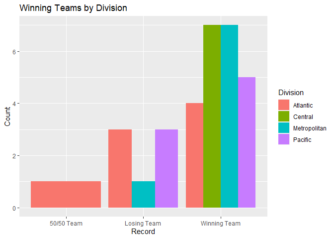
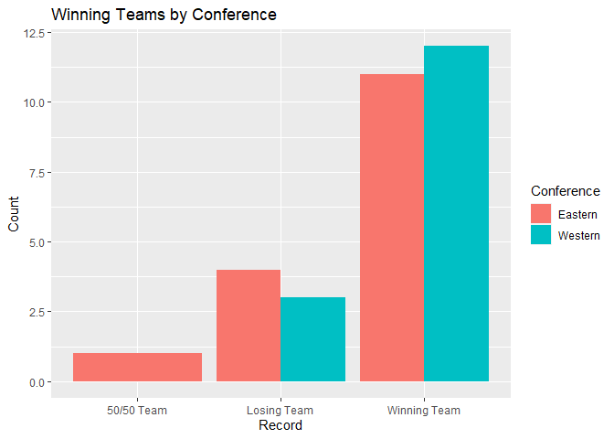
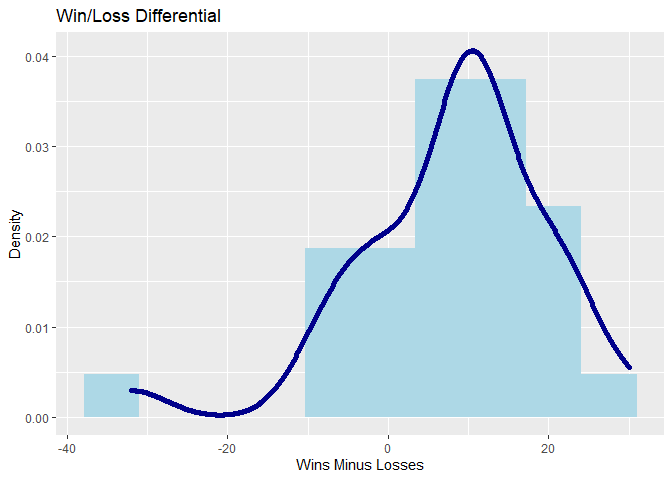
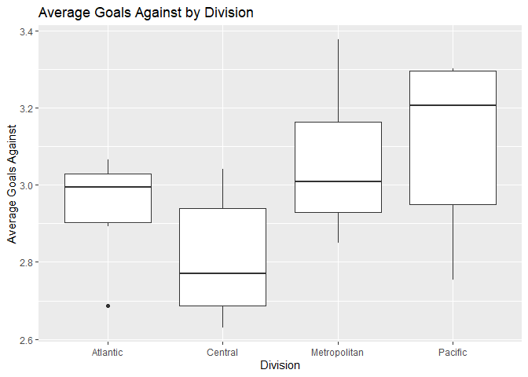
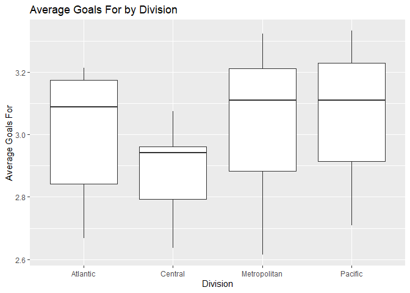

Joshua Burrows Project 1
================

# Title

Hi

``` r
recBaseURL <- "https://records.nhl.com/site/api"

# Return the requested table from records API
getTable <- function(table){
  
  if(!is.string(table)){
    stop("Input must be a character string")
  }
  
  recFullURL <- paste0(recBaseURL, "/", table) 
  info <- recFullURL %>% GET() %>% content("text", encoding = "UTF-8") %>% fromJSON(flatten = "TRUE")
  info <- info[[1]] %>% as_tibble()
  
  return(info)
}
```

``` r
# filter info from requested records table by team name or team Id
filterTable <- function(table, nameName = NULL, idNumName = NULL, name = NULL, idNum = NULL){
  
  # If neither filter condition specified, return full table
  if((is.null(name) & is.null(idNum))){
    return(table)
  }
  
  if((is.null(nameName) & is.null(idNumName))){
    stop("in order to filter, either nameName or idNumName must be specified")
  } 
  
  # User should search by one condition at a time
  if((!is.null(name) & !is.null(idNum))){
    stop("search by either name or idNum, not both")
  }
  
  if((!is.null(name) & is.null(nameName))){
    stop("if name is specified, nameName must be specified")
  }
  
  if((!is.null(idNum) & is.null(idNumName))){
    stop("is idNum is specified, idNumName must be specified")
  }
  
  if(!is.null(name)){
    if(name == "all"){ 
        return(table)
    } else{
        team <- table %>% filter(table[[nameName]] == name)
        if(length(team[[nameName]]) == 0){
          stop("not a vaild team name")
        } else{
            return(team)
          }
      } 
  }
    
  if(!is.null(idNum)){
    if(idNum == "all"){
        return(table)
    } else{
        team <- table %>% filter(table[[idNumName]] == idNum)
        if(length(team[[idNumName]]) == 0){ 
          stop("Not a valid team idNum")
        } else{
            return(team)
          }
      } 
  } 

}
```

``` r
# Get franchise info by name or idNum
franchise <- function(name = NULL, idNum = NULL){

  franchises <- getTable("franchise") 
  
  filterTable(franchises, nameName = "teamCommonName", idNumName = "id", name, idNum) 
  
}
franchise()
```

    ## # A tibble: 38 x 6
    ##       id firstSeasonId lastSeasonId
    ##    <int>         <int>        <int>
    ##  1     1      19171918           NA
    ##  2     2      19171918     19171918
    ##  3     3      19171918     19341935
    ##  4     4      19191920     19241925
    ##  5     5      19171918           NA
    ##  6     6      19241925           NA
    ##  7     7      19241925     19371938
    ##  8     8      19251926     19411942
    ##  9     9      19251926     19301931
    ## 10    10      19261927           NA
    ## # ... with 28 more rows, and 3 more
    ## #   variables: mostRecentTeamId <int>,
    ## #   teamCommonName <chr>,
    ## #   teamPlaceName <chr>

``` r
# Return franchise team totals
teamTotals <- function(name = NULL, idNum = NULL){
  
  teamTotals <- getTable("franchise-team-totals") 
  
  filterTable(teamTotals, nameName = "teamName", idNumName = "franchiseId", name, idNum) 
  
} 
teamTotals()
```

    ## # A tibble: 105 x 30
    ##       id activeFranchise firstSeasonId
    ##    <int>           <int>         <int>
    ##  1     1               1      19821983
    ##  2     2               1      19821983
    ##  3     3               1      19721973
    ##  4     4               1      19721973
    ##  5     5               1      19261927
    ##  6     6               1      19261927
    ##  7     7               1      19671968
    ##  8     8               1      19671968
    ##  9     9               1      19671968
    ## 10    10               1      19671968
    ## # ... with 95 more rows, and 27 more
    ## #   variables: franchiseId <int>,
    ## #   gameTypeId <int>,
    ## #   gamesPlayed <int>,
    ## #   goalsAgainst <int>,
    ## #   goalsFor <int>, homeLosses <int>,
    ## #   homeOvertimeLosses <int>,
    ## #   homeTies <int>, homeWins <int>,
    ## #   lastSeasonId <int>, losses <int>,
    ## #   overtimeLosses <int>,
    ## #   penaltyMinutes <int>,
    ## #   pointPctg <dbl>, points <int>,
    ## #   roadLosses <int>,
    ## #   roadOvertimeLosses <int>,
    ## #   roadTies <int>, roadWins <int>,
    ## #   shootoutLosses <int>,
    ## #   shootoutWins <int>,
    ## #   shutouts <int>, teamId <int>,
    ## #   teamName <chr>, ties <int>,
    ## #   triCode <chr>, wins <int>

``` r
# Return season records for a given franchise
season <- function(name = NULL, idNum = NULL){
  
  seasonRecords <- getTable("franchise-season-records") 
  
  filterTable(seasonRecords, nameName = "franchiseName", idNumName = "franchiseId", name, idNum) 
} 
```

``` r
# Return franchise goalie records 
goalie <- function(name = NULL, idNum = NULL){
  
  goalieRecords <- getTable("franchise-goalie-records")
  
  filterTable(goalieRecords, nameName = "franchiseName", idNumName = "franchiseId", name, idNum)
  
} 
```

``` r
skater <- function(name = NULL, idNum = NULL){
  
  skaterRecords <- getTable("franchise-skater-records") 
  
  filterTable(skaterRecords, nameName = "franchiseName", idNumName = "franchiseId", name, idNum) 
  
}
```

# Stats API

``` r
statsBaseURL <- "https://statsapi.web.nhl.com/api/v1/teams"

getStatsTable <- function(modifier = NULL, seasonId = NULL, idNum = NULL){
  
  # no modifier 
  if(is.null(modifier)){
    
    if((!is.null(seasonId) | !is.null(idNum))){
      stop("search by seasonId and/or idNum requires appropriate modifier")
    }
    
    base <- statsBaseURL %>% GET() %>% content("text") %>% fromJSON(flatten = TRUE)
    base <- base[[2]] %>% as_tibble()
    return(base)
  }
    
  # MODIFIER 
  # team.roster 
  if(modifier == "team.roster"){
    if((!is.null(seasonId) | !is.null(idNum))){
      stop("search by seasonId and/or idNum not compatible with modifier team.roster")
    }
    
    mod = "?expand=team.roster"
  } 
  
  # MODIFIER 
  # person.names 
  if(modifier == "person.names"){
    if((!is.null(seasonId) | !is.null(idNum))){
      stop("search by seasonId and/or idNum not compatible with modifier person.names")
    }
    
    mod = "?expand=person.names" 
  }
  
  # MODIFIER 
  # team.schedule.next 
  if(modifier == "team.schedule.next"){
    if((!is.null(seasonId) | !is.null(idNum))){
      stop("search by seasonId and/or idNum not compatible with modifier team.schedule.next")
    }
    
    mod = "?expand=team.schedule.next"
  } 
  
  # MODIFIER 
  # team.schedule.previous 
  if(modifier == "team.schedule.previous"){
    if((!is.null(seasonId) | !is.null(idNum))){
      stop("search by seasonId and/or idNum not compatible with modifier team.schedule.previous")
    }
    
    mod = "?expand=team.schedule.previous"
  }
  
  # MODIFIER 
  # team.stats
  if(modifier == "team.stats"){
    if((!is.null(seasonId) | !is.null(idNum))){
      stop("search by seasonId and/or idNum not compatible with modifier team.stats")
    }
    
    mod = "?expand=team.stats"
  }
  
  # MODIFIER 
  # team.roster&season
  if(modifier == "team.roster&season"){
    if(!is.null(idNum)){
      stop("search by idNum not compatible with modifier team.roster&season")
    }
    
    if(is.null(seasonId)){
      stop("team.roster&season modifier requires search by seasonId") 
    }
    
    if(nchar(seasonId) != 8){
      stop("seasonId must be of format 20142015")
    }
    
    mod = paste0("?expand=team.roster&season=", seasonId)
  }
  
  # MODIFIER 
  # teamId
  if(modifier == "teamId"){
    if(!is.null(seasonId)){
      stop("search by seasonId not compatible with modifier teamId")
    }
    
    if(!is.null(idNum)){
      idCheck <- strsplit(idNum, split = "")[[1]]
      for(i in idCheck){
        if((!(i %in% c("1", "2", "3", "4", "5", "6", "7", "8", "9", "0", ",")))){
          stop("idNum must be of format 1,2,3")
        }
      }
    }
    
    mod = paste0("?teamId=", idNum)
  }
  
  # MODIFIER 
  # statsSingleSeasonPlayoffs 
  if(modifier == "statsSingleSeasonPlayoffs"){
    if((!is.null(seasonId) | !is.null(idNum))){
      stop("search by seasonId and/or idNum not compatible with modifier statsSingleSeasonPlayoffs")
    }
    
    mod <- "?stats=statsSingleSeasonPlayoffs"
  }
  
  # create URL and return 
  statsFullURL <- paste0(statsBaseURL, "/", mod)
  
  full <- statsFullURL %>% GET() %>% content("text") %>% fromJSON(flatten = TRUE)
  full <- full[[2]] %>% as_tibble()
  
  return(full)
}
```

## Teams Endpoint

The teams endpoint of the NHL stats API has eight modifiers. Typically,
including a modifier returns more detailed information about a
particular topic.

Most modified endpoints require “flattening”.

This is a long one, so check out the comments to keep your bearings.

``` r
teamStats <- function(modifier = NULL, seasonId = NULL, idNum = NULL){
  
  # if no modifier is present
  if(is.null(modifier)){
    base <- getStatsTable()
    return(base)
  }

  # MODIFIER 
  # team.roster
  if(modifier == "team.roster"){
    
    stats <- getStatsTable(modifier = modifier, seasonId = seasonId, idNum = idNum) 
    
    # get col to be flattened 
    roster <- stats[["roster.roster"]] 
    
    # append team names to keep track of who plays for who
    for(i in 1:length(roster)){
      roster[[i]]$name <- stats[["name"]][[i]]
    }
    
    # flatten roster info
    roster <- do.call(rbind, roster)
    statsFlatten <- left_join(roster, stats, by = "name") %>% select(-c("roster.roster"))
    
    return(statsFlatten)
  } 
  
  # MODIFIER
  # person.names
  # appears to be the same as the unmodified endpoint 
  if(modifier == "person.names"){ 
    
    stats <- getStatsTable(modifier = modifier, seasonId = seasonId, idNum = idNum) 
    return(stats) 
  } 
  
  # MODIFIER
  # team.schedule.next 
  if(modifier == "team.schedule.next"){
    
    stats <- getStatsTable(modifier = modifier, seasonId = seasonId, idNum = idNum)
    
    # get col to be flattened 
    dates <- stats[["nextGameSchedule.dates"]]
    
    # create names column to track data by team
    # create list of teams that have a next game scheduled 
    datesNonNull <- list()
    for(i in 1:length(dates)){
      if(!is.null(dates[[i]])){
        dates[[i]]$name <- stats[["name"]][[i]]
        datesNonNull <- cbind(datesNonNull, dates[i])
      }
    }
    
    # flatten datesNonNull
    for(i in 1:length(datesNonNull)){
      datesNonNull[[i]] <- cbind(datesNonNull[[i]], datesNonNull[[i]][["games"]]) %>% select(-c("games")) 
      
      datesNonNull[[i]][["events"]] <- 
        datesNonNull[[i]][["events"]][[1]][1][[1]]
      
      datesNonNull[[i]][["matches"]] <- 
        datesNonNull[[i]][["matches"]][[1]][1][[1]]
    } 
    
    # Put dates info in one tibble 
    datesVert <- tibble() 
    for(i in 1:length(datesNonNull)){
      datesVert <- rbind(datesVert, datesNonNull[[i]]) 
    } 
    
    # join flattened data with full data set 
    schedule <- left_join(stats, datesVert, by = "name", suffix = c(".main", ".nextGame")) %>% select(-c("nextGameSchedule.dates"))
    
    return(schedule) 
  } 
  
  # MODIFIER
  # team.schedule.previous
  if(modifier == "team.schedule.previous"){
    
    stats <- getStatsTable(modifier = modifier, seasonId = seasonId, idNum = idNum) 
    
    # grab col to flatten
    dates <- stats[["previousGameSchedule.dates"]]
    
    # create names column to track data by team
    # create list of teams that have a next game scheduled 
    datesNonNull <- list()
    for(i in 1:length(dates)){
      if(!is.null(dates[[i]])){
        dates[[i]]$name <- stats[["name"]][[i]]
        datesNonNull <- cbind(datesNonNull, dates[i])
      }
    }
    
    # flatten datesNonNull
    for(i in 1:length(datesNonNull)){
      datesNonNull[[i]] <- cbind(datesNonNull[[i]], datesNonNull[[i]][["games"]]) %>% select(-c("games")) 
      
      datesNonNull[[i]][["events"]] <- 
        datesNonNull[[i]][["events"]][[1]][1][[1]]
      
      datesNonNull[[i]][["matches"]] <- 
        datesNonNull[[i]][["matches"]][[1]][1][[1]]
    } 
    
    # create venue.id col where it doesn't exist 
    for(i in 1:length(datesNonNull)){
      if(is.null(datesNonNull[[i]][["venue.id"]])){
        datesNonNull[[i]][["venue.id"]] <- NA
      }
    }
    
    # put dates info in one tibble 
    datesVert <- tibble() 
    for(i in 1:length(datesNonNull)){
      datesVert <- rbind(datesVert, datesNonNull[[i]]) 
    } 
  
    # join flattened data with full data set 
    schedule <- left_join(stats, datesVert, by = "name", suffix = c(".main", ".previousGame")) %>% select(-c("previousGameSchedule.dates"))
    
    return(schedule) 
  } 
  
  # MODIFIER
  # team.stats
  if(modifier == "team.stats"){ 
    
    stats <- getStatsTable(modifier = modifier, seasonId = seasonId, idNum = idNum)
    
    # create empty list to contain final results
    final <- list()
    
    # include data from the base endpoint 
    final$teamOverview <- stats %>% select(-c("teamStats"))
    
    # get col to flatten
    teamStats <- stats[["teamStats"]]
    
    # empty tibbles to contain flattened data 
    statsOverview <- tibble()
    statsValues <- tibble()
    statsRanks <- tibble()
    
    # flatten 
    for(i in 1:length(teamStats)){
      teamStats[[i]]$name <- stats[["name"]][[i]]
      
      statsOverview <- rbind(statsOverview, teamStats[[i]])
      
      statsValues <- rbind(statsValues, teamStats[[i]][["splits"]][[1]][1, ]) 
      
      statsRanks <- rbind(statsRanks, teamStats[[i]][["splits"]][[1]][2, ])
    }
    
    statsOverview <- statsOverview %>% select(-c("splits"))
    
    # values table should be numeric 
    for(i in 1:(ncol(statsValues) - 2)){
      statsValues[[i]] <- as.double(statsValues[[i]])
    }
    
    # fill in final list 
    final$statsOverview <- statsOverview
    final$statsValues <- statsValues
    final$statsRanks <- statsRanks
    
    return(final)
  } 
  
  # MODIFIER
  # team.roster&season
  if(modifier == "team.roster&season"){
    
    stats <- getStatsTable(modifier = modifier, seasonId = seasonId, idNum = idNum) 
    
    # get col to flatten 
    roster <- stats[["roster.roster"]]
    
    # add team names to keep track of who plays for who 
    for(i in 1:length(roster)){
      roster[[i]]$name <- stats[["name"]][[i]]
    }
    
    # flatten 
    roster <- do.call(rbind, roster)
    
    # combine and return 
    statsFlatten <- left_join(roster, stats, by = "name") %>% select(-c("roster.roster"))
    
    return(statsFlatten)
  }
  
  # MODIFIER
  # teamId
  if(modifier == "teamId"){
    
    stats <- getStatsTable(modifier = modifier, seasonId = seasonId, idNum = idNum) 
    
    return(stats) 
  }
  
  # MODIFIER
  # statsSingleSeasonPlayoffs
  # appears to be the same as the unmodified endpoint
  if(modifier == "statsSingleSeasonPlayoffs"){
    
    stats <- getStatsTable(modifier = modifier, seasonId = seasonId, idNum = idNum)
    
    return(stats)
  }
  
  stop("modifier must be one of: team.roster, person.names, team.schedule.next, team.schedule.previous, team.stats, team.roster&season, teamId, statsSingleSeasonPlayoffs")
}
```

# Wrapper

``` r
getNHL <- function(API, recTable = NULL, name = NULL, idNum = NULL, modifier = NULL, seasonId = NULL){
  
  if(!(API %in% c("records", "stats"))){
    return(warning("API must be either records or stats"))
  }
  
  if(API == "records"){
    
    if(recTable == "franchise"){
      tab <- franchise(name = name, idNum = idNum)
      return(tab)
    }
    
    if(recTable == "franchise-team-totals"){
      tab <- teamTotals(name = name, idNum = idNum)
      return(tab)
    }
    
    if(recTable == "franchise-season-records"){
      tab <- season(name = name, idNum = idNum)
      return(tab) 
    }
    
    if(recTable == "franchise-goalie-records"){
      tab <- goalie(name = name, idNum = idNum)
      return(tab) 
    }
    
    if(recTable == "franchise-skater-records"){
      tab <- skater(name = name, idNum = idNum)
      return(tab) 
    }
    
    stop("recTable must be one of: franchise, franchise-team-totals, franchise-season-records, franchise-goalie-records, franchise-skater-records")
  
  }
  
  if(API == "stats"){
   tab <- teamStats(modifier = modifier, seasonId = seasonId, idNum = idNum)
   return(tab)
  }
  
}

getNHL(API = "records", recTable = "franchise")
```

    ## # A tibble: 38 x 6
    ##       id firstSeasonId lastSeasonId
    ##    <int>         <int>        <int>
    ##  1     1      19171918           NA
    ##  2     2      19171918     19171918
    ##  3     3      19171918     19341935
    ##  4     4      19191920     19241925
    ##  5     5      19171918           NA
    ##  6     6      19241925           NA
    ##  7     7      19241925     19371938
    ##  8     8      19251926     19411942
    ##  9     9      19251926     19301931
    ## 10    10      19261927           NA
    ## # ... with 28 more rows, and 3 more
    ## #   variables: mostRecentTeamId <int>,
    ## #   teamCommonName <chr>,
    ## #   teamPlaceName <chr>

``` r
getNHL(API = "records", recTable = "franchise-team-totals")
```

    ## # A tibble: 105 x 30
    ##       id activeFranchise firstSeasonId
    ##    <int>           <int>         <int>
    ##  1     1               1      19821983
    ##  2     2               1      19821983
    ##  3     3               1      19721973
    ##  4     4               1      19721973
    ##  5     5               1      19261927
    ##  6     6               1      19261927
    ##  7     7               1      19671968
    ##  8     8               1      19671968
    ##  9     9               1      19671968
    ## 10    10               1      19671968
    ## # ... with 95 more rows, and 27 more
    ## #   variables: franchiseId <int>,
    ## #   gameTypeId <int>,
    ## #   gamesPlayed <int>,
    ## #   goalsAgainst <int>,
    ## #   goalsFor <int>, homeLosses <int>,
    ## #   homeOvertimeLosses <int>,
    ## #   homeTies <int>, homeWins <int>,
    ## #   lastSeasonId <int>, losses <int>,
    ## #   overtimeLosses <int>,
    ## #   penaltyMinutes <int>,
    ## #   pointPctg <dbl>, points <int>,
    ## #   roadLosses <int>,
    ## #   roadOvertimeLosses <int>,
    ## #   roadTies <int>, roadWins <int>,
    ## #   shootoutLosses <int>,
    ## #   shootoutWins <int>,
    ## #   shutouts <int>, teamId <int>,
    ## #   teamName <chr>, ties <int>,
    ## #   triCode <chr>, wins <int>

``` r
getNHL(API = "records", recTable = "franchise-season-records") 
```

    ## # A tibble: 38 x 57
    ##       id fewestGoals fewestGoalsAgai~
    ##    <int>       <int>            <int>
    ##  1     1         174              164
    ##  2     2         170              190
    ##  3     3         150              177
    ##  4     4         173              164
    ##  5     5         182              188
    ##  6     6         147              172
    ##  7     7         157              175
    ##  8     8         155              131
    ##  9     9         191              179
    ## 10    10         147              131
    ## # ... with 28 more rows, and 54 more
    ## #   variables:
    ## #   fewestGoalsAgainstSeasons <chr>,
    ## #   fewestGoalsSeasons <chr>,
    ## #   fewestLosses <int>,
    ## #   fewestLossesSeasons <chr>,
    ## #   fewestPoints <int>,
    ## #   fewestPointsSeasons <chr>,
    ## #   fewestTies <int>,
    ## #   fewestTiesSeasons <chr>,
    ## #   fewestWins <int>,
    ## #   fewestWinsSeasons <chr>,
    ## #   franchiseId <int>,
    ## #   franchiseName <chr>,
    ## #   homeLossStreak <int>,
    ## #   homeLossStreakDates <chr>,
    ## #   homePointStreak <int>,
    ## #   homePointStreakDates <chr>,
    ## #   homeWinStreak <int>,
    ## #   homeWinStreakDates <chr>,
    ## #   homeWinlessStreak <int>,
    ## #   homeWinlessStreakDates <chr>,
    ## #   lossStreak <int>,
    ## #   lossStreakDates <chr>,
    ## #   mostGameGoals <int>,
    ## #   mostGameGoalsDates <chr>,
    ## #   mostGoals <int>,
    ## #   mostGoalsAgainst <int>,
    ## #   mostGoalsAgainstSeasons <chr>,
    ## #   mostGoalsSeasons <chr>,
    ## #   mostLosses <int>,
    ## #   mostLossesSeasons <chr>,
    ## #   mostPenaltyMinutes <int>,
    ## #   mostPenaltyMinutesSeasons <chr>,
    ## #   mostPoints <int>,
    ## #   mostPointsSeasons <chr>,
    ## #   mostShutouts <int>,
    ## #   mostShutoutsSeasons <chr>,
    ## #   mostTies <int>,
    ## #   mostTiesSeasons <chr>,
    ## #   mostWins <int>,
    ## #   mostWinsSeasons <chr>,
    ## #   pointStreak <int>,
    ## #   pointStreakDates <chr>,
    ## #   roadLossStreak <int>,
    ## #   roadLossStreakDates <chr>,
    ## #   roadPointStreak <int>,
    ## #   roadPointStreakDates <chr>,
    ## #   roadWinStreak <int>,
    ## #   roadWinStreakDates <chr>,
    ## #   roadWinlessStreak <int>,
    ## #   roadWinlessStreakDates <chr>,
    ## #   winStreak <int>,
    ## #   winStreakDates <chr>,
    ## #   winlessStreak <int>,
    ## #   winlessStreakDates <chr>

``` r
getNHL(API = "records", recTable = "franchise-goalie-records", idNum = 5)
```

    ## # A tibble: 53 x 29
    ##       id activePlayer firstName
    ##    <int> <lgl>        <chr>    
    ##  1   246 FALSE        Turk     
    ##  2   324 TRUE         James    
    ##  3   334 FALSE        Tom      
    ##  4   338 FALSE        Don      
    ##  5   342 FALSE        Ed       
    ##  6   395 FALSE        Don      
    ##  7   408 FALSE        Doug     
    ##  8   418 FALSE        Grant    
    ##  9   445 FALSE        Paul     
    ## 10   453 FALSE        Glenn    
    ## # ... with 43 more rows, and 26 more
    ## #   variables: franchiseId <int>,
    ## #   franchiseName <chr>,
    ## #   gameTypeId <int>,
    ## #   gamesPlayed <int>, lastName <chr>,
    ## #   losses <int>,
    ## #   mostGoalsAgainstDates <chr>,
    ## #   mostGoalsAgainstOneGame <int>,
    ## #   mostSavesDates <chr>,
    ## #   mostSavesOneGame <int>,
    ## #   mostShotsAgainstDates <chr>,
    ## #   mostShotsAgainstOneGame <int>,
    ## #   mostShutoutsOneSeason <int>,
    ## #   mostShutoutsSeasonIds <chr>,
    ## #   mostWinsOneSeason <int>,
    ## #   mostWinsSeasonIds <chr>,
    ## #   overtimeLosses <int>,
    ## #   playerId <int>,
    ## #   positionCode <chr>,
    ## #   rookieGamesPlayed <int>,
    ## #   rookieShutouts <int>,
    ## #   rookieWins <int>, seasons <int>,
    ## #   shutouts <int>, ties <int>,
    ## #   wins <int>

``` r
getNHL(API = "records", recTable = "franchise-skater-records", name = "Dallas Stars")
```

    ## # A tibble: 615 x 30
    ##       id activePlayer assists firstName
    ##    <int> <lgl>          <int> <chr>    
    ##  1 16924 FALSE            802 Mike     
    ##  2 17017 FALSE             36 Shane    
    ##  3 17044 FALSE            380 Brian    
    ##  4 17045 FALSE            319 Dino     
    ##  5 17068 FALSE            593 Neal     
    ##  6 17091 FALSE            369 Bobby    
    ##  7 17107 FALSE             58 Basil    
    ##  8 17183 FALSE            315 Craig    
    ##  9 17215 FALSE              3 Chris    
    ## 10 17240 FALSE             57 Greg     
    ## # ... with 605 more rows, and 26 more
    ## #   variables: franchiseId <int>,
    ## #   franchiseName <chr>,
    ## #   gameTypeId <int>,
    ## #   gamesPlayed <int>, goals <int>,
    ## #   lastName <chr>,
    ## #   mostAssistsGameDates <chr>,
    ## #   mostAssistsOneGame <int>,
    ## #   mostAssistsOneSeason <int>,
    ## #   mostAssistsSeasonIds <chr>,
    ## #   mostGoalsGameDates <chr>,
    ## #   mostGoalsOneGame <int>,
    ## #   mostGoalsOneSeason <int>,
    ## #   mostGoalsSeasonIds <chr>,
    ## #   mostPenaltyMinutesOneSeason <int>,
    ## #   mostPenaltyMinutesSeasonIds <chr>,
    ## #   mostPointsGameDates <chr>,
    ## #   mostPointsOneGame <int>,
    ## #   mostPointsOneSeason <int>,
    ## #   mostPointsSeasonIds <chr>,
    ## #   penaltyMinutes <int>,
    ## #   playerId <int>, points <int>,
    ## #   positionCode <chr>,
    ## #   rookiePoints <int>, seasons <int>

``` r
getNHL(API = "stats")
```

    ## # A tibble: 31 x 29
    ##       id name  link  abbreviation
    ##    <int> <chr> <chr> <chr>       
    ##  1     1 New ~ /api~ NJD         
    ##  2     2 New ~ /api~ NYI         
    ##  3     3 New ~ /api~ NYR         
    ##  4     4 Phil~ /api~ PHI         
    ##  5     5 Pitt~ /api~ PIT         
    ##  6     6 Bost~ /api~ BOS         
    ##  7     7 Buff~ /api~ BUF         
    ##  8     8 Mont~ /api~ MTL         
    ##  9     9 Otta~ /api~ OTT         
    ## 10    10 Toro~ /api~ TOR         
    ## # ... with 21 more rows, and 25 more
    ## #   variables: teamName <chr>,
    ## #   locationName <chr>,
    ## #   firstYearOfPlay <chr>,
    ## #   shortName <chr>,
    ## #   officialSiteUrl <chr>,
    ## #   franchiseId <int>, active <lgl>,
    ## #   venue.name <chr>,
    ## #   venue.link <chr>,
    ## #   venue.city <chr>, venue.id <int>,
    ## #   venue.timeZone.id <chr>,
    ## #   venue.timeZone.offset <int>,
    ## #   venue.timeZone.tz <chr>,
    ## #   division.id <int>,
    ## #   division.name <chr>,
    ## #   division.nameShort <chr>,
    ## #   division.link <chr>,
    ## #   division.abbreviation <chr>,
    ## #   conference.id <int>,
    ## #   conference.name <chr>,
    ## #   conference.link <chr>,
    ## #   franchise.franchiseId <int>,
    ## #   franchise.teamName <chr>,
    ## #   franchise.link <chr>

``` r
getNHL(API = "stats", modifier = "team.roster")
```

    ##    jerseyNumber person.id
    ## 1            19   8471233
    ## 2            35   8471239
    ## 3            76   8474056
    ## 4            21   8475151
    ## 5            33   8476368
    ## 6            28   8476923
    ## 7             5   8476941
    ## 8            97   8477038
    ## 9             8   8477355
    ## 10           15   8477401
    ## 11           44   8477425
    ## 12           25   8477509
    ## 13           32   8477541
    ## 14           37   8478401
    ## 15           29   8478406
    ## 16           16   8479291
    ## 17           14   8479315
    ## 18           63   8479407
    ## 19           41   8479415
    ## 20           13   8480002
    ## 21           86   8481559
    ## 22           55   8470187
    ## 23           16   8471217
    ## 24            1   8471306
    ## 25            4   8472382
    ## 26           47   8473463
    ##        person.fullName
    ## 1         Travis Zajac
    ## 2       Cory Schneider
    ## 3          P.K. Subban
    ## 4        Kyle Palmieri
    ## 5     Fredrik Claesson
    ## 6       Damon Severson
    ## 7       Connor Carrick
    ## 8         Nikita Gusev
    ## 9         Will Butcher
    ## 10         John Hayden
    ## 11          Miles Wood
    ## 12       Mirco Mueller
    ## 13       Dakota Mermis
    ## 14         Pavel Zacha
    ## 15 Mackenzie Blackwood
    ## 16        Kevin Rooney
    ## 17       Joey Anderson
    ## 18        Jesper Bratt
    ## 19      Michael McLeod
    ## 20       Nico Hischier
    ## 21         Jack Hughes
    ## 22      Johnny Boychuk
    ## 23         Andrew Ladd
    ## 24       Thomas Greiss
    ## 25         Andy Greene
    ## 26         Leo Komarov
    ##               person.link
    ## 1  /api/v1/people/8471233
    ## 2  /api/v1/people/8471239
    ## 3  /api/v1/people/8474056
    ## 4  /api/v1/people/8475151
    ## 5  /api/v1/people/8476368
    ## 6  /api/v1/people/8476923
    ## 7  /api/v1/people/8476941
    ## 8  /api/v1/people/8477038
    ## 9  /api/v1/people/8477355
    ## 10 /api/v1/people/8477401
    ## 11 /api/v1/people/8477425
    ## 12 /api/v1/people/8477509
    ## 13 /api/v1/people/8477541
    ## 14 /api/v1/people/8478401
    ## 15 /api/v1/people/8478406
    ## 16 /api/v1/people/8479291
    ## 17 /api/v1/people/8479315
    ## 18 /api/v1/people/8479407
    ## 19 /api/v1/people/8479415
    ## 20 /api/v1/people/8480002
    ## 21 /api/v1/people/8481559
    ## 22 /api/v1/people/8470187
    ## 23 /api/v1/people/8471217
    ## 24 /api/v1/people/8471306
    ## 25 /api/v1/people/8472382
    ## 26 /api/v1/people/8473463
    ##    position.code position.name
    ## 1              C        Center
    ## 2              G        Goalie
    ## 3              D    Defenseman
    ## 4              R    Right Wing
    ## 5              D    Defenseman
    ## 6              D    Defenseman
    ## 7              D    Defenseman
    ## 8              L     Left Wing
    ## 9              D    Defenseman
    ## 10             C        Center
    ## 11             L     Left Wing
    ## 12             D    Defenseman
    ## 13             D    Defenseman
    ## 14             C        Center
    ## 15             G        Goalie
    ## 16             C        Center
    ## 17             R    Right Wing
    ## 18             L     Left Wing
    ## 19             C        Center
    ## 20             C        Center
    ## 21             C        Center
    ## 22             D    Defenseman
    ## 23             L     Left Wing
    ## 24             G        Goalie
    ## 25             D    Defenseman
    ## 26             R    Right Wing
    ##    position.type position.abbreviation
    ## 1        Forward                     C
    ## 2         Goalie                     G
    ## 3     Defenseman                     D
    ## 4        Forward                    RW
    ## 5     Defenseman                     D
    ## 6     Defenseman                     D
    ## 7     Defenseman                     D
    ## 8        Forward                    LW
    ## 9     Defenseman                     D
    ## 10       Forward                     C
    ## 11       Forward                    LW
    ## 12    Defenseman                     D
    ## 13    Defenseman                     D
    ## 14       Forward                     C
    ## 15        Goalie                     G
    ## 16       Forward                     C
    ## 17       Forward                    RW
    ## 18       Forward                    LW
    ## 19       Forward                     C
    ## 20       Forward                     C
    ## 21       Forward                     C
    ## 22    Defenseman                     D
    ## 23       Forward                    LW
    ## 24        Goalie                     G
    ## 25    Defenseman                     D
    ## 26       Forward                    RW
    ##                  name id
    ## 1   New Jersey Devils  1
    ## 2   New Jersey Devils  1
    ## 3   New Jersey Devils  1
    ## 4   New Jersey Devils  1
    ## 5   New Jersey Devils  1
    ## 6   New Jersey Devils  1
    ## 7   New Jersey Devils  1
    ## 8   New Jersey Devils  1
    ## 9   New Jersey Devils  1
    ## 10  New Jersey Devils  1
    ## 11  New Jersey Devils  1
    ## 12  New Jersey Devils  1
    ## 13  New Jersey Devils  1
    ## 14  New Jersey Devils  1
    ## 15  New Jersey Devils  1
    ## 16  New Jersey Devils  1
    ## 17  New Jersey Devils  1
    ## 18  New Jersey Devils  1
    ## 19  New Jersey Devils  1
    ## 20  New Jersey Devils  1
    ## 21  New Jersey Devils  1
    ## 22 New York Islanders  2
    ## 23 New York Islanders  2
    ## 24 New York Islanders  2
    ## 25 New York Islanders  2
    ## 26 New York Islanders  2
    ##               link abbreviation
    ## 1  /api/v1/teams/1          NJD
    ## 2  /api/v1/teams/1          NJD
    ## 3  /api/v1/teams/1          NJD
    ## 4  /api/v1/teams/1          NJD
    ## 5  /api/v1/teams/1          NJD
    ## 6  /api/v1/teams/1          NJD
    ## 7  /api/v1/teams/1          NJD
    ## 8  /api/v1/teams/1          NJD
    ## 9  /api/v1/teams/1          NJD
    ## 10 /api/v1/teams/1          NJD
    ## 11 /api/v1/teams/1          NJD
    ## 12 /api/v1/teams/1          NJD
    ## 13 /api/v1/teams/1          NJD
    ## 14 /api/v1/teams/1          NJD
    ## 15 /api/v1/teams/1          NJD
    ## 16 /api/v1/teams/1          NJD
    ## 17 /api/v1/teams/1          NJD
    ## 18 /api/v1/teams/1          NJD
    ## 19 /api/v1/teams/1          NJD
    ## 20 /api/v1/teams/1          NJD
    ## 21 /api/v1/teams/1          NJD
    ## 22 /api/v1/teams/2          NYI
    ## 23 /api/v1/teams/2          NYI
    ## 24 /api/v1/teams/2          NYI
    ## 25 /api/v1/teams/2          NYI
    ## 26 /api/v1/teams/2          NYI
    ##     teamName locationName
    ## 1     Devils   New Jersey
    ## 2     Devils   New Jersey
    ## 3     Devils   New Jersey
    ## 4     Devils   New Jersey
    ## 5     Devils   New Jersey
    ## 6     Devils   New Jersey
    ## 7     Devils   New Jersey
    ## 8     Devils   New Jersey
    ## 9     Devils   New Jersey
    ## 10    Devils   New Jersey
    ## 11    Devils   New Jersey
    ## 12    Devils   New Jersey
    ## 13    Devils   New Jersey
    ## 14    Devils   New Jersey
    ## 15    Devils   New Jersey
    ## 16    Devils   New Jersey
    ## 17    Devils   New Jersey
    ## 18    Devils   New Jersey
    ## 19    Devils   New Jersey
    ## 20    Devils   New Jersey
    ## 21    Devils   New Jersey
    ## 22 Islanders     New York
    ## 23 Islanders     New York
    ## 24 Islanders     New York
    ## 25 Islanders     New York
    ## 26 Islanders     New York
    ##    firstYearOfPlay    shortName
    ## 1             1982   New Jersey
    ## 2             1982   New Jersey
    ## 3             1982   New Jersey
    ## 4             1982   New Jersey
    ## 5             1982   New Jersey
    ## 6             1982   New Jersey
    ## 7             1982   New Jersey
    ## 8             1982   New Jersey
    ## 9             1982   New Jersey
    ## 10            1982   New Jersey
    ## 11            1982   New Jersey
    ## 12            1982   New Jersey
    ## 13            1982   New Jersey
    ## 14            1982   New Jersey
    ## 15            1982   New Jersey
    ## 16            1982   New Jersey
    ## 17            1982   New Jersey
    ## 18            1982   New Jersey
    ## 19            1982   New Jersey
    ## 20            1982   New Jersey
    ## 21            1982   New Jersey
    ## 22            1972 NY Islanders
    ## 23            1972 NY Islanders
    ## 24            1972 NY Islanders
    ## 25            1972 NY Islanders
    ## 26            1972 NY Islanders
    ##                     officialSiteUrl
    ## 1   http://www.newjerseydevils.com/
    ## 2   http://www.newjerseydevils.com/
    ## 3   http://www.newjerseydevils.com/
    ## 4   http://www.newjerseydevils.com/
    ## 5   http://www.newjerseydevils.com/
    ## 6   http://www.newjerseydevils.com/
    ## 7   http://www.newjerseydevils.com/
    ## 8   http://www.newjerseydevils.com/
    ## 9   http://www.newjerseydevils.com/
    ## 10  http://www.newjerseydevils.com/
    ## 11  http://www.newjerseydevils.com/
    ## 12  http://www.newjerseydevils.com/
    ## 13  http://www.newjerseydevils.com/
    ## 14  http://www.newjerseydevils.com/
    ## 15  http://www.newjerseydevils.com/
    ## 16  http://www.newjerseydevils.com/
    ## 17  http://www.newjerseydevils.com/
    ## 18  http://www.newjerseydevils.com/
    ## 19  http://www.newjerseydevils.com/
    ## 20  http://www.newjerseydevils.com/
    ## 21  http://www.newjerseydevils.com/
    ## 22 http://www.newyorkislanders.com/
    ## 23 http://www.newyorkislanders.com/
    ## 24 http://www.newyorkislanders.com/
    ## 25 http://www.newyorkislanders.com/
    ## 26 http://www.newyorkislanders.com/
    ##    franchiseId active
    ## 1           23   TRUE
    ## 2           23   TRUE
    ## 3           23   TRUE
    ## 4           23   TRUE
    ## 5           23   TRUE
    ## 6           23   TRUE
    ## 7           23   TRUE
    ## 8           23   TRUE
    ## 9           23   TRUE
    ## 10          23   TRUE
    ## 11          23   TRUE
    ## 12          23   TRUE
    ## 13          23   TRUE
    ## 14          23   TRUE
    ## 15          23   TRUE
    ## 16          23   TRUE
    ## 17          23   TRUE
    ## 18          23   TRUE
    ## 19          23   TRUE
    ## 20          23   TRUE
    ## 21          23   TRUE
    ## 22          22   TRUE
    ## 23          22   TRUE
    ## 24          22   TRUE
    ## 25          22   TRUE
    ## 26          22   TRUE
    ##           venue.name
    ## 1  Prudential Center
    ## 2  Prudential Center
    ## 3  Prudential Center
    ## 4  Prudential Center
    ## 5  Prudential Center
    ## 6  Prudential Center
    ## 7  Prudential Center
    ## 8  Prudential Center
    ## 9  Prudential Center
    ## 10 Prudential Center
    ## 11 Prudential Center
    ## 12 Prudential Center
    ## 13 Prudential Center
    ## 14 Prudential Center
    ## 15 Prudential Center
    ## 16 Prudential Center
    ## 17 Prudential Center
    ## 18 Prudential Center
    ## 19 Prudential Center
    ## 20 Prudential Center
    ## 21 Prudential Center
    ## 22   Barclays Center
    ## 23   Barclays Center
    ## 24   Barclays Center
    ## 25   Barclays Center
    ## 26   Barclays Center
    ##             venue.link venue.city
    ## 1  /api/v1/venues/null     Newark
    ## 2  /api/v1/venues/null     Newark
    ## 3  /api/v1/venues/null     Newark
    ## 4  /api/v1/venues/null     Newark
    ## 5  /api/v1/venues/null     Newark
    ## 6  /api/v1/venues/null     Newark
    ## 7  /api/v1/venues/null     Newark
    ## 8  /api/v1/venues/null     Newark
    ## 9  /api/v1/venues/null     Newark
    ## 10 /api/v1/venues/null     Newark
    ## 11 /api/v1/venues/null     Newark
    ## 12 /api/v1/venues/null     Newark
    ## 13 /api/v1/venues/null     Newark
    ## 14 /api/v1/venues/null     Newark
    ## 15 /api/v1/venues/null     Newark
    ## 16 /api/v1/venues/null     Newark
    ## 17 /api/v1/venues/null     Newark
    ## 18 /api/v1/venues/null     Newark
    ## 19 /api/v1/venues/null     Newark
    ## 20 /api/v1/venues/null     Newark
    ## 21 /api/v1/venues/null     Newark
    ## 22 /api/v1/venues/5026   Brooklyn
    ## 23 /api/v1/venues/5026   Brooklyn
    ## 24 /api/v1/venues/5026   Brooklyn
    ## 25 /api/v1/venues/5026   Brooklyn
    ## 26 /api/v1/venues/5026   Brooklyn
    ##    venue.id venue.timeZone.id
    ## 1        NA  America/New_York
    ## 2        NA  America/New_York
    ## 3        NA  America/New_York
    ## 4        NA  America/New_York
    ## 5        NA  America/New_York
    ## 6        NA  America/New_York
    ## 7        NA  America/New_York
    ## 8        NA  America/New_York
    ## 9        NA  America/New_York
    ## 10       NA  America/New_York
    ## 11       NA  America/New_York
    ## 12       NA  America/New_York
    ## 13       NA  America/New_York
    ## 14       NA  America/New_York
    ## 15       NA  America/New_York
    ## 16       NA  America/New_York
    ## 17       NA  America/New_York
    ## 18       NA  America/New_York
    ## 19       NA  America/New_York
    ## 20       NA  America/New_York
    ## 21       NA  America/New_York
    ## 22     5026  America/New_York
    ## 23     5026  America/New_York
    ## 24     5026  America/New_York
    ## 25     5026  America/New_York
    ## 26     5026  America/New_York
    ##    venue.timeZone.offset
    ## 1                     -4
    ## 2                     -4
    ## 3                     -4
    ## 4                     -4
    ## 5                     -4
    ## 6                     -4
    ## 7                     -4
    ## 8                     -4
    ## 9                     -4
    ## 10                    -4
    ## 11                    -4
    ## 12                    -4
    ## 13                    -4
    ## 14                    -4
    ## 15                    -4
    ## 16                    -4
    ## 17                    -4
    ## 18                    -4
    ## 19                    -4
    ## 20                    -4
    ## 21                    -4
    ## 22                    -4
    ## 23                    -4
    ## 24                    -4
    ## 25                    -4
    ## 26                    -4
    ##    venue.timeZone.tz division.id
    ## 1                EDT          18
    ## 2                EDT          18
    ## 3                EDT          18
    ## 4                EDT          18
    ## 5                EDT          18
    ## 6                EDT          18
    ## 7                EDT          18
    ## 8                EDT          18
    ## 9                EDT          18
    ## 10               EDT          18
    ## 11               EDT          18
    ## 12               EDT          18
    ## 13               EDT          18
    ## 14               EDT          18
    ## 15               EDT          18
    ## 16               EDT          18
    ## 17               EDT          18
    ## 18               EDT          18
    ## 19               EDT          18
    ## 20               EDT          18
    ## 21               EDT          18
    ## 22               EDT          18
    ## 23               EDT          18
    ## 24               EDT          18
    ## 25               EDT          18
    ## 26               EDT          18
    ##    division.name division.nameShort
    ## 1   Metropolitan              Metro
    ## 2   Metropolitan              Metro
    ## 3   Metropolitan              Metro
    ## 4   Metropolitan              Metro
    ## 5   Metropolitan              Metro
    ## 6   Metropolitan              Metro
    ## 7   Metropolitan              Metro
    ## 8   Metropolitan              Metro
    ## 9   Metropolitan              Metro
    ## 10  Metropolitan              Metro
    ## 11  Metropolitan              Metro
    ## 12  Metropolitan              Metro
    ## 13  Metropolitan              Metro
    ## 14  Metropolitan              Metro
    ## 15  Metropolitan              Metro
    ## 16  Metropolitan              Metro
    ## 17  Metropolitan              Metro
    ## 18  Metropolitan              Metro
    ## 19  Metropolitan              Metro
    ## 20  Metropolitan              Metro
    ## 21  Metropolitan              Metro
    ## 22  Metropolitan              Metro
    ## 23  Metropolitan              Metro
    ## 24  Metropolitan              Metro
    ## 25  Metropolitan              Metro
    ## 26  Metropolitan              Metro
    ##           division.link
    ## 1  /api/v1/divisions/18
    ## 2  /api/v1/divisions/18
    ## 3  /api/v1/divisions/18
    ## 4  /api/v1/divisions/18
    ## 5  /api/v1/divisions/18
    ## 6  /api/v1/divisions/18
    ## 7  /api/v1/divisions/18
    ## 8  /api/v1/divisions/18
    ## 9  /api/v1/divisions/18
    ## 10 /api/v1/divisions/18
    ## 11 /api/v1/divisions/18
    ## 12 /api/v1/divisions/18
    ## 13 /api/v1/divisions/18
    ## 14 /api/v1/divisions/18
    ## 15 /api/v1/divisions/18
    ## 16 /api/v1/divisions/18
    ## 17 /api/v1/divisions/18
    ## 18 /api/v1/divisions/18
    ## 19 /api/v1/divisions/18
    ## 20 /api/v1/divisions/18
    ## 21 /api/v1/divisions/18
    ## 22 /api/v1/divisions/18
    ## 23 /api/v1/divisions/18
    ## 24 /api/v1/divisions/18
    ## 25 /api/v1/divisions/18
    ## 26 /api/v1/divisions/18
    ##    division.abbreviation conference.id
    ## 1                      M             6
    ## 2                      M             6
    ## 3                      M             6
    ## 4                      M             6
    ## 5                      M             6
    ## 6                      M             6
    ## 7                      M             6
    ## 8                      M             6
    ## 9                      M             6
    ## 10                     M             6
    ## 11                     M             6
    ## 12                     M             6
    ## 13                     M             6
    ## 14                     M             6
    ## 15                     M             6
    ## 16                     M             6
    ## 17                     M             6
    ## 18                     M             6
    ## 19                     M             6
    ## 20                     M             6
    ## 21                     M             6
    ## 22                     M             6
    ## 23                     M             6
    ## 24                     M             6
    ## 25                     M             6
    ## 26                     M             6
    ##    conference.name
    ## 1          Eastern
    ## 2          Eastern
    ## 3          Eastern
    ## 4          Eastern
    ## 5          Eastern
    ## 6          Eastern
    ## 7          Eastern
    ## 8          Eastern
    ## 9          Eastern
    ## 10         Eastern
    ## 11         Eastern
    ## 12         Eastern
    ## 13         Eastern
    ## 14         Eastern
    ## 15         Eastern
    ## 16         Eastern
    ## 17         Eastern
    ## 18         Eastern
    ## 19         Eastern
    ## 20         Eastern
    ## 21         Eastern
    ## 22         Eastern
    ## 23         Eastern
    ## 24         Eastern
    ## 25         Eastern
    ## 26         Eastern
    ##          conference.link
    ## 1  /api/v1/conferences/6
    ## 2  /api/v1/conferences/6
    ## 3  /api/v1/conferences/6
    ## 4  /api/v1/conferences/6
    ## 5  /api/v1/conferences/6
    ## 6  /api/v1/conferences/6
    ## 7  /api/v1/conferences/6
    ## 8  /api/v1/conferences/6
    ## 9  /api/v1/conferences/6
    ## 10 /api/v1/conferences/6
    ## 11 /api/v1/conferences/6
    ## 12 /api/v1/conferences/6
    ## 13 /api/v1/conferences/6
    ## 14 /api/v1/conferences/6
    ## 15 /api/v1/conferences/6
    ## 16 /api/v1/conferences/6
    ## 17 /api/v1/conferences/6
    ## 18 /api/v1/conferences/6
    ## 19 /api/v1/conferences/6
    ## 20 /api/v1/conferences/6
    ## 21 /api/v1/conferences/6
    ## 22 /api/v1/conferences/6
    ## 23 /api/v1/conferences/6
    ## 24 /api/v1/conferences/6
    ## 25 /api/v1/conferences/6
    ## 26 /api/v1/conferences/6
    ##    franchise.franchiseId
    ## 1                     23
    ## 2                     23
    ## 3                     23
    ## 4                     23
    ## 5                     23
    ## 6                     23
    ## 7                     23
    ## 8                     23
    ## 9                     23
    ## 10                    23
    ## 11                    23
    ## 12                    23
    ## 13                    23
    ## 14                    23
    ## 15                    23
    ## 16                    23
    ## 17                    23
    ## 18                    23
    ## 19                    23
    ## 20                    23
    ## 21                    23
    ## 22                    22
    ## 23                    22
    ## 24                    22
    ## 25                    22
    ## 26                    22
    ##    franchise.teamName
    ## 1              Devils
    ## 2              Devils
    ## 3              Devils
    ## 4              Devils
    ## 5              Devils
    ## 6              Devils
    ## 7              Devils
    ## 8              Devils
    ## 9              Devils
    ## 10             Devils
    ## 11             Devils
    ## 12             Devils
    ## 13             Devils
    ## 14             Devils
    ## 15             Devils
    ## 16             Devils
    ## 17             Devils
    ## 18             Devils
    ## 19             Devils
    ## 20             Devils
    ## 21             Devils
    ## 22          Islanders
    ## 23          Islanders
    ## 24          Islanders
    ## 25          Islanders
    ## 26          Islanders
    ##           franchise.link
    ## 1  /api/v1/franchises/23
    ## 2  /api/v1/franchises/23
    ## 3  /api/v1/franchises/23
    ## 4  /api/v1/franchises/23
    ## 5  /api/v1/franchises/23
    ## 6  /api/v1/franchises/23
    ## 7  /api/v1/franchises/23
    ## 8  /api/v1/franchises/23
    ## 9  /api/v1/franchises/23
    ## 10 /api/v1/franchises/23
    ## 11 /api/v1/franchises/23
    ## 12 /api/v1/franchises/23
    ## 13 /api/v1/franchises/23
    ## 14 /api/v1/franchises/23
    ## 15 /api/v1/franchises/23
    ## 16 /api/v1/franchises/23
    ## 17 /api/v1/franchises/23
    ## 18 /api/v1/franchises/23
    ## 19 /api/v1/franchises/23
    ## 20 /api/v1/franchises/23
    ## 21 /api/v1/franchises/23
    ## 22 /api/v1/franchises/22
    ## 23 /api/v1/franchises/22
    ## 24 /api/v1/franchises/22
    ## 25 /api/v1/franchises/22
    ## 26 /api/v1/franchises/22
    ##               roster.link
    ## 1  /api/v1/teams/1/roster
    ## 2  /api/v1/teams/1/roster
    ## 3  /api/v1/teams/1/roster
    ## 4  /api/v1/teams/1/roster
    ## 5  /api/v1/teams/1/roster
    ## 6  /api/v1/teams/1/roster
    ## 7  /api/v1/teams/1/roster
    ## 8  /api/v1/teams/1/roster
    ## 9  /api/v1/teams/1/roster
    ## 10 /api/v1/teams/1/roster
    ## 11 /api/v1/teams/1/roster
    ## 12 /api/v1/teams/1/roster
    ## 13 /api/v1/teams/1/roster
    ## 14 /api/v1/teams/1/roster
    ## 15 /api/v1/teams/1/roster
    ## 16 /api/v1/teams/1/roster
    ## 17 /api/v1/teams/1/roster
    ## 18 /api/v1/teams/1/roster
    ## 19 /api/v1/teams/1/roster
    ## 20 /api/v1/teams/1/roster
    ## 21 /api/v1/teams/1/roster
    ## 22 /api/v1/teams/2/roster
    ## 23 /api/v1/teams/2/roster
    ## 24 /api/v1/teams/2/roster
    ## 25 /api/v1/teams/2/roster
    ## 26 /api/v1/teams/2/roster
    ##  [ reached 'max' / getOption("max.print") -- omitted 871 rows ]

``` r
getNHL(API = "stats", modifier = "person.names")
```

    ## # A tibble: 31 x 29
    ##       id name  link  abbreviation
    ##    <int> <chr> <chr> <chr>       
    ##  1     1 New ~ /api~ NJD         
    ##  2     2 New ~ /api~ NYI         
    ##  3     3 New ~ /api~ NYR         
    ##  4     4 Phil~ /api~ PHI         
    ##  5     5 Pitt~ /api~ PIT         
    ##  6     6 Bost~ /api~ BOS         
    ##  7     7 Buff~ /api~ BUF         
    ##  8     8 Mont~ /api~ MTL         
    ##  9     9 Otta~ /api~ OTT         
    ## 10    10 Toro~ /api~ TOR         
    ## # ... with 21 more rows, and 25 more
    ## #   variables: teamName <chr>,
    ## #   locationName <chr>,
    ## #   firstYearOfPlay <chr>,
    ## #   shortName <chr>,
    ## #   officialSiteUrl <chr>,
    ## #   franchiseId <int>, active <lgl>,
    ## #   venue.name <chr>,
    ## #   venue.link <chr>,
    ## #   venue.city <chr>, venue.id <int>,
    ## #   venue.timeZone.id <chr>,
    ## #   venue.timeZone.offset <int>,
    ## #   venue.timeZone.tz <chr>,
    ## #   division.id <int>,
    ## #   division.name <chr>,
    ## #   division.nameShort <chr>,
    ## #   division.link <chr>,
    ## #   division.abbreviation <chr>,
    ## #   conference.id <int>,
    ## #   conference.name <chr>,
    ## #   conference.link <chr>,
    ## #   franchise.franchiseId <int>,
    ## #   franchise.teamName <chr>,
    ## #   franchise.link <chr>

``` r
getNHL(API = "stats", modifier = "team.schedule.next")
```

    ## # A tibble: 31 x 68
    ##       id name  link.main abbreviation
    ##    <int> <chr> <chr>     <chr>       
    ##  1     1 New ~ /api/v1/~ NJD         
    ##  2     2 New ~ /api/v1/~ NYI         
    ##  3     3 New ~ /api/v1/~ NYR         
    ##  4     4 Phil~ /api/v1/~ PHI         
    ##  5     5 Pitt~ /api/v1/~ PIT         
    ##  6     6 Bost~ /api/v1/~ BOS         
    ##  7     7 Buff~ /api/v1/~ BUF         
    ##  8     8 Mont~ /api/v1/~ MTL         
    ##  9     9 Otta~ /api/v1/~ OTT         
    ## 10    10 Toro~ /api/v1/~ TOR         
    ## # ... with 21 more rows, and 64 more
    ## #   variables: teamName <chr>,
    ## #   locationName <chr>,
    ## #   firstYearOfPlay <chr>,
    ## #   shortName <chr>,
    ## #   officialSiteUrl <chr>,
    ## #   franchiseId <int>, active <lgl>,
    ## #   venue.name.main <chr>,
    ## #   venue.link.main <chr>,
    ## #   venue.city <chr>,
    ## #   venue.id.main <int>,
    ## #   venue.timeZone.id <chr>,
    ## #   venue.timeZone.offset <int>,
    ## #   venue.timeZone.tz <chr>,
    ## #   division.id <int>,
    ## #   division.name <chr>,
    ## #   division.nameShort <chr>,
    ## #   division.link <chr>,
    ## #   division.abbreviation <chr>,
    ## #   conference.id <int>,
    ## #   conference.name <chr>,
    ## #   conference.link <chr>,
    ## #   franchise.franchiseId <int>,
    ## #   franchise.teamName <chr>,
    ## #   franchise.link <chr>,
    ## #   nextGameSchedule.totalItems <int>,
    ## #   nextGameSchedule.totalEvents <int>,
    ## #   nextGameSchedule.totalGames <int>,
    ## #   nextGameSchedule.totalMatches <int>,
    ## #   date <chr>, totalItems <int>,
    ## #   totalEvents <int>,
    ## #   totalGames <int>,
    ## #   totalMatches <int>, gamePk <int>,
    ## #   link.nextGame <chr>,
    ## #   gameType <chr>, season <chr>,
    ## #   gameDate <chr>,
    ## #   status.abstractGameState <chr>,
    ## #   status.codedGameState <chr>,
    ## #   status.detailedState <chr>,
    ## #   status.statusCode <chr>,
    ## #   status.startTimeTBD <lgl>,
    ## #   teams.away.score <int>,
    ## #   teams.away.leagueRecord.wins <int>,
    ## #   teams.away.leagueRecord.losses <int>,
    ## #   teams.away.leagueRecord.ot <int>,
    ## #   teams.away.leagueRecord.type <chr>,
    ## #   teams.away.team.id <int>,
    ## #   teams.away.team.name <chr>,
    ## #   teams.away.team.link <chr>,
    ## #   teams.home.score <int>,
    ## #   teams.home.leagueRecord.wins <int>,
    ## #   teams.home.leagueRecord.losses <int>,
    ## #   teams.home.leagueRecord.ot <int>,
    ## #   teams.home.leagueRecord.type <chr>,
    ## #   teams.home.team.id <int>,
    ## #   teams.home.team.name <chr>,
    ## #   teams.home.team.link <chr>,
    ## #   venue.id.nextGame <int>,
    ## #   venue.name.nextGame <chr>,
    ## #   venue.link.nextGame <chr>,
    ## #   content.link <chr>

``` r
getNHL(API = "stats", modifier = "team.schedule.previous")
```

    ## # A tibble: 31 x 68
    ##       id name  link.main abbreviation
    ##    <int> <chr> <chr>     <chr>       
    ##  1     1 New ~ /api/v1/~ NJD         
    ##  2     2 New ~ /api/v1/~ NYI         
    ##  3     3 New ~ /api/v1/~ NYR         
    ##  4     4 Phil~ /api/v1/~ PHI         
    ##  5     5 Pitt~ /api/v1/~ PIT         
    ##  6     6 Bost~ /api/v1/~ BOS         
    ##  7     7 Buff~ /api/v1/~ BUF         
    ##  8     8 Mont~ /api/v1/~ MTL         
    ##  9     9 Otta~ /api/v1/~ OTT         
    ## 10    10 Toro~ /api/v1/~ TOR         
    ## # ... with 21 more rows, and 64 more
    ## #   variables: teamName <chr>,
    ## #   locationName <chr>,
    ## #   firstYearOfPlay <chr>,
    ## #   shortName <chr>,
    ## #   officialSiteUrl <chr>,
    ## #   franchiseId <int>, active <lgl>,
    ## #   venue.name.main <chr>,
    ## #   venue.link.main <chr>,
    ## #   venue.city <chr>,
    ## #   venue.id.main <int>,
    ## #   venue.timeZone.id <chr>,
    ## #   venue.timeZone.offset <int>,
    ## #   venue.timeZone.tz <chr>,
    ## #   division.id <int>,
    ## #   division.name <chr>,
    ## #   division.nameShort <chr>,
    ## #   division.link <chr>,
    ## #   division.abbreviation <chr>,
    ## #   conference.id <int>,
    ## #   conference.name <chr>,
    ## #   conference.link <chr>,
    ## #   franchise.franchiseId <int>,
    ## #   franchise.teamName <chr>,
    ## #   franchise.link <chr>,
    ## #   previousGameSchedule.totalItems <int>,
    ## #   previousGameSchedule.totalEvents <int>,
    ## #   previousGameSchedule.totalGames <int>,
    ## #   previousGameSchedule.totalMatches <int>,
    ## #   date <chr>, totalItems <int>,
    ## #   totalEvents <int>,
    ## #   totalGames <int>,
    ## #   totalMatches <int>, gamePk <int>,
    ## #   link.previousGame <chr>,
    ## #   gameType <chr>, season <chr>,
    ## #   gameDate <chr>,
    ## #   status.abstractGameState <chr>,
    ## #   status.codedGameState <chr>,
    ## #   status.detailedState <chr>,
    ## #   status.statusCode <chr>,
    ## #   status.startTimeTBD <lgl>,
    ## #   teams.away.score <int>,
    ## #   teams.away.leagueRecord.wins <int>,
    ## #   teams.away.leagueRecord.losses <int>,
    ## #   teams.away.leagueRecord.ot <int>,
    ## #   teams.away.leagueRecord.type <chr>,
    ## #   teams.away.team.id <int>,
    ## #   teams.away.team.name <chr>,
    ## #   teams.away.team.link <chr>,
    ## #   teams.home.score <int>,
    ## #   teams.home.leagueRecord.wins <int>,
    ## #   teams.home.leagueRecord.losses <int>,
    ## #   teams.home.leagueRecord.ot <int>,
    ## #   teams.home.leagueRecord.type <chr>,
    ## #   teams.home.team.id <int>,
    ## #   teams.home.team.name <chr>,
    ## #   teams.home.team.link <chr>,
    ## #   venue.name.previousGame <chr>,
    ## #   venue.link.previousGame <chr>,
    ## #   content.link <chr>,
    ## #   venue.id.previousGame <int>

``` r
getNHL(API = "stats", modifier = "team.stats")
```

    ## $teamOverview
    ## # A tibble: 31 x 29
    ##       id name  link  abbreviation
    ##    <int> <chr> <chr> <chr>       
    ##  1     1 New ~ /api~ NJD         
    ##  2     2 New ~ /api~ NYI         
    ##  3     3 New ~ /api~ NYR         
    ##  4     4 Phil~ /api~ PHI         
    ##  5     5 Pitt~ /api~ PIT         
    ##  6     6 Bost~ /api~ BOS         
    ##  7     7 Buff~ /api~ BUF         
    ##  8     8 Mont~ /api~ MTL         
    ##  9     9 Otta~ /api~ OTT         
    ## 10    10 Toro~ /api~ TOR         
    ## # ... with 21 more rows, and 25 more
    ## #   variables: teamName <chr>,
    ## #   locationName <chr>,
    ## #   firstYearOfPlay <chr>,
    ## #   shortName <chr>,
    ## #   officialSiteUrl <chr>,
    ## #   franchiseId <int>, active <lgl>,
    ## #   venue.name <chr>,
    ## #   venue.link <chr>,
    ## #   venue.city <chr>, venue.id <int>,
    ## #   venue.timeZone.id <chr>,
    ## #   venue.timeZone.offset <int>,
    ## #   venue.timeZone.tz <chr>,
    ## #   division.id <int>,
    ## #   division.name <chr>,
    ## #   division.nameShort <chr>,
    ## #   division.link <chr>,
    ## #   division.abbreviation <chr>,
    ## #   conference.id <int>,
    ## #   conference.name <chr>,
    ## #   conference.link <chr>,
    ## #   franchise.franchiseId <int>,
    ## #   franchise.teamName <chr>,
    ## #   franchise.link <chr>
    ## 
    ## $statsOverview
    ##     type.displayName type.gameType.id
    ## 1  statsSingleSeason                R
    ## 2  statsSingleSeason                R
    ## 3  statsSingleSeason                R
    ## 4  statsSingleSeason                R
    ## 5  statsSingleSeason                R
    ## 6  statsSingleSeason                R
    ## 7  statsSingleSeason                R
    ## 8  statsSingleSeason                R
    ## 9  statsSingleSeason                R
    ## 10 statsSingleSeason                R
    ## 11 statsSingleSeason                R
    ## 12 statsSingleSeason                R
    ## 13 statsSingleSeason                R
    ## 14 statsSingleSeason                R
    ## 15 statsSingleSeason                R
    ## 16 statsSingleSeason                R
    ## 17 statsSingleSeason                R
    ## 18 statsSingleSeason                R
    ## 19 statsSingleSeason                R
    ## 20 statsSingleSeason                R
    ## 21 statsSingleSeason                R
    ## 22 statsSingleSeason                R
    ## 23 statsSingleSeason                R
    ## 24 statsSingleSeason                R
    ## 25 statsSingleSeason                R
    ## 26 statsSingleSeason                R
    ## 27 statsSingleSeason                R
    ## 28 statsSingleSeason                R
    ## 29 statsSingleSeason                R
    ## 30 statsSingleSeason                R
    ## 31 statsSingleSeason                R
    ##    type.gameType.description
    ## 1             Regular season
    ## 2             Regular season
    ## 3             Regular season
    ## 4             Regular season
    ## 5             Regular season
    ## 6             Regular season
    ## 7             Regular season
    ## 8             Regular season
    ## 9             Regular season
    ## 10            Regular season
    ## 11            Regular season
    ## 12            Regular season
    ## 13            Regular season
    ## 14            Regular season
    ## 15            Regular season
    ## 16            Regular season
    ## 17            Regular season
    ## 18            Regular season
    ## 19            Regular season
    ## 20            Regular season
    ## 21            Regular season
    ## 22            Regular season
    ## 23            Regular season
    ## 24            Regular season
    ## 25            Regular season
    ## 26            Regular season
    ## 27            Regular season
    ## 28            Regular season
    ## 29            Regular season
    ## 30            Regular season
    ## 31            Regular season
    ##    type.gameType.postseason
    ## 1                     FALSE
    ## 2                     FALSE
    ## 3                     FALSE
    ## 4                     FALSE
    ## 5                     FALSE
    ## 6                     FALSE
    ## 7                     FALSE
    ## 8                     FALSE
    ## 9                     FALSE
    ## 10                    FALSE
    ## 11                    FALSE
    ## 12                    FALSE
    ## 13                    FALSE
    ## 14                    FALSE
    ## 15                    FALSE
    ## 16                    FALSE
    ## 17                    FALSE
    ## 18                    FALSE
    ## 19                    FALSE
    ## 20                    FALSE
    ## 21                    FALSE
    ## 22                    FALSE
    ## 23                    FALSE
    ## 24                    FALSE
    ## 25                    FALSE
    ## 26                    FALSE
    ## 27                    FALSE
    ## 28                    FALSE
    ## 29                    FALSE
    ## 30                    FALSE
    ## 31                    FALSE
    ##                     name
    ## 1      New Jersey Devils
    ## 2     New York Islanders
    ## 3       New York Rangers
    ## 4    Philadelphia Flyers
    ## 5    Pittsburgh Penguins
    ## 6          Boston Bruins
    ## 7         Buffalo Sabres
    ## 8     Montréal Canadiens
    ## 9        Ottawa Senators
    ## 10   Toronto Maple Leafs
    ## 11   Carolina Hurricanes
    ## 12      Florida Panthers
    ## 13   Tampa Bay Lightning
    ## 14   Washington Capitals
    ## 15    Chicago Blackhawks
    ## 16     Detroit Red Wings
    ## 17   Nashville Predators
    ## 18       St. Louis Blues
    ## 19        Calgary Flames
    ## 20    Colorado Avalanche
    ## 21       Edmonton Oilers
    ## 22     Vancouver Canucks
    ## 23         Anaheim Ducks
    ## 24          Dallas Stars
    ## 25     Los Angeles Kings
    ## 26       San Jose Sharks
    ## 27 Columbus Blue Jackets
    ## 28        Minnesota Wild
    ## 29         Winnipeg Jets
    ## 30       Arizona Coyotes
    ## 31  Vegas Golden Knights
    ## 
    ## $statsValues
    ##    stat.gamesPlayed stat.wins
    ## 1                69        28
    ## 2                68        35
    ## 3                70        37
    ## 4                69        41
    ## 5                69        40
    ## 6                70        44
    ## 7                69        30
    ## 8                71        31
    ## 9                71        25
    ## 10               70        36
    ## 11               68        38
    ## 12               69        35
    ## 13               70        43
    ## 14               69        41
    ## 15               70        32
    ## 16               71        17
    ## 17               69        35
    ## 18               71        42
    ## 19               70        36
    ## 20               70        42
    ## 21               71        37
    ## 22               69        36
    ## 23               71        29
    ## 24               69        37
    ## 25               70        29
    ## 26               70        29
    ## 27               70        33
    ## 28               69        35
    ## 29               71        37
    ##    stat.losses stat.ot stat.pts
    ## 1           29      12       68
    ## 2           23      10       80
    ## 3           28       5       79
    ## 4           21       7       89
    ## 5           23       6       86
    ## 6           14      12      100
    ## 7           31       8       68
    ## 8           31       9       71
    ## 9           34      12       62
    ## 10          25       9       81
    ## 11          25       5       81
    ## 12          26       8       78
    ## 13          21       6       92
    ## 14          20       8       90
    ## 15          30       8       72
    ## 16          49       5       39
    ## 17          26       8       78
    ## 18          19      10       94
    ## 19          27       7       79
    ## 20          20       8       92
    ## 21          25       9       83
    ## 22          27       6       78
    ## 23          33       9       67
    ## 24          24       8       82
    ## 25          35       6       64
    ## 26          36       5       63
    ## 27          22      15       81
    ## 28          27       7       77
    ## 29          28       6       80
    ##    stat.ptPctg stat.goalsPerGame
    ## 1         49.3             2.681
    ## 2         58.8             2.779
    ## 3         56.4             3.329
    ## 4         64.5             3.290
    ## 5         62.3             3.203
    ## 6         71.4             3.243
    ## 7         49.3             2.797
    ## 8         50.0             2.930
    ## 9         43.7             2.676
    ## 10        57.9             3.386
    ## 11        59.6             3.191
    ## 12        56.5             3.304
    ## 13        65.7             3.471
    ## 14        65.2             3.420
    ## 15        51.4             2.971
    ## 16        27.5             2.000
    ## 17        56.5             3.072
    ## 18        66.2             3.141
    ## 19        56.4             2.914
    ## 20        65.7             3.371
    ## 21        58.5             3.141
    ## 22        56.5             3.246
    ## 23        47.2             2.563
    ## 24        59.4             2.580
    ## 25        45.7             2.529
    ## 26        45.0             2.571
    ## 27        57.9             2.571
    ## 28        55.8             3.159
    ## 29        56.3             3.000
    ##    stat.goalsAgainstPerGame
    ## 1                     3.246
    ## 2                     2.794
    ## 3                     3.143
    ## 4                     2.768
    ## 5                     2.841
    ## 6                     2.386
    ## 7                     3.116
    ## 8                     3.099
    ## 9                     3.352
    ## 10                    3.171
    ## 11                    2.838
    ## 12                    3.246
    ## 13                    2.771
    ## 14                    3.072
    ## 15                    3.057
    ## 16                    3.732
    ## 17                    3.101
    ## 18                    2.676
    ## 19                    3.057
    ## 20                    2.714
    ## 21                    3.028
    ## 22                    3.101
    ## 23                    3.169
    ## 24                    2.522
    ## 25                    2.986
    ## 26                    3.214
    ## 27                    2.614
    ## 28                    3.145
    ## 29                    2.831
    ##    stat.evGGARatio
    ## 1           0.7821
    ## 2           0.9474
    ## 3           1.0490
    ## 4           1.1333
    ## 5           1.1014
    ## 6           1.3429
    ## 7           0.9701
    ## 8           1.0352
    ## 9           0.8217
    ## 10          1.0127
    ## 11          1.0368
    ## 12          1.0260
    ## 13          1.3279
    ## 14          1.1056
    ## 15          1.0000
    ## 16          0.5444
    ## 17          1.1176
    ## 18          1.2521
    ## 19          0.9178
    ## 20          1.4087
    ## 21          0.8987
    ## 22          0.9724
    ## 23          0.8784
    ## 24          0.9818
    ## 25          0.8429
    ## 26          0.7593
    ## 27          1.0246
    ## 28          1.1143
    ## 29          0.9718
    ##    stat.powerPlayPercentage
    ## 1                      17.9
    ## 2                      17.3
    ## 3                      22.9
    ## 4                      20.8
    ## 5                      19.9
    ## 6                      25.2
    ## 7                      18.9
    ## 8                      17.7
    ## 9                      14.2
    ## 10                     23.1
    ## 11                     22.3
    ## 12                     21.3
    ## 13                     23.1
    ## 14                     19.4
    ## 15                     15.2
    ## 16                     14.9
    ## 17                     17.3
    ## 18                     24.3
    ## 19                     21.2
    ## 20                     19.1
    ## 21                     29.5
    ## 22                     24.1
    ## 23                     14.7
    ## 24                     21.1
    ## 25                     17.1
    ## 26                     17.5
    ## 27                     16.4
    ## 28                     21.3
    ## 29                     20.5
    ##    stat.powerPlayGoals
    ## 1                   42
    ## 2                   29
    ## 3                   52
    ## 4                   47
    ## 5                   42
    ## 6                   57
    ## 7                   37
    ## 8                   33
    ## 9                   30
    ## 10                  45
    ## 11                  46
    ## 12                  45
    ## 13                  49
    ## 14                  42
    ## 15                  33
    ## 16                  32
    ## 17                  39
    ## 18                  49
    ## 19                  41
    ## 20                  46
    ## 21                  59
    ## 22                  57
    ## 23                  27
    ## 24                  42
    ## 25                  33
    ## 26                  33
    ## 27                  31
    ## 28                  46
    ## 29                  42
    ##    stat.powerPlayGoalsAgainst
    ## 1                          39
    ## 2                          34
    ## 3                          52
    ## 4                          38
    ## 5                          34
    ## 6                          34
    ## 7                          47
    ## 8                          45
    ## 9                          55
    ## 10                         43
    ## 11                         39
    ## 12                         40
    ## 13                         43
    ## 14                         42
    ## 15                         37
    ## 16                         58
    ## 17                         51
    ## 18                         42
    ## 19                         35
    ## 20                         39
    ## 21                         31
    ## 22                         42
    ## 23                         49
    ## 24                         44
    ## 25                         43
    ## 26                         32
    ## 27                         31
    ## 28                         47
    ## 29                         39
    ##    stat.powerPlayOpportunities
    ## 1                          234
    ## 2                          168
    ## 3                          227
    ## 4                          226
    ## 5                          211
    ## 6                          226
    ## 7                          196
    ## 8                          186
    ## 9                          211
    ## 10                         195
    ## 11                         206
    ## 12                         211
    ## 13                         212
    ## 14                         216
    ## 15                         217
    ## 16                         215
    ## 17                         226
    ## 18                         202
    ## 19                         193
    ## 20                         241
    ## 21                         200
    ## 22                         236
    ## 23                         184
    ## 24                         199
    ## 25                         193
    ## 26                         189
    ## 27                         189
    ## 28                         216
    ## 29                         205
    ##    stat.penaltyKillPercentage
    ## 1                        82.3
    ## 2                        80.7
    ## 3                        77.4
    ## 4                        81.8
    ## 5                        82.1
    ## 6                        84.3
    ## 7                        74.6
    ## 8                        78.7
    ## 9                        76.1
    ## 10                       77.7
    ## 11                       84.0
    ## 12                       78.5
    ## 13                       81.4
    ## 14                       82.6
    ## 15                       82.1
    ## 16                       74.3
    ## 17                       76.1
    ## 18                       79.3
    ## 19                       82.1
    ## 20                       81.4
    ## 21                       84.4
    ## 22                       80.5
    ## 23                       77.0
    ## 24                       79.7
    ## 25                       77.4
    ## 26                       85.7
    ## 27                       81.7
    ## 28                       77.2
    ## 29                       77.6
    ##    stat.shotsPerGame stat.shotsAllowed
    ## 1            30.6812           32.6957
    ## 2            29.6471           31.2206
    ## 3            31.0714           34.0143
    ## 4            31.3913           28.6522
    ## 5            31.9420           29.7246
    ## 6            32.1000           30.0429
    ## 7            29.2899           31.1304
    ## 8            34.1127           31.0986
    ## 9            30.6197           33.5775
    ## 10           32.8857           31.9000
    ## 11           33.2500           29.3235
    ## 12           32.6522           32.2754
    ## 13           31.0857           30.9286
    ## 14           31.9710           30.2029
    ## 15           31.8143           35.1143
    ## 16           27.0986           32.8028
    ## 17           33.1449           31.2609
    ## 18           30.6901           29.5775
    ## 19           31.6000           32.4429
    ## 20           32.2429           31.3286
    ## 21           29.5775           32.0282
    ## 22           31.2029           33.2899
    ## 23           29.6620           32.1408
    ## 24           30.6232           31.5507
    ## 25           33.2143           29.7000
    ## 26           30.0143           30.5714
    ## 27           32.4571           29.8857
    ## 28           30.1014           30.6522
    ## 29           31.2958           32.6056
    ##    stat.winScoreFirst
    ## 1               0.484
    ## 2               0.639
    ## 3               0.625
    ## 4               0.718
    ## 5               0.781
    ## 6               0.634
    ## 7               0.629
    ## 8               0.553
    ## 9               0.519
    ## 10              0.774
    ## 11              0.839
    ## 12              0.743
    ## 13              0.732
    ## 14              0.727
    ## 15              0.625
    ## 16              0.367
    ## 17              0.730
    ## 18              0.750
    ## 19              0.667
    ## 20              0.698
    ## 21              0.744
    ## 22              0.774
    ## 23              0.583
    ## 24              0.719
    ## 25              0.590
    ## 26              0.625
    ## 27              0.667
    ## 28              0.676
    ## 29              0.719
    ##    stat.winOppScoreFirst
    ## 1                  0.342
    ## 2                  0.375
    ## 3                  0.400
    ## 4                  0.433
    ## 5                  0.405
    ## 6                  0.621
    ## 7                  0.235
    ## 8                  0.303
    ## 9                  0.250
    ## 10                 0.308
    ## 11                 0.324
    ## 12                 0.265
    ## 13                 0.448
    ## 14                 0.472
    ## 15                 0.316
    ## 16                 0.146
    ## 17                 0.250
    ## 18                 0.387
    ## 19                 0.400
    ## 20                 0.444
    ## 21                 0.250
    ## 22                 0.316
    ## 23                 0.229
    ## 24                 0.378
    ## 25                 0.194
    ## 26                 0.237
    ## 27                 0.265
    ## 28                 0.343
    ## 29                 0.359
    ##    stat.winLeadFirstPer
    ## 1                 0.500
    ## 2                 0.714
    ## 3                 0.741
    ## 4                 0.850
    ## 5                 0.826
    ## 6                 0.750
    ## 7                 0.684
    ## 8                 0.600
    ## 9                 0.632
    ## 10                0.810
    ## 11                0.950
    ## 12                0.800
    ## 13                0.821
    ## 14                0.870
    ## 15                0.731
    ## 16                0.474
    ## 17                0.800
    ## 18                0.654
    ## 19                0.857
    ## 20                0.731
    ## 21                0.815
    ## 22                0.750
    ## 23                0.900
    ## 24                0.850
    ## 25                0.655
    ## 26                0.737
    ## 27                0.579
    ## 28                0.704
    ## 29                0.857
    ##    stat.winLeadSecondPer
    ## 1                  0.704
    ## 2                  0.885
    ## 3                  0.889
    ## 4                  0.935
    ## 5                  0.862
    ## 6                  0.800
    ## 7                  0.958
    ## 8                  0.667
    ## 9                  0.850
    ## 10                 0.857
    ## 11                 0.963
    ## 12                 0.963
    ## 13                 0.861
    ## 14                 0.844
    ## 15                 0.786
    ## 16                 0.600
    ## 17                 0.815
    ## 18                 0.818
    ## 19                 0.852
    ## 20                 0.850
    ## 21                 0.897
    ## 22                 0.885
    ## 23                 0.806
    ## 24                 0.885
    ## 25                 0.900
    ## 26                 0.870
    ## 27                 0.667
    ## 28                 0.750
    ## 29                 0.960
    ##    stat.winOutshootOpp
    ## 1                0.417
    ## 2                0.481
    ## 3                0.444
    ## 4                0.537
    ## 5                0.550
    ## 6                0.610
    ## 7                0.387
    ## 8                0.465
    ## 9                0.435
    ## 10               0.588
    ## 11               0.487
    ## 12               0.429
    ## 13               0.581
    ## 14               0.625
    ## 15               0.478
    ## 16               0.333
    ## 17               0.474
    ## 18               0.600
    ## 19               0.500
    ## 20               0.559
    ## 21               0.429
    ## 22               0.371
    ## 23               0.185
    ## 24               0.581
    ## 25               0.370
    ## 26               0.417
    ## 27               0.385
    ## 28               0.630
    ## 29               0.419
    ##    stat.winOutshotByOpp
    ## 1                 0.381
    ## 2                 0.550
    ## 3                 0.585
    ## 4                 0.654
    ## 5                 0.625
    ## 6                 0.654
    ## 7                 0.472
    ## 8                 0.400
    ## 9                 0.349
    ## 10                0.438
    ## 11                0.643
    ## 12                0.594
    ## 13                0.611
    ## 14                0.571
    ## 15                0.467
    ## 16                0.204
    ## 17                0.567
    ## 18                0.559
    ## 19                0.485
    ## 20                0.636
    ## 21                0.564
    ## 22                0.667
    ## 23                0.585
    ## 24                0.485
    ## 25                0.500
    ## 26                0.419
    ## 27                0.600
    ## 28                0.405
    ## 29                0.583
    ##    stat.faceOffsTaken stat.faceOffsWon
    ## 1                3990             1869
    ## 2                3617             1803
    ## 3                3862             1799
    ## 4                3954             2159
    ## 5                3974             1942
    ## 6                3971             2024
    ## 7                3788             1737
    ## 8                4249             2143
    ## 9                4242             2132
    ## 10               3924             2060
    ## 11               4072             2058
    ## 12               4005             2014
    ## 13               4032             2037
    ## 14               4121             1991
    ## 15               3933             1964
    ## 16               3960             1959
    ## 17               4085             2135
    ## 18               4020             2073
    ## 19               4120             2022
    ## 20               4095             2031
    ## 21               3930             1925
    ## 22               4008             2166
    ## 23               3940             1991
    ## 24               3994             2070
    ## 25               3998             2031
    ## 26               3817             1868
    ## 27               3883             1883
    ## 28               4016             1945
    ## 29               3969             1988
    ##    stat.faceOffsLost
    ## 1               2121
    ## 2               1814
    ## 3               2063
    ## 4               1795
    ## 5               2032
    ## 6               1947
    ## 7               2051
    ## 8               2106
    ## 9               2110
    ## 10              1864
    ## 11              2014
    ## 12              1991
    ## 13              1995
    ## 14              2130
    ## 15              1969
    ## 16              2001
    ## 17              1950
    ## 18              1947
    ## 19              2098
    ## 20              2064
    ## 21              2005
    ## 22              1842
    ## 23              1949
    ## 24              1924
    ## 25              1967
    ## 26              1949
    ## 27              2000
    ## 28              2071
    ## 29              1981
    ##    stat.faceOffWinPercentage
    ## 1                       46.8
    ## 2                       49.9
    ## 3                       46.6
    ## 4                       54.6
    ## 5                       48.9
    ## 6                       51.0
    ## 7                       45.9
    ## 8                       50.4
    ## 9                       50.3
    ## 10                      52.5
    ## 11                      50.5
    ## 12                      50.3
    ## 13                      50.5
    ## 14                      48.3
    ## 15                      49.9
    ## 16                      49.5
    ## 17                      52.3
    ## 18                      51.6
    ## 19                      49.1
    ## 20                      49.6
    ## 21                      49.0
    ## 22                      54.0
    ## 23                      50.5
    ## 24                      51.8
    ## 25                      50.8
    ## 26                      48.9
    ## 27                      48.5
    ## 28                      48.4
    ## 29                      50.1
    ##    stat.shootingPctg stat.savePctg
    ## 1                8.7         0.901
    ## 2                9.4         0.911
    ## 3               10.7         0.908
    ## 4               10.5         0.903
    ## 5               10.0         0.904
    ## 6               10.1         0.921
    ## 7                9.5         0.900
    ## 8                8.6         0.900
    ## 9                8.7         0.900
    ## 10              10.3         0.901
    ## 11               9.6         0.903
    ## 12              10.1         0.899
    ## 13              11.2         0.910
    ## 14              10.7         0.898
    ## 15               9.3         0.913
    ## 16               7.4         0.886
    ## 17               9.3         0.901
    ## 18              10.2         0.910
    ## 19               9.2         0.906
    ## 20              10.5         0.913
    ## 21              10.6         0.905
    ## 22              10.4         0.907
    ## 23               8.6         0.901
    ## 24               8.4         0.920
    ## 25               7.6         0.899
    ## 26               8.6         0.895
    ## 27               7.9         0.913
    ## 28              10.5         0.897
    ## 29               9.6         0.913
    ##    stat.penaltyKillOpportunities
    ## 1                             NA
    ## 2                             NA
    ## 3                             NA
    ## 4                             NA
    ## 5                             NA
    ## 6                             NA
    ## 7                             NA
    ## 8                             NA
    ## 9                             NA
    ## 10                            NA
    ## 11                            NA
    ## 12                            NA
    ## 13                            NA
    ## 14                            NA
    ## 15                            NA
    ## 16                            NA
    ## 17                            NA
    ## 18                            NA
    ## 19                            NA
    ## 20                            NA
    ## 21                            NA
    ## 22                            NA
    ## 23                            NA
    ## 24                            NA
    ## 25                            NA
    ## 26                            NA
    ## 27                            NA
    ## 28                            NA
    ## 29                            NA
    ##    stat.savePctRank
    ## 1                NA
    ## 2                NA
    ## 3                NA
    ## 4                NA
    ## 5                NA
    ## 6                NA
    ## 7                NA
    ## 8                NA
    ## 9                NA
    ## 10               NA
    ## 11               NA
    ## 12               NA
    ## 13               NA
    ## 14               NA
    ## 15               NA
    ## 16               NA
    ## 17               NA
    ## 18               NA
    ## 19               NA
    ## 20               NA
    ## 21               NA
    ## 22               NA
    ## 23               NA
    ## 24               NA
    ## 25               NA
    ## 26               NA
    ## 27               NA
    ## 28               NA
    ## 29               NA
    ##    stat.shootingPctRank team.id
    ## 1                    NA       1
    ## 2                    NA       2
    ## 3                    NA       3
    ## 4                    NA       4
    ## 5                    NA       5
    ## 6                    NA       6
    ## 7                    NA       7
    ## 8                    NA       8
    ## 9                    NA       9
    ## 10                   NA      10
    ## 11                   NA      12
    ## 12                   NA      13
    ## 13                   NA      14
    ## 14                   NA      15
    ## 15                   NA      16
    ## 16                   NA      17
    ## 17                   NA      18
    ## 18                   NA      19
    ## 19                   NA      20
    ## 20                   NA      21
    ## 21                   NA      22
    ## 22                   NA      23
    ## 23                   NA      24
    ## 24                   NA      25
    ## 25                   NA      26
    ## 26                   NA      28
    ## 27                   NA      29
    ## 28                   NA      30
    ## 29                   NA      52
    ##                team.name
    ## 1      New Jersey Devils
    ## 2     New York Islanders
    ## 3       New York Rangers
    ## 4    Philadelphia Flyers
    ## 5    Pittsburgh Penguins
    ## 6          Boston Bruins
    ## 7         Buffalo Sabres
    ## 8     Montréal Canadiens
    ## 9        Ottawa Senators
    ## 10   Toronto Maple Leafs
    ## 11   Carolina Hurricanes
    ## 12      Florida Panthers
    ## 13   Tampa Bay Lightning
    ## 14   Washington Capitals
    ## 15    Chicago Blackhawks
    ## 16     Detroit Red Wings
    ## 17   Nashville Predators
    ## 18       St. Louis Blues
    ## 19        Calgary Flames
    ## 20    Colorado Avalanche
    ## 21       Edmonton Oilers
    ## 22     Vancouver Canucks
    ## 23         Anaheim Ducks
    ## 24          Dallas Stars
    ## 25     Los Angeles Kings
    ## 26       San Jose Sharks
    ## 27 Columbus Blue Jackets
    ## 28        Minnesota Wild
    ## 29         Winnipeg Jets
    ##           team.link
    ## 1   /api/v1/teams/1
    ## 2   /api/v1/teams/2
    ## 3   /api/v1/teams/3
    ## 4   /api/v1/teams/4
    ## 5   /api/v1/teams/5
    ## 6   /api/v1/teams/6
    ## 7   /api/v1/teams/7
    ## 8   /api/v1/teams/8
    ## 9   /api/v1/teams/9
    ## 10 /api/v1/teams/10
    ## 11 /api/v1/teams/12
    ## 12 /api/v1/teams/13
    ## 13 /api/v1/teams/14
    ## 14 /api/v1/teams/15
    ## 15 /api/v1/teams/16
    ## 16 /api/v1/teams/17
    ## 17 /api/v1/teams/18
    ## 18 /api/v1/teams/19
    ## 19 /api/v1/teams/20
    ## 20 /api/v1/teams/21
    ## 21 /api/v1/teams/22
    ## 22 /api/v1/teams/23
    ## 23 /api/v1/teams/24
    ## 24 /api/v1/teams/25
    ## 25 /api/v1/teams/26
    ## 26 /api/v1/teams/28
    ## 27 /api/v1/teams/29
    ## 28 /api/v1/teams/30
    ## 29 /api/v1/teams/52
    ##  [ reached 'max' / getOption("max.print") -- omitted 2 rows ]
    ## 
    ## $statsRanks
    ##     stat.gamesPlayed stat.wins
    ## 2                 NA      29th
    ## 21                NA      17th
    ## 22                NA      13th
    ## 23                NA       6th
    ## 24                NA       7th
    ## 25                NA       1st
    ## 26                NA      25th
    ## 27                NA      24th
    ## 28                NA      30th
    ## 29                NA      14th
    ## 210               NA       9th
    ## 211               NA      18th
    ## 212               NA       2nd
    ## 213               NA       5th
    ## 214               NA      23rd
    ## 215               NA      31st
    ## 216               NA      19th
    ## 217               NA       3rd
    ## 218               NA      15th
    ## 219               NA       4th
    ## 220               NA      10th
    ## 221               NA      16th
    ## 222               NA      26th
    ## 223               NA      11th
    ## 224               NA      27th
    ## 225               NA      28th
    ## 226               NA      21st
    ## 227               NA      20th
    ## 228               NA      12th
    ##     stat.losses stat.ot stat.pts
    ## 2          23rd     3rd     25th
    ## 21          9th     6th     14th
    ## 22         21st    29th     17th
    ## 23          6th    20th      6th
    ## 24          8th    24th      8th
    ## 25          1st     2nd      1st
    ## 26         26th    19th     26th
    ## 27         25th     9th     24th
    ## 28         28th     4th     30th
    ## 29         14th     8th     12th
    ## 210        13th    28th     13th
    ## 211        15th    15th     18th
    ## 212         5th    23rd      4th
    ## 213         4th    12th      5th
    ## 214        24th    18th     23rd
    ## 215        31st    31st     31st
    ## 216        16th    16th     19th
    ## 217         2nd     5th      2nd
    ## 218        17th    21st     16th
    ## 219         3rd    11th      3rd
    ## 220        12th     7th      9th
    ## 221        18th    26th     20th
    ## 222        27th    10th     27th
    ## 223        11th    14th     10th
    ## 224        29th    27th     28th
    ## 225        30th    30th     29th
    ## 226         7th     1st     11th
    ## 227        19th    22nd     21st
    ## 228        20th    25th     15th
    ##     stat.ptPctg stat.goalsPerGame
    ## 2          25th              24th
    ## 21         11th              22nd
    ## 22         19th               5th
    ## 23          6th               7th
    ## 24          7th              10th
    ## 25          1st               9th
    ## 26         26th              21st
    ## 27         24th              19th
    ## 28         30th              25th
    ## 29         14th               3rd
    ## 210         9th              11th
    ## 211        15th               6th
    ## 212         4th               1st
    ## 213         5th               2nd
    ## 214        23rd              18th
    ## 215        31st              31st
    ## 216        16th              16th
    ## 217         2nd              14th
    ## 218        18th              20th
    ## 219         3rd               4th
    ## 220        12th              15th
    ## 221        17th               8th
    ## 222        27th              29th
    ## 223        10th              26th
    ## 224        28th              30th
    ## 225        29th              28th
    ## 226        13th              27th
    ## 227        21st              12th
    ## 228        20th              17th
    ##     stat.goalsAgainstPerGame
    ## 2                       29th
    ## 21                       9th
    ## 22                      23rd
    ## 23                       7th
    ## 24                      12th
    ## 25                       1st
    ## 26                      22nd
    ## 27                      19th
    ## 28                      30th
    ## 29                      26th
    ## 210                     11th
    ## 211                     28th
    ## 212                      8th
    ## 213                     18th
    ## 214                     17th
    ## 215                     31st
    ## 216                     21st
    ## 217                      5th
    ## 218                     16th
    ## 219                      6th
    ## 220                     15th
    ## 221                     20th
    ## 222                     25th
    ## 223                      2nd
    ## 224                     14th
    ## 225                     27th
    ## 226                      3rd
    ## 227                     24th
    ## 228                     10th
    ##     stat.evGGARatio
    ## 2              29th
    ## 21             23rd
    ## 22             10th
    ## 23              5th
    ## 24              9th
    ## 25              2nd
    ## 26             22nd
    ## 27             13th
    ## 28             28th
    ## 29             17th
    ## 210            12th
    ## 211            14th
    ## 212             3rd
    ## 213             8th
    ## 214            18th
    ## 215            31st
    ## 216             6th
    ## 217             4th
    ## 218            24th
    ## 219             1st
    ## 220            25th
    ## 221            20th
    ## 222            26th
    ## 223            19th
    ## 224            27th
    ## 225            30th
    ## 226            15th
    ## 227             7th
    ## 228            21st
    ##     stat.powerPlayPercentage
    ## 2                       21st
    ## 21                      24th
    ## 22                       7th
    ## 23                      14th
    ## 24                      16th
    ## 25                       2nd
    ## 26                      20th
    ## 27                      22nd
    ## 28                      31st
    ## 29                       6th
    ## 210                      8th
    ## 211                     10th
    ## 212                      5th
    ## 213                     17th
    ## 214                     28th
    ## 215                     29th
    ## 216                     25th
    ## 217                      3rd
    ## 218                     12th
    ## 219                     19th
    ## 220                      1st
    ## 221                      4th
    ## 222                     30th
    ## 223                     13th
    ## 224                     26th
    ## 225                     23rd
    ## 226                     27th
    ## 227                     11th
    ## 228                     15th
    ##     stat.powerPlayGoals
    ## 2                  18th
    ## 21                 30th
    ## 22                  4th
    ## 23                  7th
    ## 24                 15th
    ## 25                  2nd
    ## 26                 22nd
    ## 27                 24th
    ## 28                 29th
    ## 29                 11th
    ## 210                 9th
    ## 211                12th
    ## 212                 6th
    ## 213                13th
    ## 214                23rd
    ## 215                27th
    ## 216                21st
    ## 217                 5th
    ## 218                19th
    ## 219                 8th
    ## 220                 1st
    ## 221                 3rd
    ## 222                31st
    ## 223                16th
    ## 224                25th
    ## 225                26th
    ## 226                28th
    ## 227                10th
    ## 228                17th
    ##     stat.powerPlayGoalsAgainst
    ## 2                         14th
    ## 21                         6th
    ## 22                        29th
    ## 23                        10th
    ## 24                         5th
    ## 25                         4th
    ## 26                        25th
    ## 27                        23rd
    ## 28                        30th
    ## 29                        20th
    ## 210                       12th
    ## 211                       15th
    ## 212                       19th
    ## 213                       17th
    ## 214                        9th
    ## 215                       31st
    ## 216                       28th
    ## 217                       16th
    ## 218                        8th
    ## 219                       11th
    ## 220                        1st
    ## 221                       18th
    ## 222                       26th
    ## 223                       22nd
    ## 224                       21st
    ## 225                        3rd
    ## 226                        2nd
    ## 227                       24th
    ## 228                       13th
    ##     stat.powerPlayOpportunities
    ## 2                           3rd
    ## 21                         31st
    ## 22                          4th
    ## 23                          6th
    ## 24                         14th
    ## 25                          5th
    ## 26                         22nd
    ## 27                         29th
    ## 28                         16th
    ## 29                         23rd
    ## 210                        17th
    ## 211                        15th
    ## 212                        13th
    ## 213                         9th
    ## 214                         8th
    ## 215                        11th
    ## 216                         7th
    ## 217                        19th
    ## 218                        24th
    ## 219                         1st
    ## 220                        20th
    ## 221                         2nd
    ## 222                        30th
    ## 223                        21st
    ## 224                        25th
    ## 225                        28th
    ## 226                        27th
    ## 227                        10th
    ## 228                        18th
    ##     stat.penaltyKillPercentage
    ## 2                          7th
    ## 21                        15th
    ## 22                        23rd
    ## 23                        11th
    ## 24                        10th
    ## 25                         3rd
    ## 26                        30th
    ## 27                        19th
    ## 28                        28th
    ## 29                        21st
    ## 210                        4th
    ## 211                       20th
    ## 212                       14th
    ## 213                        6th
    ## 214                        9th
    ## 215                       31st
    ## 216                       29th
    ## 217                       18th
    ## 218                        8th
    ## 219                       13th
    ## 220                        2nd
    ## 221                       16th
    ## 222                       26th
    ## 223                       17th
    ## 224                       24th
    ## 225                        1st
    ## 226                       12th
    ## 227                       25th
    ## 228                       22nd
    ##     stat.shotsPerGame
    ## 2                22nd
    ## 21               28th
    ## 22               20th
    ## 23               16th
    ## 24               12th
    ## 25               10th
    ## 26               30th
    ## 27                2nd
    ## 28               24th
    ## 29                6th
    ## 210               3rd
    ## 211               7th
    ## 212              19th
    ## 213              11th
    ## 214              13th
    ## 215              31st
    ## 216               5th
    ## 217              21st
    ## 218              15th
    ## 219               9th
    ## 220              29th
    ## 221              18th
    ## 222              27th
    ## 223              23rd
    ## 224               4th
    ## 225              26th
    ## 226               8th
    ## 227              25th
    ## 228              17th
    ##     stat.shotsAllowed
    ## 2                26th
    ## 21               15th
    ## 22               30th
    ## 23                1st
    ## 24                6th
    ## 25                8th
    ## 26               14th
    ## 27               13th
    ## 28               29th
    ## 29               19th
    ## 210               2nd
    ## 211              22nd
    ## 212              12th
    ## 213               9th
    ## 214              31st
    ## 215              27th
    ## 216              16th
    ## 217               4th
    ## 218              24th
    ## 219              17th
    ## 220              20th
    ## 221              28th
    ## 222              21st
    ## 223              18th
    ## 224               5th
    ## 225              10th
    ## 226               7th
    ## 227              11th
    ## 228              25th
    ##     stat.winScoreFirst
    ## 2                 29th
    ## 21                19th
    ## 22                12th
    ## 23                 5th
    ## 24                11th
    ## 25                 7th
    ## 26                23rd
    ## 27                24th
    ## 28                30th
    ## 29                15th
    ## 210                9th
    ## 211               10th
    ## 212                2nd
    ## 213               13th
    ## 214               27th
    ## 215               31st
    ## 216                6th
    ## 217                1st
    ## 218               26th
    ## 219                3rd
    ## 220                4th
    ## 221               16th
    ## 222               25th
    ## 223               18th
    ## 224               22nd
    ## 225               28th
    ## 226               14th
    ## 227               21st
    ## 228               20th
    ##     stat.winOppScoreFirst
    ## 2                    10th
    ## 21                   15th
    ## 22                   16th
    ## 23                    8th
    ## 24                    4th
    ## 25                    1st
    ## 26                   28th
    ## 27                   21st
    ## 28                   20th
    ## 29                   14th
    ## 210                  13th
    ## 211                  23rd
    ## 212                   7th
    ## 213                   2nd
    ## 214                  19th
    ## 215                  31st
    ## 216                  27th
    ## 217                  11th
    ## 218                   3rd
    ## 219                  12th
    ## 220                  26th
    ## 221                  17th
    ## 222                  29th
    ## 223                   5th
    ## 224                  30th
    ## 225                  25th
    ## 226                  22nd
    ## 227                  18th
    ## 228                   6th
    ##     stat.winLeadFirstPer
    ## 2                   30th
    ## 21                  21st
    ## 22                  17th
    ## 23                   6th
    ## 24                   8th
    ## 25                  15th
    ## 26                  24th
    ## 27                  28th
    ## 28                  27th
    ## 29                  11th
    ## 210                  1st
    ## 211                 12th
    ## 212                  9th
    ## 213                  3rd
    ## 214                 20th
    ## 215                 31st
    ## 216                 13th
    ## 217                 26th
    ## 218                  5th
    ## 219                 19th
    ## 220                 10th
    ## 221                 16th
    ## 222                  2nd
    ## 223                  7th
    ## 224                 25th
    ## 225                 18th
    ## 226                 29th
    ## 227                 22nd
    ## 228                  4th
    ##     stat.winLeadSecondPer
    ## 2                    28th
    ## 21                   11th
    ## 22                    8th
    ## 23                    5th
    ## 24                   14th
    ## 25                   25th
    ## 26                    4th
    ## 27                   30th
    ## 28                   19th
    ## 29                   16th
    ## 210                   1st
    ## 211                   2nd
    ## 212                  15th
    ## 213                  20th
    ## 214                  26th
    ## 215                  31st
    ## 216                  22nd
    ## 217                  21st
    ## 218                  17th
    ## 219                  18th
    ## 220                   7th
    ## 221                  12th
    ## 222                  24th
    ## 223                  10th
    ## 224                   6th
    ## 225                  13th
    ## 226                  29th
    ## 227                  27th
    ## 228                   3rd
    ##     stat.winOutshootOpp
    ## 2                  24th
    ## 21                 14th
    ## 22                 19th
    ## 23                 11th
    ## 24                 10th
    ## 25                  3rd
    ## 26                 26th
    ## 27                 17th
    ## 28                 20th
    ## 29                  6th
    ## 210                13th
    ## 211                22nd
    ## 212                 7th
    ## 213                 2nd
    ## 214                15th
    ## 215                30th
    ## 216                16th
    ## 217                 4th
    ## 218                12th
    ## 219                 9th
    ## 220                21st
    ## 221                28th
    ## 222                31st
    ## 223                 8th
    ## 224                29th
    ## 225                25th
    ## 226                27th
    ## 227                 1st
    ## 228                23rd
    ##     stat.winOutshotByOpp
    ## 2                   24th
    ## 21                  14th
    ## 22                  19th
    ## 23                  11th
    ## 24                  10th
    ## 25                   3rd
    ## 26                  26th
    ## 27                  17th
    ## 28                  20th
    ## 29                   6th
    ## 210                 13th
    ## 211                 22nd
    ## 212                  7th
    ## 213                  2nd
    ## 214                 15th
    ## 215                 30th
    ## 216                 16th
    ## 217                  4th
    ## 218                 12th
    ## 219                  9th
    ## 220                 21st
    ## 221                 28th
    ## 222                 31st
    ## 223                  8th
    ## 224                 29th
    ## 225                 25th
    ## 226                 27th
    ## 227                  1st
    ## 228                 23rd
    ##     stat.faceOffsTaken
    ## 2                 16th
    ## 21                31st
    ## 22                28th
    ## 23                22nd
    ## 24                18th
    ## 25                19th
    ## 26                30th
    ## 27                 1st
    ## 28                 2nd
    ## 29                26th
    ## 210                8th
    ## 211               13th
    ## 212                9th
    ## 213                4th
    ## 214               24th
    ## 215               21st
    ## 216                7th
    ## 217               10th
    ## 218                5th
    ## 219                6th
    ## 220               25th
    ## 221               12th
    ## 222               23rd
    ## 223               15th
    ## 224               14th
    ## 225               29th
    ## 226               27th
    ## 227               11th
    ## 228               20th
    ##     stat.faceOffsWon stat.faceOffsLost
    ## 2               27th              30th
    ## 21              29th               2nd
    ## 22              30th              23rd
    ## 23               2nd               1st
    ## 24              24th              21st
    ## 25              14th               6th
    ## 26              31st              22nd
    ## 27               3rd              28th
    ## 28               5th              29th
    ## 29               9th               4th
    ## 210             10th              19th
    ## 211             16th              14th
    ## 212             11th              15th
    ## 213             17th              31st
    ## 214             20th              12th
    ## 215             21st              17th
    ## 216              4th              10th
    ## 217              7th               7th
    ## 218             15th              26th
    ## 219             12th              24th
    ## 220             25th              18th
    ## 221              1st               3rd
    ## 222             18th               8th
    ## 223              8th               5th
    ## 224             13th              11th
    ## 225             28th               9th
    ## 226             26th              16th
    ## 227             23rd              25th
    ## 228             19th              13th
    ##     stat.faceOffWinPercentage
    ## 2                        29th
    ## 21                       18th
    ## 22                       30th
    ## 23                        1st
    ## 24                       25th
    ## 25                        7th
    ## 26                       31st
    ## 27                       12th
    ## 28                       14th
    ## 29                        3rd
    ## 210                       9th
    ## 211                      13th
    ## 212                      11th
    ## 213                      28th
    ## 214                      17th
    ## 215                      20th
    ## 216                       4th
    ## 217                       6th
    ## 218                      22nd
    ## 219                      19th
    ## 220                      23rd
    ## 221                       2nd
    ## 222                      10th
    ## 223                       5th
    ## 224                       8th
    ## 225                      24th
    ## 226                      26th
    ## 227                      27th
    ## 228                      15th
    ##     stat.shootingPctg stat.savePctg
    ## 2                  NA            NA
    ## 21                 NA            NA
    ## 22                 NA            NA
    ## 23                 NA            NA
    ## 24                 NA            NA
    ## 25                 NA            NA
    ## 26                 NA            NA
    ## 27                 NA            NA
    ## 28                 NA            NA
    ## 29                 NA            NA
    ## 210                NA            NA
    ## 211                NA            NA
    ## 212                NA            NA
    ## 213                NA            NA
    ## 214                NA            NA
    ## 215                NA            NA
    ## 216                NA            NA
    ## 217                NA            NA
    ## 218                NA            NA
    ## 219                NA            NA
    ## 220                NA            NA
    ## 221                NA            NA
    ## 222                NA            NA
    ## 223                NA            NA
    ## 224                NA            NA
    ## 225                NA            NA
    ## 226                NA            NA
    ## 227                NA            NA
    ## 228                NA            NA
    ##     stat.penaltyKillOpportunities
    ## 2                            24th
    ## 21                            3rd
    ## 22                           27th
    ## 23                           15th
    ## 24                            6th
    ## 25                           22nd
    ## 26                            4th
    ## 27                           17th
    ## 28                           28th
    ## 29                            8th
    ## 210                          31st
    ## 211                           5th
    ## 212                          29th
    ## 213                          30th
    ## 214                          14th
    ## 215                          26th
    ## 216                          18th
    ## 217                          12th
    ## 218                           9th
    ## 219                          16th
    ## 220                          11th
    ## 221                          21st
    ## 222                          19th
    ## 223                          23rd
    ## 224                           7th
    ## 225                          25th
    ## 226                           1st
    ## 227                          13th
    ## 228                           2nd
    ##     stat.savePctRank
    ## 2               20th
    ## 21               8th
    ## 22              11th
    ## 23              16th
    ## 24              15th
    ## 25               1st
    ## 26              24th
    ## 27              22nd
    ## 28              23rd
    ## 29              21st
    ## 210             17th
    ## 211             27th
    ## 212              9th
    ## 213             28th
    ## 214              6th
    ## 215             31st
    ## 216             19th
    ## 217             10th
    ## 218             13th
    ## 219              4th
    ## 220             14th
    ## 221             12th
    ## 222             18th
    ## 223              2nd
    ## 224             26th
    ## 225             30th
    ## 226              7th
    ## 227             29th
    ## 228              5th
    ##     stat.shootingPctRank team.id
    ## 2                   22nd       1
    ## 21                  17th       2
    ## 22                   3rd       3
    ## 23                   6th       4
    ## 24                  13th       5
    ## 25                  11th       6
    ## 26                  16th       7
    ## 27                  25th       8
    ## 28                  23rd       9
    ## 29                   9th      10
    ## 210                 14th      12
    ## 211                 12th      13
    ## 212                  1st      14
    ## 213                  2nd      15
    ## 214                 19th      16
    ## 215                 31st      17
    ## 216                 18th      18
    ## 217                 10th      19
    ## 218                 20th      20
    ## 219                  5th      21
    ## 220                  4th      22
    ## 221                  8th      23
    ## 222                 26th      24
    ## 223                 28th      25
    ## 224                 30th      26
    ## 225                 27th      28
    ## 226                 29th      29
    ## 227                  7th      30
    ## 228                 15th      52
    ##                 team.name
    ## 2       New Jersey Devils
    ## 21     New York Islanders
    ## 22       New York Rangers
    ## 23    Philadelphia Flyers
    ## 24    Pittsburgh Penguins
    ## 25          Boston Bruins
    ## 26         Buffalo Sabres
    ## 27     Montréal Canadiens
    ## 28        Ottawa Senators
    ## 29    Toronto Maple Leafs
    ## 210   Carolina Hurricanes
    ## 211      Florida Panthers
    ## 212   Tampa Bay Lightning
    ## 213   Washington Capitals
    ## 214    Chicago Blackhawks
    ## 215     Detroit Red Wings
    ## 216   Nashville Predators
    ## 217       St. Louis Blues
    ## 218        Calgary Flames
    ## 219    Colorado Avalanche
    ## 220       Edmonton Oilers
    ## 221     Vancouver Canucks
    ## 222         Anaheim Ducks
    ## 223          Dallas Stars
    ## 224     Los Angeles Kings
    ## 225       San Jose Sharks
    ## 226 Columbus Blue Jackets
    ## 227        Minnesota Wild
    ## 228         Winnipeg Jets
    ##            team.link
    ## 2    /api/v1/teams/1
    ## 21   /api/v1/teams/2
    ## 22   /api/v1/teams/3
    ## 23   /api/v1/teams/4
    ## 24   /api/v1/teams/5
    ## 25   /api/v1/teams/6
    ## 26   /api/v1/teams/7
    ## 27   /api/v1/teams/8
    ## 28   /api/v1/teams/9
    ## 29  /api/v1/teams/10
    ## 210 /api/v1/teams/12
    ## 211 /api/v1/teams/13
    ## 212 /api/v1/teams/14
    ## 213 /api/v1/teams/15
    ## 214 /api/v1/teams/16
    ## 215 /api/v1/teams/17
    ## 216 /api/v1/teams/18
    ## 217 /api/v1/teams/19
    ## 218 /api/v1/teams/20
    ## 219 /api/v1/teams/21
    ## 220 /api/v1/teams/22
    ## 221 /api/v1/teams/23
    ## 222 /api/v1/teams/24
    ## 223 /api/v1/teams/25
    ## 224 /api/v1/teams/26
    ## 225 /api/v1/teams/28
    ## 226 /api/v1/teams/29
    ## 227 /api/v1/teams/30
    ## 228 /api/v1/teams/52
    ##  [ reached 'max' / getOption("max.print") -- omitted 2 rows ]

``` r
getNHL(API = "stats", modifier = "team.roster&season", seasonId = "20192020")
```

    ##    jerseyNumber person.id
    ## 1            19   8471233
    ## 2            35   8471239
    ## 3            76   8474056
    ## 4            21   8475151
    ## 5            33   8476368
    ## 6            28   8476923
    ## 7             5   8476941
    ## 8            97   8477038
    ## 9             8   8477355
    ## 10           15   8477401
    ## 11           44   8477425
    ## 12           25   8477509
    ## 13           32   8477541
    ## 14           37   8478401
    ## 15           29   8478406
    ## 16           16   8479291
    ## 17           14   8479315
    ## 18           63   8479407
    ## 19           41   8479415
    ## 20           13   8480002
    ## 21           86   8481559
    ## 22           55   8470187
    ## 23           16   8471217
    ## 24            1   8471306
    ## 25            4   8472382
    ## 26           47   8473463
    ##        person.fullName
    ## 1         Travis Zajac
    ## 2       Cory Schneider
    ## 3          P.K. Subban
    ## 4        Kyle Palmieri
    ## 5     Fredrik Claesson
    ## 6       Damon Severson
    ## 7       Connor Carrick
    ## 8         Nikita Gusev
    ## 9         Will Butcher
    ## 10         John Hayden
    ## 11          Miles Wood
    ## 12       Mirco Mueller
    ## 13       Dakota Mermis
    ## 14         Pavel Zacha
    ## 15 Mackenzie Blackwood
    ## 16        Kevin Rooney
    ## 17       Joey Anderson
    ## 18        Jesper Bratt
    ## 19      Michael McLeod
    ## 20       Nico Hischier
    ## 21         Jack Hughes
    ## 22      Johnny Boychuk
    ## 23         Andrew Ladd
    ## 24       Thomas Greiss
    ## 25         Andy Greene
    ## 26         Leo Komarov
    ##               person.link
    ## 1  /api/v1/people/8471233
    ## 2  /api/v1/people/8471239
    ## 3  /api/v1/people/8474056
    ## 4  /api/v1/people/8475151
    ## 5  /api/v1/people/8476368
    ## 6  /api/v1/people/8476923
    ## 7  /api/v1/people/8476941
    ## 8  /api/v1/people/8477038
    ## 9  /api/v1/people/8477355
    ## 10 /api/v1/people/8477401
    ## 11 /api/v1/people/8477425
    ## 12 /api/v1/people/8477509
    ## 13 /api/v1/people/8477541
    ## 14 /api/v1/people/8478401
    ## 15 /api/v1/people/8478406
    ## 16 /api/v1/people/8479291
    ## 17 /api/v1/people/8479315
    ## 18 /api/v1/people/8479407
    ## 19 /api/v1/people/8479415
    ## 20 /api/v1/people/8480002
    ## 21 /api/v1/people/8481559
    ## 22 /api/v1/people/8470187
    ## 23 /api/v1/people/8471217
    ## 24 /api/v1/people/8471306
    ## 25 /api/v1/people/8472382
    ## 26 /api/v1/people/8473463
    ##    position.code position.name
    ## 1              C        Center
    ## 2              G        Goalie
    ## 3              D    Defenseman
    ## 4              R    Right Wing
    ## 5              D    Defenseman
    ## 6              D    Defenseman
    ## 7              D    Defenseman
    ## 8              L     Left Wing
    ## 9              D    Defenseman
    ## 10             C        Center
    ## 11             L     Left Wing
    ## 12             D    Defenseman
    ## 13             D    Defenseman
    ## 14             C        Center
    ## 15             G        Goalie
    ## 16             C        Center
    ## 17             R    Right Wing
    ## 18             L     Left Wing
    ## 19             C        Center
    ## 20             C        Center
    ## 21             C        Center
    ## 22             D    Defenseman
    ## 23             L     Left Wing
    ## 24             G        Goalie
    ## 25             D    Defenseman
    ## 26             R    Right Wing
    ##    position.type position.abbreviation
    ## 1        Forward                     C
    ## 2         Goalie                     G
    ## 3     Defenseman                     D
    ## 4        Forward                    RW
    ## 5     Defenseman                     D
    ## 6     Defenseman                     D
    ## 7     Defenseman                     D
    ## 8        Forward                    LW
    ## 9     Defenseman                     D
    ## 10       Forward                     C
    ## 11       Forward                    LW
    ## 12    Defenseman                     D
    ## 13    Defenseman                     D
    ## 14       Forward                     C
    ## 15        Goalie                     G
    ## 16       Forward                     C
    ## 17       Forward                    RW
    ## 18       Forward                    LW
    ## 19       Forward                     C
    ## 20       Forward                     C
    ## 21       Forward                     C
    ## 22    Defenseman                     D
    ## 23       Forward                    LW
    ## 24        Goalie                     G
    ## 25    Defenseman                     D
    ## 26       Forward                    RW
    ##                  name id
    ## 1   New Jersey Devils  1
    ## 2   New Jersey Devils  1
    ## 3   New Jersey Devils  1
    ## 4   New Jersey Devils  1
    ## 5   New Jersey Devils  1
    ## 6   New Jersey Devils  1
    ## 7   New Jersey Devils  1
    ## 8   New Jersey Devils  1
    ## 9   New Jersey Devils  1
    ## 10  New Jersey Devils  1
    ## 11  New Jersey Devils  1
    ## 12  New Jersey Devils  1
    ## 13  New Jersey Devils  1
    ## 14  New Jersey Devils  1
    ## 15  New Jersey Devils  1
    ## 16  New Jersey Devils  1
    ## 17  New Jersey Devils  1
    ## 18  New Jersey Devils  1
    ## 19  New Jersey Devils  1
    ## 20  New Jersey Devils  1
    ## 21  New Jersey Devils  1
    ## 22 New York Islanders  2
    ## 23 New York Islanders  2
    ## 24 New York Islanders  2
    ## 25 New York Islanders  2
    ## 26 New York Islanders  2
    ##               link abbreviation
    ## 1  /api/v1/teams/1          NJD
    ## 2  /api/v1/teams/1          NJD
    ## 3  /api/v1/teams/1          NJD
    ## 4  /api/v1/teams/1          NJD
    ## 5  /api/v1/teams/1          NJD
    ## 6  /api/v1/teams/1          NJD
    ## 7  /api/v1/teams/1          NJD
    ## 8  /api/v1/teams/1          NJD
    ## 9  /api/v1/teams/1          NJD
    ## 10 /api/v1/teams/1          NJD
    ## 11 /api/v1/teams/1          NJD
    ## 12 /api/v1/teams/1          NJD
    ## 13 /api/v1/teams/1          NJD
    ## 14 /api/v1/teams/1          NJD
    ## 15 /api/v1/teams/1          NJD
    ## 16 /api/v1/teams/1          NJD
    ## 17 /api/v1/teams/1          NJD
    ## 18 /api/v1/teams/1          NJD
    ## 19 /api/v1/teams/1          NJD
    ## 20 /api/v1/teams/1          NJD
    ## 21 /api/v1/teams/1          NJD
    ## 22 /api/v1/teams/2          NYI
    ## 23 /api/v1/teams/2          NYI
    ## 24 /api/v1/teams/2          NYI
    ## 25 /api/v1/teams/2          NYI
    ## 26 /api/v1/teams/2          NYI
    ##     teamName locationName
    ## 1     Devils   New Jersey
    ## 2     Devils   New Jersey
    ## 3     Devils   New Jersey
    ## 4     Devils   New Jersey
    ## 5     Devils   New Jersey
    ## 6     Devils   New Jersey
    ## 7     Devils   New Jersey
    ## 8     Devils   New Jersey
    ## 9     Devils   New Jersey
    ## 10    Devils   New Jersey
    ## 11    Devils   New Jersey
    ## 12    Devils   New Jersey
    ## 13    Devils   New Jersey
    ## 14    Devils   New Jersey
    ## 15    Devils   New Jersey
    ## 16    Devils   New Jersey
    ## 17    Devils   New Jersey
    ## 18    Devils   New Jersey
    ## 19    Devils   New Jersey
    ## 20    Devils   New Jersey
    ## 21    Devils   New Jersey
    ## 22 Islanders     New York
    ## 23 Islanders     New York
    ## 24 Islanders     New York
    ## 25 Islanders     New York
    ## 26 Islanders     New York
    ##    firstYearOfPlay    shortName
    ## 1             1982   New Jersey
    ## 2             1982   New Jersey
    ## 3             1982   New Jersey
    ## 4             1982   New Jersey
    ## 5             1982   New Jersey
    ## 6             1982   New Jersey
    ## 7             1982   New Jersey
    ## 8             1982   New Jersey
    ## 9             1982   New Jersey
    ## 10            1982   New Jersey
    ## 11            1982   New Jersey
    ## 12            1982   New Jersey
    ## 13            1982   New Jersey
    ## 14            1982   New Jersey
    ## 15            1982   New Jersey
    ## 16            1982   New Jersey
    ## 17            1982   New Jersey
    ## 18            1982   New Jersey
    ## 19            1982   New Jersey
    ## 20            1982   New Jersey
    ## 21            1982   New Jersey
    ## 22            1972 NY Islanders
    ## 23            1972 NY Islanders
    ## 24            1972 NY Islanders
    ## 25            1972 NY Islanders
    ## 26            1972 NY Islanders
    ##                     officialSiteUrl
    ## 1   http://www.newjerseydevils.com/
    ## 2   http://www.newjerseydevils.com/
    ## 3   http://www.newjerseydevils.com/
    ## 4   http://www.newjerseydevils.com/
    ## 5   http://www.newjerseydevils.com/
    ## 6   http://www.newjerseydevils.com/
    ## 7   http://www.newjerseydevils.com/
    ## 8   http://www.newjerseydevils.com/
    ## 9   http://www.newjerseydevils.com/
    ## 10  http://www.newjerseydevils.com/
    ## 11  http://www.newjerseydevils.com/
    ## 12  http://www.newjerseydevils.com/
    ## 13  http://www.newjerseydevils.com/
    ## 14  http://www.newjerseydevils.com/
    ## 15  http://www.newjerseydevils.com/
    ## 16  http://www.newjerseydevils.com/
    ## 17  http://www.newjerseydevils.com/
    ## 18  http://www.newjerseydevils.com/
    ## 19  http://www.newjerseydevils.com/
    ## 20  http://www.newjerseydevils.com/
    ## 21  http://www.newjerseydevils.com/
    ## 22 http://www.newyorkislanders.com/
    ## 23 http://www.newyorkislanders.com/
    ## 24 http://www.newyorkislanders.com/
    ## 25 http://www.newyorkislanders.com/
    ## 26 http://www.newyorkislanders.com/
    ##    franchiseId active
    ## 1           23   TRUE
    ## 2           23   TRUE
    ## 3           23   TRUE
    ## 4           23   TRUE
    ## 5           23   TRUE
    ## 6           23   TRUE
    ## 7           23   TRUE
    ## 8           23   TRUE
    ## 9           23   TRUE
    ## 10          23   TRUE
    ## 11          23   TRUE
    ## 12          23   TRUE
    ## 13          23   TRUE
    ## 14          23   TRUE
    ## 15          23   TRUE
    ## 16          23   TRUE
    ## 17          23   TRUE
    ## 18          23   TRUE
    ## 19          23   TRUE
    ## 20          23   TRUE
    ## 21          23   TRUE
    ## 22          22   TRUE
    ## 23          22   TRUE
    ## 24          22   TRUE
    ## 25          22   TRUE
    ## 26          22   TRUE
    ##           venue.name
    ## 1  Prudential Center
    ## 2  Prudential Center
    ## 3  Prudential Center
    ## 4  Prudential Center
    ## 5  Prudential Center
    ## 6  Prudential Center
    ## 7  Prudential Center
    ## 8  Prudential Center
    ## 9  Prudential Center
    ## 10 Prudential Center
    ## 11 Prudential Center
    ## 12 Prudential Center
    ## 13 Prudential Center
    ## 14 Prudential Center
    ## 15 Prudential Center
    ## 16 Prudential Center
    ## 17 Prudential Center
    ## 18 Prudential Center
    ## 19 Prudential Center
    ## 20 Prudential Center
    ## 21 Prudential Center
    ## 22   Barclays Center
    ## 23   Barclays Center
    ## 24   Barclays Center
    ## 25   Barclays Center
    ## 26   Barclays Center
    ##             venue.link venue.city
    ## 1  /api/v1/venues/null     Newark
    ## 2  /api/v1/venues/null     Newark
    ## 3  /api/v1/venues/null     Newark
    ## 4  /api/v1/venues/null     Newark
    ## 5  /api/v1/venues/null     Newark
    ## 6  /api/v1/venues/null     Newark
    ## 7  /api/v1/venues/null     Newark
    ## 8  /api/v1/venues/null     Newark
    ## 9  /api/v1/venues/null     Newark
    ## 10 /api/v1/venues/null     Newark
    ## 11 /api/v1/venues/null     Newark
    ## 12 /api/v1/venues/null     Newark
    ## 13 /api/v1/venues/null     Newark
    ## 14 /api/v1/venues/null     Newark
    ## 15 /api/v1/venues/null     Newark
    ## 16 /api/v1/venues/null     Newark
    ## 17 /api/v1/venues/null     Newark
    ## 18 /api/v1/venues/null     Newark
    ## 19 /api/v1/venues/null     Newark
    ## 20 /api/v1/venues/null     Newark
    ## 21 /api/v1/venues/null     Newark
    ## 22 /api/v1/venues/5026   Brooklyn
    ## 23 /api/v1/venues/5026   Brooklyn
    ## 24 /api/v1/venues/5026   Brooklyn
    ## 25 /api/v1/venues/5026   Brooklyn
    ## 26 /api/v1/venues/5026   Brooklyn
    ##    venue.id venue.timeZone.id
    ## 1        NA  America/New_York
    ## 2        NA  America/New_York
    ## 3        NA  America/New_York
    ## 4        NA  America/New_York
    ## 5        NA  America/New_York
    ## 6        NA  America/New_York
    ## 7        NA  America/New_York
    ## 8        NA  America/New_York
    ## 9        NA  America/New_York
    ## 10       NA  America/New_York
    ## 11       NA  America/New_York
    ## 12       NA  America/New_York
    ## 13       NA  America/New_York
    ## 14       NA  America/New_York
    ## 15       NA  America/New_York
    ## 16       NA  America/New_York
    ## 17       NA  America/New_York
    ## 18       NA  America/New_York
    ## 19       NA  America/New_York
    ## 20       NA  America/New_York
    ## 21       NA  America/New_York
    ## 22     5026  America/New_York
    ## 23     5026  America/New_York
    ## 24     5026  America/New_York
    ## 25     5026  America/New_York
    ## 26     5026  America/New_York
    ##    venue.timeZone.offset
    ## 1                     -4
    ## 2                     -4
    ## 3                     -4
    ## 4                     -4
    ## 5                     -4
    ## 6                     -4
    ## 7                     -4
    ## 8                     -4
    ## 9                     -4
    ## 10                    -4
    ## 11                    -4
    ## 12                    -4
    ## 13                    -4
    ## 14                    -4
    ## 15                    -4
    ## 16                    -4
    ## 17                    -4
    ## 18                    -4
    ## 19                    -4
    ## 20                    -4
    ## 21                    -4
    ## 22                    -4
    ## 23                    -4
    ## 24                    -4
    ## 25                    -4
    ## 26                    -4
    ##    venue.timeZone.tz division.id
    ## 1                EDT          18
    ## 2                EDT          18
    ## 3                EDT          18
    ## 4                EDT          18
    ## 5                EDT          18
    ## 6                EDT          18
    ## 7                EDT          18
    ## 8                EDT          18
    ## 9                EDT          18
    ## 10               EDT          18
    ## 11               EDT          18
    ## 12               EDT          18
    ## 13               EDT          18
    ## 14               EDT          18
    ## 15               EDT          18
    ## 16               EDT          18
    ## 17               EDT          18
    ## 18               EDT          18
    ## 19               EDT          18
    ## 20               EDT          18
    ## 21               EDT          18
    ## 22               EDT          18
    ## 23               EDT          18
    ## 24               EDT          18
    ## 25               EDT          18
    ## 26               EDT          18
    ##    division.name division.nameShort
    ## 1   Metropolitan              Metro
    ## 2   Metropolitan              Metro
    ## 3   Metropolitan              Metro
    ## 4   Metropolitan              Metro
    ## 5   Metropolitan              Metro
    ## 6   Metropolitan              Metro
    ## 7   Metropolitan              Metro
    ## 8   Metropolitan              Metro
    ## 9   Metropolitan              Metro
    ## 10  Metropolitan              Metro
    ## 11  Metropolitan              Metro
    ## 12  Metropolitan              Metro
    ## 13  Metropolitan              Metro
    ## 14  Metropolitan              Metro
    ## 15  Metropolitan              Metro
    ## 16  Metropolitan              Metro
    ## 17  Metropolitan              Metro
    ## 18  Metropolitan              Metro
    ## 19  Metropolitan              Metro
    ## 20  Metropolitan              Metro
    ## 21  Metropolitan              Metro
    ## 22  Metropolitan              Metro
    ## 23  Metropolitan              Metro
    ## 24  Metropolitan              Metro
    ## 25  Metropolitan              Metro
    ## 26  Metropolitan              Metro
    ##           division.link
    ## 1  /api/v1/divisions/18
    ## 2  /api/v1/divisions/18
    ## 3  /api/v1/divisions/18
    ## 4  /api/v1/divisions/18
    ## 5  /api/v1/divisions/18
    ## 6  /api/v1/divisions/18
    ## 7  /api/v1/divisions/18
    ## 8  /api/v1/divisions/18
    ## 9  /api/v1/divisions/18
    ## 10 /api/v1/divisions/18
    ## 11 /api/v1/divisions/18
    ## 12 /api/v1/divisions/18
    ## 13 /api/v1/divisions/18
    ## 14 /api/v1/divisions/18
    ## 15 /api/v1/divisions/18
    ## 16 /api/v1/divisions/18
    ## 17 /api/v1/divisions/18
    ## 18 /api/v1/divisions/18
    ## 19 /api/v1/divisions/18
    ## 20 /api/v1/divisions/18
    ## 21 /api/v1/divisions/18
    ## 22 /api/v1/divisions/18
    ## 23 /api/v1/divisions/18
    ## 24 /api/v1/divisions/18
    ## 25 /api/v1/divisions/18
    ## 26 /api/v1/divisions/18
    ##    division.abbreviation conference.id
    ## 1                      M             6
    ## 2                      M             6
    ## 3                      M             6
    ## 4                      M             6
    ## 5                      M             6
    ## 6                      M             6
    ## 7                      M             6
    ## 8                      M             6
    ## 9                      M             6
    ## 10                     M             6
    ## 11                     M             6
    ## 12                     M             6
    ## 13                     M             6
    ## 14                     M             6
    ## 15                     M             6
    ## 16                     M             6
    ## 17                     M             6
    ## 18                     M             6
    ## 19                     M             6
    ## 20                     M             6
    ## 21                     M             6
    ## 22                     M             6
    ## 23                     M             6
    ## 24                     M             6
    ## 25                     M             6
    ## 26                     M             6
    ##    conference.name
    ## 1          Eastern
    ## 2          Eastern
    ## 3          Eastern
    ## 4          Eastern
    ## 5          Eastern
    ## 6          Eastern
    ## 7          Eastern
    ## 8          Eastern
    ## 9          Eastern
    ## 10         Eastern
    ## 11         Eastern
    ## 12         Eastern
    ## 13         Eastern
    ## 14         Eastern
    ## 15         Eastern
    ## 16         Eastern
    ## 17         Eastern
    ## 18         Eastern
    ## 19         Eastern
    ## 20         Eastern
    ## 21         Eastern
    ## 22         Eastern
    ## 23         Eastern
    ## 24         Eastern
    ## 25         Eastern
    ## 26         Eastern
    ##          conference.link
    ## 1  /api/v1/conferences/6
    ## 2  /api/v1/conferences/6
    ## 3  /api/v1/conferences/6
    ## 4  /api/v1/conferences/6
    ## 5  /api/v1/conferences/6
    ## 6  /api/v1/conferences/6
    ## 7  /api/v1/conferences/6
    ## 8  /api/v1/conferences/6
    ## 9  /api/v1/conferences/6
    ## 10 /api/v1/conferences/6
    ## 11 /api/v1/conferences/6
    ## 12 /api/v1/conferences/6
    ## 13 /api/v1/conferences/6
    ## 14 /api/v1/conferences/6
    ## 15 /api/v1/conferences/6
    ## 16 /api/v1/conferences/6
    ## 17 /api/v1/conferences/6
    ## 18 /api/v1/conferences/6
    ## 19 /api/v1/conferences/6
    ## 20 /api/v1/conferences/6
    ## 21 /api/v1/conferences/6
    ## 22 /api/v1/conferences/6
    ## 23 /api/v1/conferences/6
    ## 24 /api/v1/conferences/6
    ## 25 /api/v1/conferences/6
    ## 26 /api/v1/conferences/6
    ##    franchise.franchiseId
    ## 1                     23
    ## 2                     23
    ## 3                     23
    ## 4                     23
    ## 5                     23
    ## 6                     23
    ## 7                     23
    ## 8                     23
    ## 9                     23
    ## 10                    23
    ## 11                    23
    ## 12                    23
    ## 13                    23
    ## 14                    23
    ## 15                    23
    ## 16                    23
    ## 17                    23
    ## 18                    23
    ## 19                    23
    ## 20                    23
    ## 21                    23
    ## 22                    22
    ## 23                    22
    ## 24                    22
    ## 25                    22
    ## 26                    22
    ##    franchise.teamName
    ## 1              Devils
    ## 2              Devils
    ## 3              Devils
    ## 4              Devils
    ## 5              Devils
    ## 6              Devils
    ## 7              Devils
    ## 8              Devils
    ## 9              Devils
    ## 10             Devils
    ## 11             Devils
    ## 12             Devils
    ## 13             Devils
    ## 14             Devils
    ## 15             Devils
    ## 16             Devils
    ## 17             Devils
    ## 18             Devils
    ## 19             Devils
    ## 20             Devils
    ## 21             Devils
    ## 22          Islanders
    ## 23          Islanders
    ## 24          Islanders
    ## 25          Islanders
    ## 26          Islanders
    ##           franchise.link
    ## 1  /api/v1/franchises/23
    ## 2  /api/v1/franchises/23
    ## 3  /api/v1/franchises/23
    ## 4  /api/v1/franchises/23
    ## 5  /api/v1/franchises/23
    ## 6  /api/v1/franchises/23
    ## 7  /api/v1/franchises/23
    ## 8  /api/v1/franchises/23
    ## 9  /api/v1/franchises/23
    ## 10 /api/v1/franchises/23
    ## 11 /api/v1/franchises/23
    ## 12 /api/v1/franchises/23
    ## 13 /api/v1/franchises/23
    ## 14 /api/v1/franchises/23
    ## 15 /api/v1/franchises/23
    ## 16 /api/v1/franchises/23
    ## 17 /api/v1/franchises/23
    ## 18 /api/v1/franchises/23
    ## 19 /api/v1/franchises/23
    ## 20 /api/v1/franchises/23
    ## 21 /api/v1/franchises/23
    ## 22 /api/v1/franchises/22
    ## 23 /api/v1/franchises/22
    ## 24 /api/v1/franchises/22
    ## 25 /api/v1/franchises/22
    ## 26 /api/v1/franchises/22
    ##               roster.link
    ## 1  /api/v1/teams/1/roster
    ## 2  /api/v1/teams/1/roster
    ## 3  /api/v1/teams/1/roster
    ## 4  /api/v1/teams/1/roster
    ## 5  /api/v1/teams/1/roster
    ## 6  /api/v1/teams/1/roster
    ## 7  /api/v1/teams/1/roster
    ## 8  /api/v1/teams/1/roster
    ## 9  /api/v1/teams/1/roster
    ## 10 /api/v1/teams/1/roster
    ## 11 /api/v1/teams/1/roster
    ## 12 /api/v1/teams/1/roster
    ## 13 /api/v1/teams/1/roster
    ## 14 /api/v1/teams/1/roster
    ## 15 /api/v1/teams/1/roster
    ## 16 /api/v1/teams/1/roster
    ## 17 /api/v1/teams/1/roster
    ## 18 /api/v1/teams/1/roster
    ## 19 /api/v1/teams/1/roster
    ## 20 /api/v1/teams/1/roster
    ## 21 /api/v1/teams/1/roster
    ## 22 /api/v1/teams/2/roster
    ## 23 /api/v1/teams/2/roster
    ## 24 /api/v1/teams/2/roster
    ## 25 /api/v1/teams/2/roster
    ## 26 /api/v1/teams/2/roster
    ##  [ reached 'max' / getOption("max.print") -- omitted 871 rows ]

``` r
getNHL(API = "stats", modifier = "teamId")
```

    ## # A tibble: 31 x 29
    ##       id name  link  abbreviation
    ##    <int> <chr> <chr> <chr>       
    ##  1     1 New ~ /api~ NJD         
    ##  2     2 New ~ /api~ NYI         
    ##  3     3 New ~ /api~ NYR         
    ##  4     4 Phil~ /api~ PHI         
    ##  5     5 Pitt~ /api~ PIT         
    ##  6     6 Bost~ /api~ BOS         
    ##  7     7 Buff~ /api~ BUF         
    ##  8     8 Mont~ /api~ MTL         
    ##  9     9 Otta~ /api~ OTT         
    ## 10    10 Toro~ /api~ TOR         
    ## # ... with 21 more rows, and 25 more
    ## #   variables: teamName <chr>,
    ## #   locationName <chr>,
    ## #   firstYearOfPlay <chr>,
    ## #   shortName <chr>,
    ## #   officialSiteUrl <chr>,
    ## #   franchiseId <int>, active <lgl>,
    ## #   venue.name <chr>,
    ## #   venue.link <chr>,
    ## #   venue.city <chr>, venue.id <int>,
    ## #   venue.timeZone.id <chr>,
    ## #   venue.timeZone.offset <int>,
    ## #   venue.timeZone.tz <chr>,
    ## #   division.id <int>,
    ## #   division.name <chr>,
    ## #   division.nameShort <chr>,
    ## #   division.link <chr>,
    ## #   division.abbreviation <chr>,
    ## #   conference.id <int>,
    ## #   conference.name <chr>,
    ## #   conference.link <chr>,
    ## #   franchise.franchiseId <int>,
    ## #   franchise.teamName <chr>,
    ## #   franchise.link <chr>

# Exploratory Data Anlaysis

What are the characteristics of a winning team?

``` r
totals <- getNHL(API = "records", recTable = "franchise-team-totals")
totalsRegular <- totals %>% filter(gameTypeId == 2)
totalsPost <- totals %>% filter(gameTypeId == 3)

totalsRegular <- totalsRegular %>% filter(gamesPlayed >= 500) %>% mutate(winPct = wins / gamesPlayed, penaltyAvg = penaltyMinutes / gamesPlayed)
totalsRegular
```

    ## # A tibble: 39 x 32
    ##       id activeFranchise firstSeasonId
    ##    <int>           <int>         <int>
    ##  1     1               1      19821983
    ##  2     3               1      19721973
    ##  3     5               1      19261927
    ##  4     8               1      19671968
    ##  5     9               1      19671968
    ##  6    11               1      19241925
    ##  7    13               1      19701971
    ##  8    16               1      19171918
    ##  9    17               1      19921993
    ## 10    19               1      19271928
    ## # ... with 29 more rows, and 29 more
    ## #   variables: franchiseId <int>,
    ## #   gameTypeId <int>,
    ## #   gamesPlayed <int>,
    ## #   goalsAgainst <int>,
    ## #   goalsFor <int>, homeLosses <int>,
    ## #   homeOvertimeLosses <int>,
    ## #   homeTies <int>, homeWins <int>,
    ## #   lastSeasonId <int>, losses <int>,
    ## #   overtimeLosses <int>,
    ## #   penaltyMinutes <int>,
    ## #   pointPctg <dbl>, points <int>,
    ## #   roadLosses <int>,
    ## #   roadOvertimeLosses <int>,
    ## #   roadTies <int>, roadWins <int>,
    ## #   shootoutLosses <int>,
    ## #   shootoutWins <int>,
    ## #   shutouts <int>, teamId <int>,
    ## #   teamName <chr>, ties <int>,
    ## #   triCode <chr>, wins <int>,
    ## #   winPct <dbl>, penaltyAvg <dbl>

``` r
totalsPost <- totalsPost %>% filter(gamesPlayed >= 50) %>% mutate(winPct = wins / gamesPlayed, penaltyAvg = penaltyMinutes / gamesPlayed)
totalsPost
```

    ## # A tibble: 31 x 32
    ##       id activeFranchise firstSeasonId
    ##    <int>           <int>         <int>
    ##  1     2               1      19821983
    ##  2     4               1      19721973
    ##  3     6               1      19261927
    ##  4     7               1      19671968
    ##  5    10               1      19671968
    ##  6    12               1      19241925
    ##  7    14               1      19701971
    ##  8    15               1      19171918
    ##  9    18               1      19921993
    ## 10    20               1      19271928
    ## # ... with 21 more rows, and 29 more
    ## #   variables: franchiseId <int>,
    ## #   gameTypeId <int>,
    ## #   gamesPlayed <int>,
    ## #   goalsAgainst <int>,
    ## #   goalsFor <int>, homeLosses <int>,
    ## #   homeOvertimeLosses <int>,
    ## #   homeTies <int>, homeWins <int>,
    ## #   lastSeasonId <int>, losses <int>,
    ## #   overtimeLosses <int>,
    ## #   penaltyMinutes <int>,
    ## #   pointPctg <dbl>, points <int>,
    ## #   roadLosses <int>,
    ## #   roadOvertimeLosses <int>,
    ## #   roadTies <int>, roadWins <int>,
    ## #   shootoutLosses <int>,
    ## #   shootoutWins <int>,
    ## #   shutouts <int>, teamId <int>,
    ## #   teamName <chr>, ties <int>,
    ## #   triCode <chr>, wins <int>,
    ## #   winPct <dbl>, penaltyAvg <dbl>

``` r
corRegular <- cor(totalsRegular$winPct, totalsRegular$penaltyAvg)

corPost <- cor(totalsPost$winPct, totalsPost$penaltyAvg)

ggplot(totalsRegular, aes(x = penaltyAvg, y = winPct)) + geom_point() + geom_smooth(method = lm, col = "red") + geom_text(x = 20, y = .5, label = paste0("Correlation = ", round(corRegular, 2))) + labs(title = "Wins and Penalty Minutes, Regular Season", x = "Average Penalty Minutes", y = "Win Percentage", caption = "Teams with at least 500 games")
```

    ## `geom_smooth()` using formula 'y ~ x'

<!-- -->

``` r
ggplot(totalsPost, aes(x = penaltyAvg, y = winPct)) + geom_point() + geom_smooth(method = lm) + geom_text(x = 20, y = .55, label = paste0("Correlation = ", round(corPost, 2))) + labs(title = "Wins and Penalty Minutes, Post Season", x = "Average Penalty Minutes", y = "Win Percentage", caption = "Teams with at least 50 games")
```

    ## `geom_smooth()` using formula 'y ~ x'

<!-- -->

``` r
totalsRegular[["teamName"]] %>% sort()
```

    ##  [1] "Anaheim Ducks"         
    ##  [2] "Atlanta Flames"        
    ##  [3] "Atlanta Thrashers"     
    ##  [4] "Boston Bruins"         
    ##  [5] "Buffalo Sabres"        
    ##  [6] "Calgary Flames"        
    ##  [7] "Carolina Hurricanes"   
    ##  [8] "Chicago Blackhawks"    
    ##  [9] "Colorado Avalanche"    
    ## [10] "Columbus Blue Jackets" 
    ## [11] "Dallas Stars"          
    ## [12] "Detroit Red Wings"     
    ## [13] "Edmonton Oilers"       
    ## [14] "Florida Panthers"      
    ## [15] "Hartford Whalers"      
    ## [16] "Los Angeles Kings"     
    ## [17] "Minnesota North Stars" 
    ## [18] "Minnesota Wild"        
    ## [19] "Montréal Canadiens"    
    ## [20] "Montreal Maroons"      
    ## [21] "Nashville Predators"   
    ## [22] "New Jersey Devils"     
    ## [23] "New York Americans"    
    ## [24] "New York Islanders"    
    ## [25] "New York Rangers"      
    ## [26] "Ottawa Senators"       
    ## [27] "Ottawa Senators (1917)"
    ## [28] "Philadelphia Flyers"   
    ## [29] "Phoenix Coyotes"       
    ## [30] "Pittsburgh Penguins"   
    ## [31] "Quebec Nordiques"      
    ## [32] "San Jose Sharks"       
    ## [33] "St. Louis Blues"       
    ## [34] "Tampa Bay Lightning"   
    ## [35] "Toronto Maple Leafs"   
    ## [36] "Vancouver Canucks"     
    ## [37] "Washington Capitals"   
    ## [38] "Winnipeg Jets"         
    ## [39] "Winnipeg Jets (1979)"

``` r
skaters <- getNHL(API = "records", recTable = "franchise-skater-records") 
skaters
```

    ## # A tibble: 16,871 x 30
    ##       id activePlayer assists firstName
    ##    <int> <lgl>          <int> <chr>    
    ##  1 16888 FALSE            417 George   
    ##  2 16889 FALSE              0 Billy    
    ##  3 16890 FALSE            794 Johnny   
    ##  4 16891 FALSE            712 Jean     
    ##  5 16892 FALSE           1111 Ray      
    ##  6 16893 FALSE             33 Harold   
    ##  7 16894 FALSE             13 Herb     
    ##  8 16895 FALSE            852 Bobby    
    ##  9 16896 FALSE            142 Ken      
    ## 10 16897 FALSE              0 Gerry    
    ## # ... with 16,861 more rows, and 26
    ## #   more variables: franchiseId <int>,
    ## #   franchiseName <chr>,
    ## #   gameTypeId <int>,
    ## #   gamesPlayed <int>, goals <int>,
    ## #   lastName <chr>,
    ## #   mostAssistsGameDates <chr>,
    ## #   mostAssistsOneGame <int>,
    ## #   mostAssistsOneSeason <int>,
    ## #   mostAssistsSeasonIds <chr>,
    ## #   mostGoalsGameDates <chr>,
    ## #   mostGoalsOneGame <int>,
    ## #   mostGoalsOneSeason <int>,
    ## #   mostGoalsSeasonIds <chr>,
    ## #   mostPenaltyMinutesOneSeason <int>,
    ## #   mostPenaltyMinutesSeasonIds <chr>,
    ## #   mostPointsGameDates <chr>,
    ## #   mostPointsOneGame <int>,
    ## #   mostPointsOneSeason <int>,
    ## #   mostPointsSeasonIds <chr>,
    ## #   penaltyMinutes <int>,
    ## #   playerId <int>, points <int>,
    ## #   positionCode <chr>,
    ## #   rookiePoints <int>, seasons <int>

``` r
skatersSmall <- skaters %>% filter(franchiseName %in% totalsRegular[["teamName"]], positionCode != "D", goals > 200) %>% rename("teamName" = "franchiseName") %>% select(c("teamName", "goals", "positionCode"))

skatersSmall
```

    ## # A tibble: 228 x 3
    ##    teamName          goals positionCode
    ##    <chr>             <int> <chr>       
    ##  1 Toronto Maple Le~   296 R           
    ##  2 Boston Bruins       545 L           
    ##  3 Montréal Canadie~   507 C           
    ##  4 Philadelphia Fly~   358 C           
    ##  5 St. Louis Blues     352 C           
    ##  6 Carolina Hurrica~   382 C           
    ##  7 New York Rangers    406 R           
    ##  8 Detroit Red Wings   786 R           
    ##  9 Montréal Canadie~   358 C           
    ## 10 Pittsburgh Pengu~   690 C           
    ## # ... with 218 more rows

``` r
skatersTeamTotals <- inner_join(skatersSmall, totalsPost, by = "teamName")
skatersTeamTotals
```

    ## # A tibble: 224 x 34
    ##    teamName goals positionCode    id
    ##    <chr>    <int> <chr>        <int>
    ##  1 Toronto~   296 R               20
    ##  2 Boston ~   545 L               12
    ##  3 Montréa~   507 C               15
    ##  4 Philade~   358 C                7
    ##  5 St. Lou~   352 C               38
    ##  6 Carolin~   382 C               23
    ##  7 New Yor~   406 R                6
    ##  8 Detroit~   786 R               34
    ##  9 Montréa~   358 C               15
    ## 10 Pittsbu~   690 C               10
    ## # ... with 214 more rows, and 30 more
    ## #   variables: activeFranchise <int>,
    ## #   firstSeasonId <int>,
    ## #   franchiseId <int>,
    ## #   gameTypeId <int>,
    ## #   gamesPlayed <int>,
    ## #   goalsAgainst <int>,
    ## #   goalsFor <int>, homeLosses <int>,
    ## #   homeOvertimeLosses <int>,
    ## #   homeTies <int>, homeWins <int>,
    ## #   lastSeasonId <int>, losses <int>,
    ## #   overtimeLosses <int>,
    ## #   penaltyMinutes <int>,
    ## #   pointPctg <dbl>, points <int>,
    ## #   roadLosses <int>,
    ## #   roadOvertimeLosses <int>,
    ## #   roadTies <int>, roadWins <int>,
    ## #   shootoutLosses <int>,
    ## #   shootoutWins <int>,
    ## #   shutouts <int>, teamId <int>,
    ## #   ties <int>, triCode <chr>,
    ## #   wins <int>, winPct <dbl>,
    ## #   penaltyAvg <dbl>

``` r
ggplot(skatersTeamTotals, aes(x = goals, y = winPct, color = positionCode)) + geom_point()
```

<!-- -->

``` r
teamInfo <- getNHL(API = "stats", modifier = "team.stats")
values <- teamInfo[["statsValues"]]
values
```

    ##    stat.gamesPlayed stat.wins
    ## 1                69        28
    ## 2                68        35
    ## 3                70        37
    ## 4                69        41
    ## 5                69        40
    ## 6                70        44
    ## 7                69        30
    ## 8                71        31
    ## 9                71        25
    ## 10               70        36
    ## 11               68        38
    ## 12               69        35
    ## 13               70        43
    ## 14               69        41
    ## 15               70        32
    ## 16               71        17
    ## 17               69        35
    ## 18               71        42
    ## 19               70        36
    ## 20               70        42
    ## 21               71        37
    ## 22               69        36
    ## 23               71        29
    ## 24               69        37
    ## 25               70        29
    ## 26               70        29
    ## 27               70        33
    ## 28               69        35
    ## 29               71        37
    ##    stat.losses stat.ot stat.pts
    ## 1           29      12       68
    ## 2           23      10       80
    ## 3           28       5       79
    ## 4           21       7       89
    ## 5           23       6       86
    ## 6           14      12      100
    ## 7           31       8       68
    ## 8           31       9       71
    ## 9           34      12       62
    ## 10          25       9       81
    ## 11          25       5       81
    ## 12          26       8       78
    ## 13          21       6       92
    ## 14          20       8       90
    ## 15          30       8       72
    ## 16          49       5       39
    ## 17          26       8       78
    ## 18          19      10       94
    ## 19          27       7       79
    ## 20          20       8       92
    ## 21          25       9       83
    ## 22          27       6       78
    ## 23          33       9       67
    ## 24          24       8       82
    ## 25          35       6       64
    ## 26          36       5       63
    ## 27          22      15       81
    ## 28          27       7       77
    ## 29          28       6       80
    ##    stat.ptPctg stat.goalsPerGame
    ## 1         49.3             2.681
    ## 2         58.8             2.779
    ## 3         56.4             3.329
    ## 4         64.5             3.290
    ## 5         62.3             3.203
    ## 6         71.4             3.243
    ## 7         49.3             2.797
    ## 8         50.0             2.930
    ## 9         43.7             2.676
    ## 10        57.9             3.386
    ## 11        59.6             3.191
    ## 12        56.5             3.304
    ## 13        65.7             3.471
    ## 14        65.2             3.420
    ## 15        51.4             2.971
    ## 16        27.5             2.000
    ## 17        56.5             3.072
    ## 18        66.2             3.141
    ## 19        56.4             2.914
    ## 20        65.7             3.371
    ## 21        58.5             3.141
    ## 22        56.5             3.246
    ## 23        47.2             2.563
    ## 24        59.4             2.580
    ## 25        45.7             2.529
    ## 26        45.0             2.571
    ## 27        57.9             2.571
    ## 28        55.8             3.159
    ## 29        56.3             3.000
    ##    stat.goalsAgainstPerGame
    ## 1                     3.246
    ## 2                     2.794
    ## 3                     3.143
    ## 4                     2.768
    ## 5                     2.841
    ## 6                     2.386
    ## 7                     3.116
    ## 8                     3.099
    ## 9                     3.352
    ## 10                    3.171
    ## 11                    2.838
    ## 12                    3.246
    ## 13                    2.771
    ## 14                    3.072
    ## 15                    3.057
    ## 16                    3.732
    ## 17                    3.101
    ## 18                    2.676
    ## 19                    3.057
    ## 20                    2.714
    ## 21                    3.028
    ## 22                    3.101
    ## 23                    3.169
    ## 24                    2.522
    ## 25                    2.986
    ## 26                    3.214
    ## 27                    2.614
    ## 28                    3.145
    ## 29                    2.831
    ##    stat.evGGARatio
    ## 1           0.7821
    ## 2           0.9474
    ## 3           1.0490
    ## 4           1.1333
    ## 5           1.1014
    ## 6           1.3429
    ## 7           0.9701
    ## 8           1.0352
    ## 9           0.8217
    ## 10          1.0127
    ## 11          1.0368
    ## 12          1.0260
    ## 13          1.3279
    ## 14          1.1056
    ## 15          1.0000
    ## 16          0.5444
    ## 17          1.1176
    ## 18          1.2521
    ## 19          0.9178
    ## 20          1.4087
    ## 21          0.8987
    ## 22          0.9724
    ## 23          0.8784
    ## 24          0.9818
    ## 25          0.8429
    ## 26          0.7593
    ## 27          1.0246
    ## 28          1.1143
    ## 29          0.9718
    ##    stat.powerPlayPercentage
    ## 1                      17.9
    ## 2                      17.3
    ## 3                      22.9
    ## 4                      20.8
    ## 5                      19.9
    ## 6                      25.2
    ## 7                      18.9
    ## 8                      17.7
    ## 9                      14.2
    ## 10                     23.1
    ## 11                     22.3
    ## 12                     21.3
    ## 13                     23.1
    ## 14                     19.4
    ## 15                     15.2
    ## 16                     14.9
    ## 17                     17.3
    ## 18                     24.3
    ## 19                     21.2
    ## 20                     19.1
    ## 21                     29.5
    ## 22                     24.1
    ## 23                     14.7
    ## 24                     21.1
    ## 25                     17.1
    ## 26                     17.5
    ## 27                     16.4
    ## 28                     21.3
    ## 29                     20.5
    ##    stat.powerPlayGoals
    ## 1                   42
    ## 2                   29
    ## 3                   52
    ## 4                   47
    ## 5                   42
    ## 6                   57
    ## 7                   37
    ## 8                   33
    ## 9                   30
    ## 10                  45
    ## 11                  46
    ## 12                  45
    ## 13                  49
    ## 14                  42
    ## 15                  33
    ## 16                  32
    ## 17                  39
    ## 18                  49
    ## 19                  41
    ## 20                  46
    ## 21                  59
    ## 22                  57
    ## 23                  27
    ## 24                  42
    ## 25                  33
    ## 26                  33
    ## 27                  31
    ## 28                  46
    ## 29                  42
    ##    stat.powerPlayGoalsAgainst
    ## 1                          39
    ## 2                          34
    ## 3                          52
    ## 4                          38
    ## 5                          34
    ## 6                          34
    ## 7                          47
    ## 8                          45
    ## 9                          55
    ## 10                         43
    ## 11                         39
    ## 12                         40
    ## 13                         43
    ## 14                         42
    ## 15                         37
    ## 16                         58
    ## 17                         51
    ## 18                         42
    ## 19                         35
    ## 20                         39
    ## 21                         31
    ## 22                         42
    ## 23                         49
    ## 24                         44
    ## 25                         43
    ## 26                         32
    ## 27                         31
    ## 28                         47
    ## 29                         39
    ##    stat.powerPlayOpportunities
    ## 1                          234
    ## 2                          168
    ## 3                          227
    ## 4                          226
    ## 5                          211
    ## 6                          226
    ## 7                          196
    ## 8                          186
    ## 9                          211
    ## 10                         195
    ## 11                         206
    ## 12                         211
    ## 13                         212
    ## 14                         216
    ## 15                         217
    ## 16                         215
    ## 17                         226
    ## 18                         202
    ## 19                         193
    ## 20                         241
    ## 21                         200
    ## 22                         236
    ## 23                         184
    ## 24                         199
    ## 25                         193
    ## 26                         189
    ## 27                         189
    ## 28                         216
    ## 29                         205
    ##    stat.penaltyKillPercentage
    ## 1                        82.3
    ## 2                        80.7
    ## 3                        77.4
    ## 4                        81.8
    ## 5                        82.1
    ## 6                        84.3
    ## 7                        74.6
    ## 8                        78.7
    ## 9                        76.1
    ## 10                       77.7
    ## 11                       84.0
    ## 12                       78.5
    ## 13                       81.4
    ## 14                       82.6
    ## 15                       82.1
    ## 16                       74.3
    ## 17                       76.1
    ## 18                       79.3
    ## 19                       82.1
    ## 20                       81.4
    ## 21                       84.4
    ## 22                       80.5
    ## 23                       77.0
    ## 24                       79.7
    ## 25                       77.4
    ## 26                       85.7
    ## 27                       81.7
    ## 28                       77.2
    ## 29                       77.6
    ##    stat.shotsPerGame stat.shotsAllowed
    ## 1            30.6812           32.6957
    ## 2            29.6471           31.2206
    ## 3            31.0714           34.0143
    ## 4            31.3913           28.6522
    ## 5            31.9420           29.7246
    ## 6            32.1000           30.0429
    ## 7            29.2899           31.1304
    ## 8            34.1127           31.0986
    ## 9            30.6197           33.5775
    ## 10           32.8857           31.9000
    ## 11           33.2500           29.3235
    ## 12           32.6522           32.2754
    ## 13           31.0857           30.9286
    ## 14           31.9710           30.2029
    ## 15           31.8143           35.1143
    ## 16           27.0986           32.8028
    ## 17           33.1449           31.2609
    ## 18           30.6901           29.5775
    ## 19           31.6000           32.4429
    ## 20           32.2429           31.3286
    ## 21           29.5775           32.0282
    ## 22           31.2029           33.2899
    ## 23           29.6620           32.1408
    ## 24           30.6232           31.5507
    ## 25           33.2143           29.7000
    ## 26           30.0143           30.5714
    ## 27           32.4571           29.8857
    ## 28           30.1014           30.6522
    ## 29           31.2958           32.6056
    ##    stat.winScoreFirst
    ## 1               0.484
    ## 2               0.639
    ## 3               0.625
    ## 4               0.718
    ## 5               0.781
    ## 6               0.634
    ## 7               0.629
    ## 8               0.553
    ## 9               0.519
    ## 10              0.774
    ## 11              0.839
    ## 12              0.743
    ## 13              0.732
    ## 14              0.727
    ## 15              0.625
    ## 16              0.367
    ## 17              0.730
    ## 18              0.750
    ## 19              0.667
    ## 20              0.698
    ## 21              0.744
    ## 22              0.774
    ## 23              0.583
    ## 24              0.719
    ## 25              0.590
    ## 26              0.625
    ## 27              0.667
    ## 28              0.676
    ## 29              0.719
    ##    stat.winOppScoreFirst
    ## 1                  0.342
    ## 2                  0.375
    ## 3                  0.400
    ## 4                  0.433
    ## 5                  0.405
    ## 6                  0.621
    ## 7                  0.235
    ## 8                  0.303
    ## 9                  0.250
    ## 10                 0.308
    ## 11                 0.324
    ## 12                 0.265
    ## 13                 0.448
    ## 14                 0.472
    ## 15                 0.316
    ## 16                 0.146
    ## 17                 0.250
    ## 18                 0.387
    ## 19                 0.400
    ## 20                 0.444
    ## 21                 0.250
    ## 22                 0.316
    ## 23                 0.229
    ## 24                 0.378
    ## 25                 0.194
    ## 26                 0.237
    ## 27                 0.265
    ## 28                 0.343
    ## 29                 0.359
    ##    stat.winLeadFirstPer
    ## 1                 0.500
    ## 2                 0.714
    ## 3                 0.741
    ## 4                 0.850
    ## 5                 0.826
    ## 6                 0.750
    ## 7                 0.684
    ## 8                 0.600
    ## 9                 0.632
    ## 10                0.810
    ## 11                0.950
    ## 12                0.800
    ## 13                0.821
    ## 14                0.870
    ## 15                0.731
    ## 16                0.474
    ## 17                0.800
    ## 18                0.654
    ## 19                0.857
    ## 20                0.731
    ## 21                0.815
    ## 22                0.750
    ## 23                0.900
    ## 24                0.850
    ## 25                0.655
    ## 26                0.737
    ## 27                0.579
    ## 28                0.704
    ## 29                0.857
    ##    stat.winLeadSecondPer
    ## 1                  0.704
    ## 2                  0.885
    ## 3                  0.889
    ## 4                  0.935
    ## 5                  0.862
    ## 6                  0.800
    ## 7                  0.958
    ## 8                  0.667
    ## 9                  0.850
    ## 10                 0.857
    ## 11                 0.963
    ## 12                 0.963
    ## 13                 0.861
    ## 14                 0.844
    ## 15                 0.786
    ## 16                 0.600
    ## 17                 0.815
    ## 18                 0.818
    ## 19                 0.852
    ## 20                 0.850
    ## 21                 0.897
    ## 22                 0.885
    ## 23                 0.806
    ## 24                 0.885
    ## 25                 0.900
    ## 26                 0.870
    ## 27                 0.667
    ## 28                 0.750
    ## 29                 0.960
    ##    stat.winOutshootOpp
    ## 1                0.417
    ## 2                0.481
    ## 3                0.444
    ## 4                0.537
    ## 5                0.550
    ## 6                0.610
    ## 7                0.387
    ## 8                0.465
    ## 9                0.435
    ## 10               0.588
    ## 11               0.487
    ## 12               0.429
    ## 13               0.581
    ## 14               0.625
    ## 15               0.478
    ## 16               0.333
    ## 17               0.474
    ## 18               0.600
    ## 19               0.500
    ## 20               0.559
    ## 21               0.429
    ## 22               0.371
    ## 23               0.185
    ## 24               0.581
    ## 25               0.370
    ## 26               0.417
    ## 27               0.385
    ## 28               0.630
    ## 29               0.419
    ##    stat.winOutshotByOpp
    ## 1                 0.381
    ## 2                 0.550
    ## 3                 0.585
    ## 4                 0.654
    ## 5                 0.625
    ## 6                 0.654
    ## 7                 0.472
    ## 8                 0.400
    ## 9                 0.349
    ## 10                0.438
    ## 11                0.643
    ## 12                0.594
    ## 13                0.611
    ## 14                0.571
    ## 15                0.467
    ## 16                0.204
    ## 17                0.567
    ## 18                0.559
    ## 19                0.485
    ## 20                0.636
    ## 21                0.564
    ## 22                0.667
    ## 23                0.585
    ## 24                0.485
    ## 25                0.500
    ## 26                0.419
    ## 27                0.600
    ## 28                0.405
    ## 29                0.583
    ##    stat.faceOffsTaken stat.faceOffsWon
    ## 1                3990             1869
    ## 2                3617             1803
    ## 3                3862             1799
    ## 4                3954             2159
    ## 5                3974             1942
    ## 6                3971             2024
    ## 7                3788             1737
    ## 8                4249             2143
    ## 9                4242             2132
    ## 10               3924             2060
    ## 11               4072             2058
    ## 12               4005             2014
    ## 13               4032             2037
    ## 14               4121             1991
    ## 15               3933             1964
    ## 16               3960             1959
    ## 17               4085             2135
    ## 18               4020             2073
    ## 19               4120             2022
    ## 20               4095             2031
    ## 21               3930             1925
    ## 22               4008             2166
    ## 23               3940             1991
    ## 24               3994             2070
    ## 25               3998             2031
    ## 26               3817             1868
    ## 27               3883             1883
    ## 28               4016             1945
    ## 29               3969             1988
    ##    stat.faceOffsLost
    ## 1               2121
    ## 2               1814
    ## 3               2063
    ## 4               1795
    ## 5               2032
    ## 6               1947
    ## 7               2051
    ## 8               2106
    ## 9               2110
    ## 10              1864
    ## 11              2014
    ## 12              1991
    ## 13              1995
    ## 14              2130
    ## 15              1969
    ## 16              2001
    ## 17              1950
    ## 18              1947
    ## 19              2098
    ## 20              2064
    ## 21              2005
    ## 22              1842
    ## 23              1949
    ## 24              1924
    ## 25              1967
    ## 26              1949
    ## 27              2000
    ## 28              2071
    ## 29              1981
    ##    stat.faceOffWinPercentage
    ## 1                       46.8
    ## 2                       49.9
    ## 3                       46.6
    ## 4                       54.6
    ## 5                       48.9
    ## 6                       51.0
    ## 7                       45.9
    ## 8                       50.4
    ## 9                       50.3
    ## 10                      52.5
    ## 11                      50.5
    ## 12                      50.3
    ## 13                      50.5
    ## 14                      48.3
    ## 15                      49.9
    ## 16                      49.5
    ## 17                      52.3
    ## 18                      51.6
    ## 19                      49.1
    ## 20                      49.6
    ## 21                      49.0
    ## 22                      54.0
    ## 23                      50.5
    ## 24                      51.8
    ## 25                      50.8
    ## 26                      48.9
    ## 27                      48.5
    ## 28                      48.4
    ## 29                      50.1
    ##    stat.shootingPctg stat.savePctg
    ## 1                8.7         0.901
    ## 2                9.4         0.911
    ## 3               10.7         0.908
    ## 4               10.5         0.903
    ## 5               10.0         0.904
    ## 6               10.1         0.921
    ## 7                9.5         0.900
    ## 8                8.6         0.900
    ## 9                8.7         0.900
    ## 10              10.3         0.901
    ## 11               9.6         0.903
    ## 12              10.1         0.899
    ## 13              11.2         0.910
    ## 14              10.7         0.898
    ## 15               9.3         0.913
    ## 16               7.4         0.886
    ## 17               9.3         0.901
    ## 18              10.2         0.910
    ## 19               9.2         0.906
    ## 20              10.5         0.913
    ## 21              10.6         0.905
    ## 22              10.4         0.907
    ## 23               8.6         0.901
    ## 24               8.4         0.920
    ## 25               7.6         0.899
    ## 26               8.6         0.895
    ## 27               7.9         0.913
    ## 28              10.5         0.897
    ## 29               9.6         0.913
    ##    stat.penaltyKillOpportunities
    ## 1                             NA
    ## 2                             NA
    ## 3                             NA
    ## 4                             NA
    ## 5                             NA
    ## 6                             NA
    ## 7                             NA
    ## 8                             NA
    ## 9                             NA
    ## 10                            NA
    ## 11                            NA
    ## 12                            NA
    ## 13                            NA
    ## 14                            NA
    ## 15                            NA
    ## 16                            NA
    ## 17                            NA
    ## 18                            NA
    ## 19                            NA
    ## 20                            NA
    ## 21                            NA
    ## 22                            NA
    ## 23                            NA
    ## 24                            NA
    ## 25                            NA
    ## 26                            NA
    ## 27                            NA
    ## 28                            NA
    ## 29                            NA
    ##    stat.savePctRank
    ## 1                NA
    ## 2                NA
    ## 3                NA
    ## 4                NA
    ## 5                NA
    ## 6                NA
    ## 7                NA
    ## 8                NA
    ## 9                NA
    ## 10               NA
    ## 11               NA
    ## 12               NA
    ## 13               NA
    ## 14               NA
    ## 15               NA
    ## 16               NA
    ## 17               NA
    ## 18               NA
    ## 19               NA
    ## 20               NA
    ## 21               NA
    ## 22               NA
    ## 23               NA
    ## 24               NA
    ## 25               NA
    ## 26               NA
    ## 27               NA
    ## 28               NA
    ## 29               NA
    ##    stat.shootingPctRank team.id
    ## 1                    NA       1
    ## 2                    NA       2
    ## 3                    NA       3
    ## 4                    NA       4
    ## 5                    NA       5
    ## 6                    NA       6
    ## 7                    NA       7
    ## 8                    NA       8
    ## 9                    NA       9
    ## 10                   NA      10
    ## 11                   NA      12
    ## 12                   NA      13
    ## 13                   NA      14
    ## 14                   NA      15
    ## 15                   NA      16
    ## 16                   NA      17
    ## 17                   NA      18
    ## 18                   NA      19
    ## 19                   NA      20
    ## 20                   NA      21
    ## 21                   NA      22
    ## 22                   NA      23
    ## 23                   NA      24
    ## 24                   NA      25
    ## 25                   NA      26
    ## 26                   NA      28
    ## 27                   NA      29
    ## 28                   NA      30
    ## 29                   NA      52
    ##                team.name
    ## 1      New Jersey Devils
    ## 2     New York Islanders
    ## 3       New York Rangers
    ## 4    Philadelphia Flyers
    ## 5    Pittsburgh Penguins
    ## 6          Boston Bruins
    ## 7         Buffalo Sabres
    ## 8     Montréal Canadiens
    ## 9        Ottawa Senators
    ## 10   Toronto Maple Leafs
    ## 11   Carolina Hurricanes
    ## 12      Florida Panthers
    ## 13   Tampa Bay Lightning
    ## 14   Washington Capitals
    ## 15    Chicago Blackhawks
    ## 16     Detroit Red Wings
    ## 17   Nashville Predators
    ## 18       St. Louis Blues
    ## 19        Calgary Flames
    ## 20    Colorado Avalanche
    ## 21       Edmonton Oilers
    ## 22     Vancouver Canucks
    ## 23         Anaheim Ducks
    ## 24          Dallas Stars
    ## 25     Los Angeles Kings
    ## 26       San Jose Sharks
    ## 27 Columbus Blue Jackets
    ## 28        Minnesota Wild
    ## 29         Winnipeg Jets
    ##           team.link
    ## 1   /api/v1/teams/1
    ## 2   /api/v1/teams/2
    ## 3   /api/v1/teams/3
    ## 4   /api/v1/teams/4
    ## 5   /api/v1/teams/5
    ## 6   /api/v1/teams/6
    ## 7   /api/v1/teams/7
    ## 8   /api/v1/teams/8
    ## 9   /api/v1/teams/9
    ## 10 /api/v1/teams/10
    ## 11 /api/v1/teams/12
    ## 12 /api/v1/teams/13
    ## 13 /api/v1/teams/14
    ## 14 /api/v1/teams/15
    ## 15 /api/v1/teams/16
    ## 16 /api/v1/teams/17
    ## 17 /api/v1/teams/18
    ## 18 /api/v1/teams/19
    ## 19 /api/v1/teams/20
    ## 20 /api/v1/teams/21
    ## 21 /api/v1/teams/22
    ## 22 /api/v1/teams/23
    ## 23 /api/v1/teams/24
    ## 24 /api/v1/teams/25
    ## 25 /api/v1/teams/26
    ## 26 /api/v1/teams/28
    ## 27 /api/v1/teams/29
    ## 28 /api/v1/teams/30
    ## 29 /api/v1/teams/52
    ##  [ reached 'max' / getOption("max.print") -- omitted 2 rows ]

``` r
teams <- getNHL(API = "stats")
teams
```

    ## # A tibble: 31 x 29
    ##       id name  link  abbreviation
    ##    <int> <chr> <chr> <chr>       
    ##  1     1 New ~ /api~ NJD         
    ##  2     2 New ~ /api~ NYI         
    ##  3     3 New ~ /api~ NYR         
    ##  4     4 Phil~ /api~ PHI         
    ##  5     5 Pitt~ /api~ PIT         
    ##  6     6 Bost~ /api~ BOS         
    ##  7     7 Buff~ /api~ BUF         
    ##  8     8 Mont~ /api~ MTL         
    ##  9     9 Otta~ /api~ OTT         
    ## 10    10 Toro~ /api~ TOR         
    ## # ... with 21 more rows, and 25 more
    ## #   variables: teamName <chr>,
    ## #   locationName <chr>,
    ## #   firstYearOfPlay <chr>,
    ## #   shortName <chr>,
    ## #   officialSiteUrl <chr>,
    ## #   franchiseId <int>, active <lgl>,
    ## #   venue.name <chr>,
    ## #   venue.link <chr>,
    ## #   venue.city <chr>, venue.id <int>,
    ## #   venue.timeZone.id <chr>,
    ## #   venue.timeZone.offset <int>,
    ## #   venue.timeZone.tz <chr>,
    ## #   division.id <int>,
    ## #   division.name <chr>,
    ## #   division.nameShort <chr>,
    ## #   division.link <chr>,
    ## #   division.abbreviation <chr>,
    ## #   conference.id <int>,
    ## #   conference.name <chr>,
    ## #   conference.link <chr>,
    ## #   franchise.franchiseId <int>,
    ## #   franchise.teamName <chr>,
    ## #   franchise.link <chr>

``` r
teamValues <- inner_join(teams, values, by = c("name" = "team.name"))
teamValues
```

    ## # A tibble: 31 x 62
    ##       id name  link  abbreviation
    ##    <int> <chr> <chr> <chr>       
    ##  1     1 New ~ /api~ NJD         
    ##  2     2 New ~ /api~ NYI         
    ##  3     3 New ~ /api~ NYR         
    ##  4     4 Phil~ /api~ PHI         
    ##  5     5 Pitt~ /api~ PIT         
    ##  6     6 Bost~ /api~ BOS         
    ##  7     7 Buff~ /api~ BUF         
    ##  8     8 Mont~ /api~ MTL         
    ##  9     9 Otta~ /api~ OTT         
    ## 10    10 Toro~ /api~ TOR         
    ## # ... with 21 more rows, and 58 more
    ## #   variables: teamName <chr>,
    ## #   locationName <chr>,
    ## #   firstYearOfPlay <chr>,
    ## #   shortName <chr>,
    ## #   officialSiteUrl <chr>,
    ## #   franchiseId <int>, active <lgl>,
    ## #   venue.name <chr>,
    ## #   venue.link <chr>,
    ## #   venue.city <chr>, venue.id <int>,
    ## #   venue.timeZone.id <chr>,
    ## #   venue.timeZone.offset <int>,
    ## #   venue.timeZone.tz <chr>,
    ## #   division.id <int>,
    ## #   division.name <chr>,
    ## #   division.nameShort <chr>,
    ## #   division.link <chr>,
    ## #   division.abbreviation <chr>,
    ## #   conference.id <int>,
    ## #   conference.name <chr>,
    ## #   conference.link <chr>,
    ## #   franchise.franchiseId <int>,
    ## #   franchise.teamName <chr>,
    ## #   franchise.link <chr>,
    ## #   stat.gamesPlayed <dbl>,
    ## #   stat.wins <dbl>,
    ## #   stat.losses <dbl>, stat.ot <dbl>,
    ## #   stat.pts <dbl>, stat.ptPctg <dbl>,
    ## #   stat.goalsPerGame <dbl>,
    ## #   stat.goalsAgainstPerGame <dbl>,
    ## #   stat.evGGARatio <dbl>,
    ## #   stat.powerPlayPercentage <dbl>,
    ## #   stat.powerPlayGoals <dbl>,
    ## #   stat.powerPlayGoalsAgainst <dbl>,
    ## #   stat.powerPlayOpportunities <dbl>,
    ## #   stat.penaltyKillPercentage <dbl>,
    ## #   stat.shotsPerGame <dbl>,
    ## #   stat.shotsAllowed <dbl>,
    ## #   stat.winScoreFirst <dbl>,
    ## #   stat.winOppScoreFirst <dbl>,
    ## #   stat.winLeadFirstPer <dbl>,
    ## #   stat.winLeadSecondPer <dbl>,
    ## #   stat.winOutshootOpp <dbl>,
    ## #   stat.winOutshotByOpp <dbl>,
    ## #   stat.faceOffsTaken <dbl>,
    ## #   stat.faceOffsWon <dbl>,
    ## #   stat.faceOffsLost <dbl>,
    ## #   stat.faceOffWinPercentage <dbl>,
    ## #   stat.shootingPctg <dbl>,
    ## #   stat.savePctg <dbl>,
    ## #   stat.penaltyKillOpportunities <dbl>,
    ## #   stat.savePctRank <dbl>,
    ## #   stat.shootingPctRank <dbl>,
    ## #   team.id <dbl>, team.link <chr>

``` r
teamValues <- teamValues %>% mutate(WLDiff = stat.wins - stat.losses, shotDiff = stat.shotsPerGame - stat.shotsAllowed)

positive <- function(x){
  if(x > 0){
    return("Winning Team")
  } else if(x == 0){
    return("50/50 Team")
    } else{
        return("Losing Team")
      }
}

positive <- Vectorize(positive)

teamValues <- teamValues %>% mutate(WLDiffIndicator = positive(WLDiff))

teamValues
```

    ## # A tibble: 31 x 65
    ##       id name  link  abbreviation
    ##    <int> <chr> <chr> <chr>       
    ##  1     1 New ~ /api~ NJD         
    ##  2     2 New ~ /api~ NYI         
    ##  3     3 New ~ /api~ NYR         
    ##  4     4 Phil~ /api~ PHI         
    ##  5     5 Pitt~ /api~ PIT         
    ##  6     6 Bost~ /api~ BOS         
    ##  7     7 Buff~ /api~ BUF         
    ##  8     8 Mont~ /api~ MTL         
    ##  9     9 Otta~ /api~ OTT         
    ## 10    10 Toro~ /api~ TOR         
    ## # ... with 21 more rows, and 61 more
    ## #   variables: teamName <chr>,
    ## #   locationName <chr>,
    ## #   firstYearOfPlay <chr>,
    ## #   shortName <chr>,
    ## #   officialSiteUrl <chr>,
    ## #   franchiseId <int>, active <lgl>,
    ## #   venue.name <chr>,
    ## #   venue.link <chr>,
    ## #   venue.city <chr>, venue.id <int>,
    ## #   venue.timeZone.id <chr>,
    ## #   venue.timeZone.offset <int>,
    ## #   venue.timeZone.tz <chr>,
    ## #   division.id <int>,
    ## #   division.name <chr>,
    ## #   division.nameShort <chr>,
    ## #   division.link <chr>,
    ## #   division.abbreviation <chr>,
    ## #   conference.id <int>,
    ## #   conference.name <chr>,
    ## #   conference.link <chr>,
    ## #   franchise.franchiseId <int>,
    ## #   franchise.teamName <chr>,
    ## #   franchise.link <chr>,
    ## #   stat.gamesPlayed <dbl>,
    ## #   stat.wins <dbl>,
    ## #   stat.losses <dbl>, stat.ot <dbl>,
    ## #   stat.pts <dbl>, stat.ptPctg <dbl>,
    ## #   stat.goalsPerGame <dbl>,
    ## #   stat.goalsAgainstPerGame <dbl>,
    ## #   stat.evGGARatio <dbl>,
    ## #   stat.powerPlayPercentage <dbl>,
    ## #   stat.powerPlayGoals <dbl>,
    ## #   stat.powerPlayGoalsAgainst <dbl>,
    ## #   stat.powerPlayOpportunities <dbl>,
    ## #   stat.penaltyKillPercentage <dbl>,
    ## #   stat.shotsPerGame <dbl>,
    ## #   stat.shotsAllowed <dbl>,
    ## #   stat.winScoreFirst <dbl>,
    ## #   stat.winOppScoreFirst <dbl>,
    ## #   stat.winLeadFirstPer <dbl>,
    ## #   stat.winLeadSecondPer <dbl>,
    ## #   stat.winOutshootOpp <dbl>,
    ## #   stat.winOutshotByOpp <dbl>,
    ## #   stat.faceOffsTaken <dbl>,
    ## #   stat.faceOffsWon <dbl>,
    ## #   stat.faceOffsLost <dbl>,
    ## #   stat.faceOffWinPercentage <dbl>,
    ## #   stat.shootingPctg <dbl>,
    ## #   stat.savePctg <dbl>,
    ## #   stat.penaltyKillOpportunities <dbl>,
    ## #   stat.savePctRank <dbl>,
    ## #   stat.shootingPctRank <dbl>,
    ## #   team.id <dbl>, team.link <chr>,
    ## #   WLDiff <dbl>, shotDiff <dbl>,
    ## #   WLDiffIndicator <chr>

``` r
table(teamValues$division.name, teamValues$WLDiffIndicator)
```

    ##               
    ##                50/50 Team Losing Team
    ##   Atlantic              1           3
    ##   Central               0           0
    ##   Metropolitan          0           1
    ##   Pacific               0           3
    ##               
    ##                Winning Team
    ##   Atlantic                4
    ##   Central                 7
    ##   Metropolitan            7
    ##   Pacific                 5

``` r
table(teamValues$conference.name, teamValues$WLDiffIndicator)
```

    ##          
    ##           50/50 Team Losing Team
    ##   Eastern          1           4
    ##   Western          0           3
    ##          
    ##           Winning Team
    ##   Eastern           11
    ##   Western           12

``` r
g <- ggplot(teamValues, aes(x = WLDiffIndicator))

g + geom_bar(aes(fill = division.name), position = "dodge") + labs(title = "Winning Teams by Division", x = "Record", y = "Count") + scale_fill_discrete(name = "Division")
```

<!-- -->

``` r
g + geom_bar(aes(fill = conference.name), position = "dodge") + labs(title = "Winning Teams by Conference", x = "Record", y = "Count") + scale_fill_discrete(name = "Conference")
```

<!-- -->

``` r
g2 <- ggplot(teamValues, aes(x = WLDiff, y = ..density..))
g2 + geom_histogram(bins = 10, fill = "lightblue") + geom_density(lwd = 2, color = "darkblue") + labs(title = "Win/Loss Differential", x = "Wins Minus Losses", y = "Density")
```

<!-- -->

``` r
teamValues
```

    ## # A tibble: 31 x 65
    ##       id name  link  abbreviation
    ##    <int> <chr> <chr> <chr>       
    ##  1     1 New ~ /api~ NJD         
    ##  2     2 New ~ /api~ NYI         
    ##  3     3 New ~ /api~ NYR         
    ##  4     4 Phil~ /api~ PHI         
    ##  5     5 Pitt~ /api~ PIT         
    ##  6     6 Bost~ /api~ BOS         
    ##  7     7 Buff~ /api~ BUF         
    ##  8     8 Mont~ /api~ MTL         
    ##  9     9 Otta~ /api~ OTT         
    ## 10    10 Toro~ /api~ TOR         
    ## # ... with 21 more rows, and 61 more
    ## #   variables: teamName <chr>,
    ## #   locationName <chr>,
    ## #   firstYearOfPlay <chr>,
    ## #   shortName <chr>,
    ## #   officialSiteUrl <chr>,
    ## #   franchiseId <int>, active <lgl>,
    ## #   venue.name <chr>,
    ## #   venue.link <chr>,
    ## #   venue.city <chr>, venue.id <int>,
    ## #   venue.timeZone.id <chr>,
    ## #   venue.timeZone.offset <int>,
    ## #   venue.timeZone.tz <chr>,
    ## #   division.id <int>,
    ## #   division.name <chr>,
    ## #   division.nameShort <chr>,
    ## #   division.link <chr>,
    ## #   division.abbreviation <chr>,
    ## #   conference.id <int>,
    ## #   conference.name <chr>,
    ## #   conference.link <chr>,
    ## #   franchise.franchiseId <int>,
    ## #   franchise.teamName <chr>,
    ## #   franchise.link <chr>,
    ## #   stat.gamesPlayed <dbl>,
    ## #   stat.wins <dbl>,
    ## #   stat.losses <dbl>, stat.ot <dbl>,
    ## #   stat.pts <dbl>, stat.ptPctg <dbl>,
    ## #   stat.goalsPerGame <dbl>,
    ## #   stat.goalsAgainstPerGame <dbl>,
    ## #   stat.evGGARatio <dbl>,
    ## #   stat.powerPlayPercentage <dbl>,
    ## #   stat.powerPlayGoals <dbl>,
    ## #   stat.powerPlayGoalsAgainst <dbl>,
    ## #   stat.powerPlayOpportunities <dbl>,
    ## #   stat.penaltyKillPercentage <dbl>,
    ## #   stat.shotsPerGame <dbl>,
    ## #   stat.shotsAllowed <dbl>,
    ## #   stat.winScoreFirst <dbl>,
    ## #   stat.winOppScoreFirst <dbl>,
    ## #   stat.winLeadFirstPer <dbl>,
    ## #   stat.winLeadSecondPer <dbl>,
    ## #   stat.winOutshootOpp <dbl>,
    ## #   stat.winOutshotByOpp <dbl>,
    ## #   stat.faceOffsTaken <dbl>,
    ## #   stat.faceOffsWon <dbl>,
    ## #   stat.faceOffsLost <dbl>,
    ## #   stat.faceOffWinPercentage <dbl>,
    ## #   stat.shootingPctg <dbl>,
    ## #   stat.savePctg <dbl>,
    ## #   stat.penaltyKillOpportunities <dbl>,
    ## #   stat.savePctRank <dbl>,
    ## #   stat.shootingPctRank <dbl>,
    ## #   team.id <dbl>, team.link <chr>,
    ## #   WLDiff <dbl>, shotDiff <dbl>,
    ## #   WLDiffIndicator <chr>

``` r
ggplot(teamValues, aes(x = WLDiff, y = shotDiff, color = conference.name)) + geom_point() + labs(title = "Win/Loss Differential by Shots Taken/Allowed Differential", x = "Wins Minus Losses", y = "Shots Taken Minus Shots Allowed", color = "Conference")
```

<!-- -->

``` r
teams
```

    ## # A tibble: 31 x 29
    ##       id name  link  abbreviation
    ##    <int> <chr> <chr> <chr>       
    ##  1     1 New ~ /api~ NJD         
    ##  2     2 New ~ /api~ NYI         
    ##  3     3 New ~ /api~ NYR         
    ##  4     4 Phil~ /api~ PHI         
    ##  5     5 Pitt~ /api~ PIT         
    ##  6     6 Bost~ /api~ BOS         
    ##  7     7 Buff~ /api~ BUF         
    ##  8     8 Mont~ /api~ MTL         
    ##  9     9 Otta~ /api~ OTT         
    ## 10    10 Toro~ /api~ TOR         
    ## # ... with 21 more rows, and 25 more
    ## #   variables: teamName <chr>,
    ## #   locationName <chr>,
    ## #   firstYearOfPlay <chr>,
    ## #   shortName <chr>,
    ## #   officialSiteUrl <chr>,
    ## #   franchiseId <int>, active <lgl>,
    ## #   venue.name <chr>,
    ## #   venue.link <chr>,
    ## #   venue.city <chr>, venue.id <int>,
    ## #   venue.timeZone.id <chr>,
    ## #   venue.timeZone.offset <int>,
    ## #   venue.timeZone.tz <chr>,
    ## #   division.id <int>,
    ## #   division.name <chr>,
    ## #   division.nameShort <chr>,
    ## #   division.link <chr>,
    ## #   division.abbreviation <chr>,
    ## #   conference.id <int>,
    ## #   conference.name <chr>,
    ## #   conference.link <chr>,
    ## #   franchise.franchiseId <int>,
    ## #   franchise.teamName <chr>,
    ## #   franchise.link <chr>

``` r
totalsRegular
```

    ## # A tibble: 39 x 32
    ##       id activeFranchise firstSeasonId
    ##    <int>           <int>         <int>
    ##  1     1               1      19821983
    ##  2     3               1      19721973
    ##  3     5               1      19261927
    ##  4     8               1      19671968
    ##  5     9               1      19671968
    ##  6    11               1      19241925
    ##  7    13               1      19701971
    ##  8    16               1      19171918
    ##  9    17               1      19921993
    ## 10    19               1      19271928
    ## # ... with 29 more rows, and 29 more
    ## #   variables: franchiseId <int>,
    ## #   gameTypeId <int>,
    ## #   gamesPlayed <int>,
    ## #   goalsAgainst <int>,
    ## #   goalsFor <int>, homeLosses <int>,
    ## #   homeOvertimeLosses <int>,
    ## #   homeTies <int>, homeWins <int>,
    ## #   lastSeasonId <int>, losses <int>,
    ## #   overtimeLosses <int>,
    ## #   penaltyMinutes <int>,
    ## #   pointPctg <dbl>, points <int>,
    ## #   roadLosses <int>,
    ## #   roadOvertimeLosses <int>,
    ## #   roadTies <int>, roadWins <int>,
    ## #   shootoutLosses <int>,
    ## #   shootoutWins <int>,
    ## #   shutouts <int>, teamId <int>,
    ## #   teamName <chr>, ties <int>,
    ## #   triCode <chr>, wins <int>,
    ## #   winPct <dbl>, penaltyAvg <dbl>

``` r
totalsRegular <- totalsRegular %>% mutate(avgGoalsAgainst = goalsAgainst / gamesPlayed, avgGoalsFor = goalsFor / gamesPlayed)
totalsRegular
```

    ## # A tibble: 39 x 34
    ##       id activeFranchise firstSeasonId
    ##    <int>           <int>         <int>
    ##  1     1               1      19821983
    ##  2     3               1      19721973
    ##  3     5               1      19261927
    ##  4     8               1      19671968
    ##  5     9               1      19671968
    ##  6    11               1      19241925
    ##  7    13               1      19701971
    ##  8    16               1      19171918
    ##  9    17               1      19921993
    ## 10    19               1      19271928
    ## # ... with 29 more rows, and 31 more
    ## #   variables: franchiseId <int>,
    ## #   gameTypeId <int>,
    ## #   gamesPlayed <int>,
    ## #   goalsAgainst <int>,
    ## #   goalsFor <int>, homeLosses <int>,
    ## #   homeOvertimeLosses <int>,
    ## #   homeTies <int>, homeWins <int>,
    ## #   lastSeasonId <int>, losses <int>,
    ## #   overtimeLosses <int>,
    ## #   penaltyMinutes <int>,
    ## #   pointPctg <dbl>, points <int>,
    ## #   roadLosses <int>,
    ## #   roadOvertimeLosses <int>,
    ## #   roadTies <int>, roadWins <int>,
    ## #   shootoutLosses <int>,
    ## #   shootoutWins <int>,
    ## #   shutouts <int>, teamId <int>,
    ## #   teamName <chr>, ties <int>,
    ## #   triCode <chr>, wins <int>,
    ## #   winPct <dbl>, penaltyAvg <dbl>,
    ## #   avgGoalsAgainst <dbl>,
    ## #   avgGoalsFor <dbl>

``` r
totalsRegularActive <- left_join(teams, totalsRegular, by = c("name" = "teamName"))
totalsRegularActive
```

    ## # A tibble: 31 x 62
    ##     id.x name  link  abbreviation
    ##    <int> <chr> <chr> <chr>       
    ##  1     1 New ~ /api~ NJD         
    ##  2     2 New ~ /api~ NYI         
    ##  3     3 New ~ /api~ NYR         
    ##  4     4 Phil~ /api~ PHI         
    ##  5     5 Pitt~ /api~ PIT         
    ##  6     6 Bost~ /api~ BOS         
    ##  7     7 Buff~ /api~ BUF         
    ##  8     8 Mont~ /api~ MTL         
    ##  9     9 Otta~ /api~ OTT         
    ## 10    10 Toro~ /api~ TOR         
    ## # ... with 21 more rows, and 58 more
    ## #   variables: teamName <chr>,
    ## #   locationName <chr>,
    ## #   firstYearOfPlay <chr>,
    ## #   shortName <chr>,
    ## #   officialSiteUrl <chr>,
    ## #   franchiseId.x <int>, active <lgl>,
    ## #   venue.name <chr>,
    ## #   venue.link <chr>,
    ## #   venue.city <chr>, venue.id <int>,
    ## #   venue.timeZone.id <chr>,
    ## #   venue.timeZone.offset <int>,
    ## #   venue.timeZone.tz <chr>,
    ## #   division.id <int>,
    ## #   division.name <chr>,
    ## #   division.nameShort <chr>,
    ## #   division.link <chr>,
    ## #   division.abbreviation <chr>,
    ## #   conference.id <int>,
    ## #   conference.name <chr>,
    ## #   conference.link <chr>,
    ## #   franchise.franchiseId <int>,
    ## #   franchise.teamName <chr>,
    ## #   franchise.link <chr>, id.y <int>,
    ## #   activeFranchise <int>,
    ## #   firstSeasonId <int>,
    ## #   franchiseId.y <int>,
    ## #   gameTypeId <int>,
    ## #   gamesPlayed <int>,
    ## #   goalsAgainst <int>,
    ## #   goalsFor <int>, homeLosses <int>,
    ## #   homeOvertimeLosses <int>,
    ## #   homeTies <int>, homeWins <int>,
    ## #   lastSeasonId <int>, losses <int>,
    ## #   overtimeLosses <int>,
    ## #   penaltyMinutes <int>,
    ## #   pointPctg <dbl>, points <int>,
    ## #   roadLosses <int>,
    ## #   roadOvertimeLosses <int>,
    ## #   roadTies <int>, roadWins <int>,
    ## #   shootoutLosses <int>,
    ## #   shootoutWins <int>,
    ## #   shutouts <int>, teamId <int>,
    ## #   ties <int>, triCode <chr>,
    ## #   wins <int>, winPct <dbl>,
    ## #   penaltyAvg <dbl>,
    ## #   avgGoalsAgainst <dbl>,
    ## #   avgGoalsFor <dbl>

``` r
totalsRegularActive %>% group_by(division.name) %>% summarize(divisionAvgGoalsAgainst = round(mean(avgGoalsAgainst), 3), divisionAvgGoalsFor = round(mean(avgGoalsFor), 3))
```

    ## `summarise()` ungrouping output (override with `.groups` argument)

    ## # A tibble: 4 x 3
    ##   division.name divisionAvgGoal~
    ##   <chr>                    <dbl>
    ## 1 Atlantic                  2.95
    ## 2 Central                   2.81
    ## 3 Metropolitan              3.06
    ## 4 Pacific                  NA   
    ## # ... with 1 more variable:
    ## #   divisionAvgGoalsFor <dbl>

``` r
g3 <- ggplot(totalsRegularActive, aes(x = division.name))

g3 + geom_boxplot(aes(y = avgGoalsAgainst)) + labs(title = "Average Goals Against by Division", x = "Division", y = "Average Goals Against")
```

    ## Warning: Removed 2 rows containing non-finite
    ## values (stat_boxplot).

<!-- -->

``` r
g3 + geom_boxplot(aes(y = avgGoalsFor)) + labs(title = "Average Goals For by Division", x = "Division", y = "Average Goals For")
```

    ## Warning: Removed 2 rows containing non-finite
    ## values (stat_boxplot).

<!-- -->

``` r
divSum <- function(div){
  
  # Make sure input is correct type
  if(!is.string(div)){
    stop("Input must be a character string!") 
  } 
  
  # Get the numbers for the division in question
  splitz <- totalsRegularActive %>% filter(division.name == div) %>% select(c("pointPctg", "avgGoalsAgainst", "avgGoalsFor"))
  
  # Get the summary statistics 
  statz <- splitz %>% apply(MARGIN = 2, FUN = summary) %>% round(digits = 3)
  
  # Format pretty for printing 
  cap <- paste0(div, " Division")
  statz <- statz %>% kable(caption = cap)
  
  return(statz)
}

divSum("Atlantic")
```

|         | pointPctg | avgGoalsAgainst | avgGoalsFor |
| :------ | --------: | --------------: | ----------: |
| Min.    |     0.499 |           2.688 |       2.667 |
| 1st Qu. |     0.507 |           2.904 |       2.842 |
| Median  |     0.523 |           2.994 |       3.089 |
| Mean    |     0.530 |           2.951 |       3.011 |
| 3rd Qu. |     0.543 |           3.029 |       3.175 |
| Max.    |     0.587 |           3.066 |       3.214 |

Atlantic Division

``` r
divSum("Central")
```

|         | pointPctg | avgGoalsAgainst | avgGoalsFor |
| :------ | --------: | --------------: | ----------: |
| Min.    |     0.504 |           2.631 |       2.637 |
| 1st Qu. |     0.540 |           2.688 |       2.794 |
| Median  |     0.556 |           2.771 |       2.942 |
| Mean    |     0.550 |           2.814 |       2.881 |
| 3rd Qu. |     0.563 |           2.940 |       2.962 |
| Max.    |     0.583 |           3.041 |       3.075 |

Central Division

``` r
divSum("Metropolitan")
```

|         | pointPctg | avgGoalsAgainst | avgGoalsFor |
| :------ | --------: | --------------: | ----------: |
| Min.    |     0.496 |           2.850 |       2.616 |
| 1st Qu. |     0.512 |           2.929 |       2.882 |
| Median  |     0.520 |           3.009 |       3.110 |
| Mean    |     0.525 |           3.055 |       3.034 |
| 3rd Qu. |     0.530 |           3.163 |       3.211 |
| Max.    |     0.576 |           3.376 |       3.324 |

Metropolitan Division

``` r
divSum("Pacific")
```

|         | pointPctg | avgGoalsAgainst | avgGoalsFor |
| :------ | --------: | --------------: | ----------: |
| Min.    |     0.488 |           2.754 |       2.709 |
| 1st Qu. |     0.498 |           2.950 |       2.914 |
| Median  |     0.527 |           3.206 |       3.109 |
| Mean    |     0.519 |           3.110 |       3.063 |
| 3rd Qu. |     0.540 |           3.296 |       3.230 |
| Max.    |     0.542 |           3.302 |       3.332 |
| NA’s    |     2.000 |           2.000 |       2.000 |

Pacific Division
