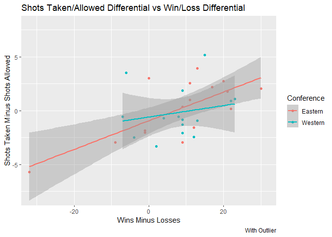

Joshua Burrows Project 1: The NHL API
================
Last Modified 18 September 2020

  - [Components of the getNHL()
    Function](#components-of-the-getnhl-function)
      - [The Records API](#the-records-api)
          - [Get Data](#get-data)
          - [Filter Data](#filter-data)
          - [Query Records Endpoints](#query-records-endpoints)
      - [The Stats API](#the-stats-api)
          - [Get Data](#get-data-1)
          - [Flatten](#flatten)
  - [Wrapper Function: getNHL()](#wrapper-function-getnhl)
      - [Examples](#examples)
  - [Exploratory Data Analysis](#exploratory-data-analysis)
      - [Wins and Penalty Minutes](#wins-and-penalty-minutes)
          - [Regular Season](#regular-season)
          - [Post Season](#post-season)
      - [Win/Loss Differential and Shots
        Differential](#winloss-differential-and-shots-differential)
          - [Join and Calculate](#join-and-calculate)
          - [Win/Loss Differential by Division and
            Conference](#winloss-differential-by-division-and-conference)
          - [Win/Loss Differential
            Histogram](#winloss-differential-histogram)
          - [Shots Differential Vs Win/Loss
            Differential](#shots-differential-vs-winloss-differential)
      - [Goals Per Game](#goals-per-game)
          - [Calculate and Join](#calculate-and-join)
          - [Regular Season Goals by
            Division](#regular-season-goals-by-division)
      - [Regular Season Numeric Summaries by
        Division](#regular-season-numeric-summaries-by-division)

This vignette explains how to access and summarize the data from the
National Hockey League’s APIs.

A github repo containing the code for this vignette can be accessed
using the links at the top and bottom of this page.

The following packages were used to create this vignette: `assertthat`,
`knitr`, `tidyverse`, `rmarkdown`, `httr`, and `jsonlite`.

# Components of the getNHL() Function

The NHL has two separate APIs: records and stats. Both can be queried
using the `getNHL()` function. This function is built from a few other
functions. I will begin by discussing these building blocks.

## The Records API

The following building block functions are used to get data from the
records API.

### Get Data

The `getRecTable()` function grabs a table from the records API. It
takes that table’s extension as input.

``` r
recBaseURL <- "https://records.nhl.com/site/api"

# return the requested table from records API
getRecTable <- function(table){
  
  if(!is.string(table)){
    stop("Input must be a character string")
  }
  
  recFullURL <- paste0(recBaseURL, "/", table) 
  info <- recFullURL %>% GET() %>% content("text", encoding = "UTF-8") %>% fromJSON(flatten = "TRUE")
  info <- info[[1]] %>% as_tibble()
  
  return(info)
  
}
```

### Filter Data

The `filterTable()` function filters records data by either franchise
name or franchise id number.

Because franchise name and franchise id number have different
identifiers on different API endpoints, `filterTable()` includes
`nameName` and `idNumName` arguments. In practice, the user won’t have
to worry about these arguments; they are behind the scenes components of
`getNHL()`.

``` r
filterTable <- function(table, nameName = NULL, idNumName = NULL, name = NULL, idNum = NULL){
  
  # if neither filter condition specified, return full table
  if((is.null(name) & is.null(idNum))){
    return(table)
  }
  
  # should search by only one condition at a time
  if((!is.null(name) & !is.null(idNum))){
    stop("search by either name or idNum, not both")
  }
  
  # either nameName or idNumName is required 
  if((!is.null(name) & is.null(nameName))){
    stop("if name is specified, nameName must be specified")
  }
  
  if((!is.null(idNum) & is.null(idNumName))){
    stop("if idNum is specified, idNumName must be specified")
  }
  
  # filter 
  if(!is.null(name)){
    if(name == "all"){ 
        return(table)
    } else{
        team <- table %>% filter(table[[nameName]] == name)
        if(length(team[[nameName]]) == 0){
          stop("not a vaild team name")
        } else{
            return(team)
          }
      } 
  }
    
  if(!is.null(idNum)){
    if(idNum == "all"){
        return(table)
    } else{
        team <- table %>% filter(table[[idNumName]] == idNum)
        if(length(team[[idNumName]]) == 0){ 
          stop("not a valid team idNum")
        } else{
            return(team)
          }
      } 
  } 
  
}
```

### Query Records Endpoints

`getNHL()` is able to query five records endpoints. It does so by
calling one of the five functions below. Each of these makes use of
`getRecTable()` and `filterTable()`. Since those functions do most of
the work, these five are relatively short.

``` r
# get franchise info
franchise <- function(name = NULL, idNum = NULL){

  franchises <- getRecTable("franchise") 
  
  filterTable(franchises, nameName = "teamCommonName", idNumName = "id", name, idNum) 
  
}
```

``` r
# get franchise team totals
teamTotals <- function(name = NULL, idNum = NULL){
  
  totals <- getRecTable("franchise-team-totals") 
  
  filterTable(totals, nameName = "teamName", idNumName = "franchiseId", name, idNum) 
  
} 
```

``` r
# get season records for a given franchise
season <- function(name = NULL, idNum = NULL){
  
  seasonRecords <- getRecTable("franchise-season-records") 
  
  filterTable(seasonRecords, nameName = "franchiseName", idNumName = "franchiseId", name, idNum) 
  
} 
```

``` r
# get goalie records 
goalie <- function(name = NULL, idNum = NULL){
  
  goalieRecords <- getRecTable("franchise-goalie-records")
  
  filterTable(goalieRecords, nameName = "franchiseName", idNumName = "franchiseId", name, idNum)
  
} 
```

``` r
# get skater records
skater <- function(name = NULL, idNum = NULL){
  
  skaterRecords <- getRecTable("franchise-skater-records") 
  
  filterTable(skaterRecords, nameName = "franchiseName", idNumName = "franchiseId", name, idNum) 
  
}
```

## The Stats API

Now I will turn to the building block functions that are used to contact
the stats API.

### Get Data

`getNHL()` is able to query eight modifiers from the teams endpoint of
the stats API. The job of `getStatsTable()` is to grab the data from
each of the eight modified endpoints. Its length is mainly due to
checking for error conditions.

`getStatsTable()` takes the modifier as input as well as `seasonId` and
`idNum`, which are additional conditions for some of the endpoints.

``` r
statsBaseURL <- "https://statsapi.web.nhl.com/api/v1/teams"

getStatsTable <- function(modifier = NULL, seasonId = NULL, idNum = NULL){
  
  # no modifier 
  if(is.null(modifier)){
    
    if((!is.null(seasonId) | !is.null(idNum))){
      stop("search by seasonId and/or idNum requires appropriate modifier")
    }
    
    base <- statsBaseURL %>% GET() %>% content("text") %>% fromJSON(flatten = TRUE)
    base <- base[[2]] %>% as_tibble()
    return(base)
  }
  
  mod <- NULL
    
  # MODIFIER 
  # team.roster 
  if(modifier == "team.roster"){
    
    if((!is.null(seasonId) | !is.null(idNum))){
      stop("search by seasonId and/or idNum not compatible with modifier team.roster")
    }
    
    mod = "?expand=team.roster"
  } 
  
  # MODIFIER 
  # person.names 
  if(modifier == "person.names"){
    
    if((!is.null(seasonId) | !is.null(idNum))){
      stop("search by seasonId and/or idNum not compatible with modifier person.names")
    }
    
    mod = "?expand=person.names" 
  }
  
  # MODIFIER 
  # team.schedule.next 
  if(modifier == "team.schedule.next"){
    
    if((!is.null(seasonId) | !is.null(idNum))){
      stop("search by seasonId and/or idNum not compatible with modifier team.schedule.next")
    }
    
    mod = "?expand=team.schedule.next"
  } 
  
  # MODIFIER 
  # team.schedule.previous 
  if(modifier == "team.schedule.previous"){
    
    if((!is.null(seasonId) | !is.null(idNum))){
      stop("search by seasonId and/or idNum not compatible with modifier team.schedule.previous")
    }
    
    mod = "?expand=team.schedule.previous"
  }
  
  # MODIFIER 
  # team.stats
  if(modifier == "team.stats"){
    
    if((!is.null(seasonId) | !is.null(idNum))){
      stop("search by seasonId and/or idNum not compatible with modifier team.stats")
    }
    
    mod = "?expand=team.stats"
  }
  
  # MODIFIER 
  # team.roster&season
  if(modifier == "team.roster&season"){
    
    if(!is.null(idNum)){
      stop("search by idNum not compatible with modifier team.roster&season")
    }
    
    if(is.null(seasonId)){
      stop("team.roster&season modifier requires search by seasonId") 
    }
    
    if(nchar(seasonId) != 8){
      stop("seasonId must be of format 20142015")
    }
    
    mod = paste0("?expand=team.roster&season=", seasonId)
  }
  
  # MODIFIER 
  # teamId
  if(modifier == "teamId"){
    
    if(!is.null(seasonId)){
      stop("search by seasonId not compatible with modifier teamId")
    }
    
    if(!is.null(idNum)){
      idCheck <- strsplit(idNum, split = "")[[1]]
      for(i in idCheck){
        if((!(i %in% c("1", "2", "3", "4", "5", "6", "7", "8", "9", "0", ",")))){
          stop("idNum must be of format 1,2,3")
        }
      }
    }
    
    mod = paste0("?teamId=", idNum)
  }
  
  # MODIFIER 
  # statsSingleSeasonPlayoffs 
  if(modifier == "statsSingleSeasonPlayoffs"){
    
    if((!is.null(seasonId) | !is.null(idNum))){
      stop("search by seasonId and/or idNum not compatible with modifier statsSingleSeasonPlayoffs")
    }
    
    mod <- "?stats=statsSingleSeasonPlayoffs"
  }
  
  if(is.null(mod)){
    stop("modifier must be one of: team.roster, person.names, team.schedule.next, team.schedule.previous, team.stats, team.roster&season, teamId, statsSingleSeasonPlayoffs")
  }
  
  # create URL and return 
  statsFullURL <- paste0(statsBaseURL, "/", mod)
  
  full <- statsFullURL %>% GET() %>% content("text") %>% fromJSON(flatten = TRUE)
  full <- full[[2]] %>% as_tibble()
  
  return(full)
  
}
```

### Flatten

Often, the teams endpoint returns a list that contains other lists. When
this happens, flattening is required. Flattening is the process of
un-nesting these nested lists to return a more user friendly object.
`teamStats()` does this job.

The modifier called *team.stats* returns an object with so many
sub-objects that flattening it all into one 2D table creates a confusing
and unwieldy data frame. So `teamStats()` doesn’t try to do that.
Instead, a list of data frames is returned.

This is a long function, so check out the comments to keep your
bearings.

``` r
teamStats <- function(modifier = NULL, seasonId = NULL, idNum = NULL){

  # get data 
  stats <- getStatsTable(modifier = modifier, seasonId = seasonId, idNum = idNum)
  
  # if no modifier is present
  if(is.null(modifier)){
    return(stats)
  }
  
  # MODIFIER 
  # team.roster
  if(modifier == "team.roster"){
    
    # get col to flatten
    roster <- stats[["roster.roster"]] 
    
    # append team names to keep track of who plays for who
    for(i in 1:length(roster)){
      roster[[i]]$name <- stats[["name"]][[i]]
    }
    
    # flatten
    roster <- do.call(rbind, roster)
    
    # join and return
    statsFlatten <- 
      left_join(roster, 
                stats, 
                by = "name", 
                suffix = c(".roster", ".base")) %>% 
      select(-c("roster.roster"))
    
    return(statsFlatten)
  } 
  
  # MODIFIER
  # person.names
  # appears to be the same as the unmodified endpoint 
  if(modifier == "person.names"){
    return(stats) 
  } 
  
  # MODIFIER
  # team.schedule.next 
  if(modifier == "team.schedule.next"){
    
    # get col to flatten
    dates <- stats[["nextGameSchedule.dates"]]
    
    # create names col to track data by team
    # create list of teams that have a next game scheduled 
    datesNonNull <- list()
    for(i in 1:length(dates)){
      if(!is.null(dates[[i]])){
        dates[[i]]$name <- stats[["name"]][[i]]
        datesNonNull <- cbind(datesNonNull, dates[i])
      }
    }
    
    # flatten datesNonNull
    for(i in 1:length(datesNonNull)){
      datesNonNull[[i]] <- 
        cbind(datesNonNull[[i]], 
              datesNonNull[[i]][["games"]]) %>% 
        select(-c("games")) 
      
      datesNonNull[[i]][["events"]] <- 
        datesNonNull[[i]][["events"]][[1]][1][[1]]
      
      datesNonNull[[i]][["matches"]] <- 
        datesNonNull[[i]][["matches"]][[1]][1][[1]]
    } 
    
    # put dates info in one tibble 
    datesVert <- tibble() 
    for(i in 1:length(datesNonNull)){
      datesVert <- rbind(datesVert, datesNonNull[[i]]) 
    } 
    
    # join flattened data with full data set 
    schedule <- 
      left_join(stats, 
                datesVert, 
                by = "name", 
                suffix = c(".main", ".nextGame")) %>% 
      select(-c("nextGameSchedule.dates"))
    
    return(schedule) 
  } 
  
  # MODIFIER
  # team.schedule.previous
  if(modifier == "team.schedule.previous"){
    
    # grab col to flatten
    dates <- stats[["previousGameSchedule.dates"]]
    
    # create names column to track data by team
    # create list of teams that have a next game scheduled 
    datesNonNull <- list()
    for(i in 1:length(dates)){
      if(!is.null(dates[[i]])){
        dates[[i]]$name <- stats[["name"]][[i]]
        datesNonNull <- cbind(datesNonNull, dates[i])
      }
    }
    
    # flatten datesNonNull
    for(i in 1:length(datesNonNull)){
      datesNonNull[[i]] <- 
        cbind(datesNonNull[[i]], 
              datesNonNull[[i]][["games"]]) %>% 
        select(-c("games")) 
      
      datesNonNull[[i]][["events"]] <- 
        datesNonNull[[i]][["events"]][[1]][1][[1]]
      
      datesNonNull[[i]][["matches"]] <- 
        datesNonNull[[i]][["matches"]][[1]][1][[1]]
    } 
    
    # create venue.id col where it doesn't exist 
    for(i in 1:length(datesNonNull)){
      if(is.null(datesNonNull[[i]][["venue.id"]])){
        datesNonNull[[i]][["venue.id"]] <- NA
      }
    }
    
    # put dates info in one tibble 
    datesVert <- tibble() 
    for(i in 1:length(datesNonNull)){
      datesVert <- rbind(datesVert, datesNonNull[[i]]) 
    } 
  
    # join flattened data with full data set 
    schedule <- 
      left_join(stats, 
                datesVert, 
                by = "name", 
                suffix = c(".main", ".previousGame")) %>% 
      select(-c("previousGameSchedule.dates"))
    
    return(schedule) 
  } 
  
  # MODIFIER
  # team.stats
  if(modifier == "team.stats"){ 
    
    # create empty list to contain final results
    final <- list()
    
    # include data from the base endpoint 
    final$teamOverview <- stats %>% select(-c("teamStats"))
    
    # get col to flatten
    teamStats <- stats[["teamStats"]]
    
    # empty tibbles to contain flattened data 
    statsOverview <- tibble()
    statsValues <- tibble()
    statsRanks <- tibble()
    
    # flatten 
    for(i in 1:length(teamStats)){
      teamStats[[i]]$name <- stats[["name"]][[i]]
      
      statsOverview <- rbind(statsOverview, teamStats[[i]])
      
      statsValues <- rbind(statsValues, teamStats[[i]][["splits"]][[1]][1, ]) 
      
      statsRanks <- rbind(statsRanks, teamStats[[i]][["splits"]][[1]][2, ])
    }
    
    # values table should be numeric 
    for(i in 1:(ncol(statsValues) - 2)){
      statsValues[[i]] <- as.double(statsValues[[i]])
    }
    
    # fill in final list 
    statsOverview <- statsOverview %>% select(-c("splits"))
    final$statsOverview <- statsOverview
    final$statsValues <- statsValues
    final$statsRanks <- statsRanks
    
    return(final)
  } 
  
  # MODIFIER
  # team.roster&season
  if(modifier == "team.roster&season"){
    
    # get col to flatten 
    roster <- stats[["roster.roster"]]
    
    # add team names to keep track of who plays for who 
    for(i in 1:length(roster)){
      roster[[i]]$name <- stats[["name"]][[i]]
    }
    
    # flatten 
    roster <- do.call(rbind, roster)
    
    # join and return 
    statsFlatten <- 
      left_join(roster, 
                stats, 
                by = "name", 
                suffix = c(".roster", ".base")) %>% 
      select(-c("roster.roster"))
    
    return(statsFlatten)
  }
  
  # MODIFIER
  # teamId
  # getStatsTable() does all that is needed here 
  if(modifier == "teamId"){
    return(stats) 
  }
  
  # MODIFIER
  # statsSingleSeasonPlayoffs
  # appears to be the same as the unmodified endpoint
  if(modifier == "statsSingleSeasonPlayoffs"){
    return(stats)
  }
  
}
```

# Wrapper Function: getNHL()

Until now, we have been looking at functions that live behind the
scenes. The star of the show is `getNHL()`.

`getNHL()` allows the user to query both the records API and the stats
API. It is a wrapper function that works by calling other functions.

`getNHL()` has six arguments, but you never use all six at once:

  - API: “records”
      - recTable: the desired records endpoint  
      - name: filter by franchise name  
      - idNum: filter by franchise id  
  - API: “stats”
      - modifier: the desired modifier  
      - idNum: for the *teamId* modifier  
      - seasonId: for the *team.roster\&season* modifier

<!-- end list -->

``` r
getNHL <- function(API, recTable = NULL, name = NULL, idNum = NULL, modifier = NULL, seasonId = NULL){
  
  # check error conditions 
  if(!(API %in% c("records", "stats"))){
    stop("API must be either records or stats")
  }
  
  if((API == "records" & is.null(recTable))){
    stop("recTable must be specified to query records API")
  }
  
  if((API == "records" & (!is.null(seasonId) | !is.null(modifier)))){
    stop("seasonId and modifier are not compatible with records API")
  }
  
  if((API == "stats" & (!is.null(recTable) | !is.null(name)))){
    stop("recTable and name are not compatible with stats API")
  }
  
  # query records API
  if(API == "records"){
    
    if(recTable == "franchise"){
      tab <- franchise(name = name, idNum = idNum)
      return(tab)
    }
    
    if(recTable == "franchise-team-totals"){
      tab <- teamTotals(name = name, idNum = idNum)
      return(tab)
    }
    
    if(recTable == "franchise-season-records"){
      tab <- season(name = name, idNum = idNum)
      return(tab) 
    }
    
    if(recTable == "franchise-goalie-records"){
      tab <- goalie(name = name, idNum = idNum)
      return(tab) 
    }
    
    if(recTable == "franchise-skater-records"){
      tab <- skater(name = name, idNum = idNum)
      return(tab) 
    }
    
    stop("recTable must be one of the following strings: franchise, franchise-team-totals, franchise-season-records, franchise-goalie-records, franchise-skater-records")
  
  }
  
  # query stats API 
  if(API == "stats"){
   tab <- teamStats(modifier = modifier, seasonId = seasonId, idNum = idNum)
   return(tab)
  }
  
}
```

## Examples

Below are a few queries that demonstrate how `getNHL()` is used.

``` r
getNHL(API = "records", recTable = "franchise") %>% head()
```

    ## # A tibble: 6 x 6
    ##      id firstSeasonId lastSeasonId
    ##   <int>         <int>        <int>
    ## 1     1      19171918           NA
    ## 2     2      19171918     19171918
    ## 3     3      19171918     19341935
    ## 4     4      19191920     19241925
    ## 5     5      19171918           NA
    ## 6     6      19241925           NA
    ## # ... with 3 more variables:
    ## #   mostRecentTeamId <int>,
    ## #   teamCommonName <chr>,
    ## #   teamPlaceName <chr>

``` r
getNHL(API = "records", recTable = "franchise-team-totals", name = "Carolina Hurricanes")
```

    ## # A tibble: 2 x 30
    ##      id activeFranchise firstSeasonId
    ##   <int>           <int>         <int>
    ## 1    23               1      19971998
    ## 2    24               1      19971998
    ## # ... with 27 more variables:
    ## #   franchiseId <int>,
    ## #   gameTypeId <int>,
    ## #   gamesPlayed <int>,
    ## #   goalsAgainst <int>,
    ## #   goalsFor <int>, homeLosses <int>,
    ## #   homeOvertimeLosses <int>,
    ## #   homeTies <int>, homeWins <int>,
    ## #   lastSeasonId <int>, losses <int>,
    ## #   overtimeLosses <int>,
    ## #   penaltyMinutes <int>,
    ## #   pointPctg <dbl>, points <int>,
    ## #   roadLosses <int>,
    ## #   roadOvertimeLosses <int>,
    ## #   roadTies <int>, roadWins <int>,
    ## #   shootoutLosses <int>,
    ## #   shootoutWins <int>,
    ## #   shutouts <int>, teamId <int>,
    ## #   teamName <chr>, ties <int>,
    ## #   triCode <chr>, wins <int>

``` r
getNHL(API = "records", recTable = "franchise-season-records", idNum = 15) 
```

    ## # A tibble: 1 x 57
    ##      id fewestGoals fewestGoalsAgai~
    ##   <int>       <int>            <int>
    ## 1    25         189              167
    ## # ... with 54 more variables:
    ## #   fewestGoalsAgainstSeasons <chr>,
    ## #   fewestGoalsSeasons <chr>,
    ## #   fewestLosses <int>,
    ## #   fewestLossesSeasons <chr>,
    ## #   fewestPoints <int>,
    ## #   fewestPointsSeasons <chr>,
    ## #   fewestTies <int>,
    ## #   fewestTiesSeasons <chr>,
    ## #   fewestWins <int>,
    ## #   fewestWinsSeasons <chr>,
    ## #   franchiseId <int>,
    ## #   franchiseName <chr>,
    ## #   homeLossStreak <int>,
    ## #   homeLossStreakDates <chr>,
    ## #   homePointStreak <int>,
    ## #   homePointStreakDates <chr>,
    ## #   homeWinStreak <int>,
    ## #   homeWinStreakDates <chr>,
    ## #   homeWinlessStreak <int>,
    ## #   homeWinlessStreakDates <chr>,
    ## #   lossStreak <int>,
    ## #   lossStreakDates <chr>,
    ## #   mostGameGoals <int>,
    ## #   mostGameGoalsDates <chr>,
    ## #   mostGoals <int>,
    ## #   mostGoalsAgainst <int>,
    ## #   mostGoalsAgainstSeasons <chr>,
    ## #   mostGoalsSeasons <chr>,
    ## #   mostLosses <int>,
    ## #   mostLossesSeasons <chr>,
    ## #   mostPenaltyMinutes <int>,
    ## #   mostPenaltyMinutesSeasons <chr>,
    ## #   mostPoints <int>,
    ## #   mostPointsSeasons <chr>,
    ## #   mostShutouts <int>,
    ## #   mostShutoutsSeasons <chr>,
    ## #   mostTies <int>,
    ## #   mostTiesSeasons <chr>,
    ## #   mostWins <int>,
    ## #   mostWinsSeasons <chr>,
    ## #   pointStreak <int>,
    ## #   pointStreakDates <chr>,
    ## #   roadLossStreak <int>,
    ## #   roadLossStreakDates <chr>,
    ## #   roadPointStreak <int>,
    ## #   roadPointStreakDates <chr>,
    ## #   roadWinStreak <int>,
    ## #   roadWinStreakDates <chr>,
    ## #   roadWinlessStreak <int>,
    ## #   roadWinlessStreakDates <chr>,
    ## #   winStreak <int>,
    ## #   winStreakDates <chr>,
    ## #   winlessStreak <int>,
    ## #   winlessStreakDates <chr>

``` r
getNHL(API = "stats", modifier = "team.schedule.previous") %>% head()
```

    ## # A tibble: 6 x 68
    ##      id name  link.main abbreviation
    ##   <int> <chr> <chr>     <chr>       
    ## 1     1 New ~ /api/v1/~ NJD         
    ## 2     2 New ~ /api/v1/~ NYI         
    ## 3     3 New ~ /api/v1/~ NYR         
    ## 4     4 Phil~ /api/v1/~ PHI         
    ## 5     5 Pitt~ /api/v1/~ PIT         
    ## 6     6 Bost~ /api/v1/~ BOS         
    ## # ... with 64 more variables:
    ## #   teamName <chr>,
    ## #   locationName <chr>,
    ## #   firstYearOfPlay <chr>,
    ## #   shortName <chr>,
    ## #   officialSiteUrl <chr>,
    ## #   franchiseId <int>, active <lgl>,
    ## #   venue.name.main <chr>,
    ## #   venue.link.main <chr>,
    ## #   venue.city <chr>,
    ## #   venue.id.main <int>,
    ## #   venue.timeZone.id <chr>,
    ## #   venue.timeZone.offset <int>,
    ## #   venue.timeZone.tz <chr>,
    ## #   division.id <int>,
    ## #   division.name <chr>,
    ## #   division.nameShort <chr>,
    ## #   division.link <chr>,
    ## #   division.abbreviation <chr>,
    ## #   conference.id <int>,
    ## #   conference.name <chr>,
    ## #   conference.link <chr>,
    ## #   franchise.franchiseId <int>,
    ## #   franchise.teamName <chr>,
    ## #   franchise.link <chr>,
    ## #   previousGameSchedule.totalItems <int>,
    ## #   previousGameSchedule.totalEvents <int>,
    ## #   previousGameSchedule.totalGames <int>,
    ## #   previousGameSchedule.totalMatches <int>,
    ## #   date <chr>, totalItems <int>,
    ## #   totalEvents <int>,
    ## #   totalGames <int>,
    ## #   totalMatches <int>, gamePk <int>,
    ## #   link.previousGame <chr>,
    ## #   gameType <chr>, season <chr>,
    ## #   gameDate <chr>,
    ## #   status.abstractGameState <chr>,
    ## #   status.codedGameState <chr>,
    ## #   status.detailedState <chr>,
    ## #   status.statusCode <chr>,
    ## #   status.startTimeTBD <lgl>,
    ## #   teams.away.score <int>,
    ## #   teams.away.leagueRecord.wins <int>,
    ## #   teams.away.leagueRecord.losses <int>,
    ## #   teams.away.leagueRecord.ot <int>,
    ## #   teams.away.leagueRecord.type <chr>,
    ## #   teams.away.team.id <int>,
    ## #   teams.away.team.name <chr>,
    ## #   teams.away.team.link <chr>,
    ## #   teams.home.score <int>,
    ## #   teams.home.leagueRecord.wins <int>,
    ## #   teams.home.leagueRecord.losses <int>,
    ## #   teams.home.leagueRecord.ot <int>,
    ## #   teams.home.leagueRecord.type <chr>,
    ## #   teams.home.team.id <int>,
    ## #   teams.home.team.name <chr>,
    ## #   teams.home.team.link <chr>,
    ## #   venue.name.previousGame <chr>,
    ## #   venue.link.previousGame <chr>,
    ## #   content.link <chr>,
    ## #   venue.id.previousGame <int>

``` r
getNHL(API = "stats", modifier = "teamId", idNum = "1,5,10")
```

    ## # A tibble: 3 x 29
    ##      id name  link  abbreviation
    ##   <int> <chr> <chr> <chr>       
    ## 1     1 New ~ /api~ NJD         
    ## 2     5 Pitt~ /api~ PIT         
    ## 3    10 Toro~ /api~ TOR         
    ## # ... with 25 more variables:
    ## #   teamName <chr>,
    ## #   locationName <chr>,
    ## #   firstYearOfPlay <chr>,
    ## #   shortName <chr>,
    ## #   officialSiteUrl <chr>,
    ## #   franchiseId <int>, active <lgl>,
    ## #   venue.name <chr>,
    ## #   venue.link <chr>,
    ## #   venue.city <chr>, venue.id <int>,
    ## #   venue.timeZone.id <chr>,
    ## #   venue.timeZone.offset <int>,
    ## #   venue.timeZone.tz <chr>,
    ## #   division.id <int>,
    ## #   division.name <chr>,
    ## #   division.nameShort <chr>,
    ## #   division.link <chr>,
    ## #   division.abbreviation <chr>,
    ## #   conference.id <int>,
    ## #   conference.name <chr>,
    ## #   conference.link <chr>,
    ## #   franchise.franchiseId <int>,
    ## #   franchise.teamName <chr>,
    ## #   franchise.link <chr>

# Exploratory Data Analysis

Now that we can get data about the NHL, let’s take a look at it\!

## Wins and Penalty Minutes

### Regular Season

Unsurprisingly, there is a negative correlation between wins and penalty
minutes during the regular season.

It is worth noting, though, that many teams with high win percentages
still have substantial penalty minutes. Perhaps this is because players
foul strategically; they get something in exchange for minutes spent in
the box.

Teams that have played less than 500 regular season games were not
considered.

``` r
totals <- getNHL(API = "records", recTable = "franchise-team-totals")
totalsRegular <- totals %>% filter(gameTypeId == 2)

totalsRegular <- totalsRegular %>% 
  filter(gamesPlayed >= 500) %>% 
  mutate(winPct = wins / gamesPlayed, 
         penaltyAvg = penaltyMinutes / gamesPlayed)

corRegular <- cor(totalsRegular$winPct, totalsRegular$penaltyAvg)

g <- ggplot(totalsRegular, aes(x = penaltyAvg, y = winPct)) 

g + 
  geom_point() + 
  geom_smooth(method = lm, col = "red") + 
  geom_text(x = 20, y = .475, label = paste0("Correlation = ", round(corRegular, 2))) + 
  labs(title = "Wins and Penalty Minutes, Regular Season", 
       x = "Average Penalty Minutes", 
       y = "Win Percentage", 
       caption = "Teams with at least 500 games")
```

<!-- -->

### Post Season

During the post season, the negative correlation between win percentage
and penalty minutes is not as strong. Perhaps this is because, during
the post season, players are even better at fouling strategically.

Teams with less than 50 post season games were not considered.

``` r
totalsPost <- totals %>% filter(gameTypeId == 3)

totalsPost <- 
  totalsPost %>% 
  filter(gamesPlayed >= 50) %>% 
  mutate(winPct = wins / gamesPlayed, 
         penaltyAvg = penaltyMinutes / gamesPlayed)

corPost <- cor(totalsPost$winPct, totalsPost$penaltyAvg)

g2 <- ggplot(totalsPost, aes(x = penaltyAvg, y = winPct)) 

g2 + 
  geom_point() + 
  geom_smooth(method = lm, col = "red") + 
  geom_text(x = 25, y = .55, label = paste0("Correlation = ", round(corPost, 2))) + 
  labs(title = "Wins and Penalty Minutes, Post Season", 
       x = "Average Penalty Minutes", 
       y = "Win Percentage", 
       caption = "Teams with at least 50 games")
```

<!-- -->

## Win/Loss Differential and Shots Differential

### Join and Calculate

Below, a new table is created by joining data from the *team.stats*
modifier with data from the unmodified stats endpoint. Then three new
variables are calculated:

  - Win/Loss Differential: Wins - Losses  
  - Win/Loss Diff Indicator: Whether a team has a winning record  
  - Shots Differential: Shots taken - Shots allowed

<!-- end list -->

``` r
teamInfo <- getNHL(API = "stats", modifier = "team.stats")
values <- teamInfo[["statsValues"]]

teams <- getNHL(API = "stats")

teamValues <- 
  inner_join(teams, 
             values, 
             by = c("name" = "team.name"), 
             suffix = c(".teams", ".values"))

teamValues <- 
  teamValues %>% 
  mutate(WLDiff = stat.wins - stat.losses, 
         shotDiff = stat.shotsPerGame - stat.shotsAllowed)

positive <- function(x){
  if(x > 0){
    return("Winning Team")
  } else if(x == 0){
    return("50/50 Team")
    } else{
        return("Losing Team")
      }
}

positive <- Vectorize(positive)

teamValues <- teamValues %>% mutate(WLDiffIndicator = positive(WLDiff))

teamValues %>% select(c("name", "WLDiff", "shotDiff", "WLDiffIndicator")) %>% head()
```

    ## # A tibble: 6 x 4
    ##   name  WLDiff shotDiff WLDiffIndicator
    ##   <chr>  <dbl>    <dbl> <chr>          
    ## 1 New ~     -1    -2.01 Losing Team    
    ## 2 New ~     12    -1.57 Winning Team   
    ## 3 New ~      9    -2.94 Winning Team   
    ## 4 Phil~     20     2.74 Winning Team   
    ## 5 Pitt~     17     2.22 Winning Team   
    ## 6 Bost~     30     2.06 Winning Team

### Win/Loss Differential by Division and Conference

Every team in the **Central** division is a winning team. In contrast,
the **Atlantic** division has the worst winning team to losing team
ratio.

The **Western** conference has a better winning team to losing team
ratio than the **Eastern** conference.

Overall, the NHL has more winning teams than losing teams.

This data is visualized in contingency tables and bar charts.

``` r
table(teamValues$division.name, teamValues$WLDiffIndicator) %>% kable(caption = "Divisions")
```

|              | 50/50 Team | Losing Team | Winning Team |
| :----------- | ---------: | ----------: | -----------: |
| Atlantic     |          1 |           3 |            4 |
| Central      |          0 |           0 |            7 |
| Metropolitan |          0 |           1 |            7 |
| Pacific      |          0 |           3 |            5 |

Divisions

``` r
table(teamValues$conference.name, teamValues$WLDiffIndicator) %>% kable(caption = "Conferences")
```

|         | 50/50 Team | Losing Team | Winning Team |
| :------ | ---------: | ----------: | -----------: |
| Eastern |          1 |           4 |           11 |
| Western |          0 |           3 |           12 |

Conferences

``` r
g3 <- ggplot(teamValues, aes(x = WLDiffIndicator))

g3 + 
  geom_bar(aes(fill = division.name), position = "dodge") + 
  labs(title = "Winning Teams by Division", 
       x = "Record", 
       y = "Count") + 
  scale_fill_discrete(name = "Division")
```

<!-- -->

``` r
g3 + 
  geom_bar(aes(fill = conference.name), position = "dodge") + 
  labs(title = "Winning Teams by Conference", 
       x = "Record", 
       y = "Count") + 
  scale_fill_discrete(name = "Conference")
```

<!-- -->

### Win/Loss Differential Histogram

The predominance of winning teams in the NHL can be visualized with a
histogram. The density line peaks at a win/loss differential of 10. This
indicates win/loss differentials in the vicinity of 10 are fairly
common.

``` r
g4 <- ggplot(teamValues, aes(x = WLDiff, y = ..density..))

g4 + 
  geom_histogram(bins = 10, fill = "lightblue") + 
  geom_density(lwd = 2, color = "darkblue") + 
  labs(title = "Win/Loss Differential", 
       x = "Wins Minus Losses", 
       y = "Density")
```

<!-- -->

### Shots Differential Vs Win/Loss Differential

Unsurprisingly, there is a positive correlation between win/loss
differential and shots differential. The slope of the regression line is
steeper in the **Eastern** conference than the **Western** conference.
This slope is not changed much by removing an outlier.

``` r
g5 <- ggplot(teamValues, aes(x = WLDiff, y = shotDiff, color = conference.name)) 

g5 + 
  geom_point() + 
  geom_smooth(method = lm) + 
  labs(title = "Shots Taken/Allowed Differential vs Win/Loss Differential", 
       x = "Wins Minus Losses", 
       y = "Shots Taken Minus Shots Allowed", 
       color = "Conference", 
       caption = "With Outlier") +
  coord_cartesian(xlim = c(-31, 31), ylim = c(-8, 8))
```

<!-- -->

``` r
teamValuesNoOut <- teamValues %>% filter(WLDiff > -20)

g6 <- ggplot(teamValuesNoOut, aes(x = WLDiff, y = shotDiff, color = conference.name)) 

g6 + 
  geom_point() + 
  geom_smooth(method = lm) + 
  labs(title = "Shots Taken/Allowed Differential vs Win/Loss Differential ", 
       x = "Wins Minus Losses", 
       y = "Shots Taken Minus Shots Allowed", 
       color = "Conference", 
       caption = "Without Outlier") +
  coord_cartesian(xlim = c(-31, 31), ylim = c(-8, 8))
```

<!-- -->

## Goals Per Game

### Calculate and Join

Below, two new variables are calculated from the regular season team
totals data:

  - Avg Goals Against: goals against divided by total games  
  - Avg Goals For: goals for divided by total games

The regular season team totals data is then joined with data from the
base endpoint of the stats API. The result is a table with information
about active teams. Again, teams with less than 500 regular season games
were not considered.

``` r
totalsRegular <- 
  totalsRegular %>% 
  mutate(avgGoalsAgainst = goalsAgainst / gamesPlayed, 
         avgGoalsFor = goalsFor / gamesPlayed)

totalsRegularActive <- 
  left_join(teams, 
            totalsRegular, 
            by = c("name" = "teamName"), 
            suffix = c(".teams", ".stats"))

totalsRegularActive %>% select(c("name", "avgGoalsAgainst", "avgGoalsFor")) %>% head()
```

    ## # A tibble: 6 x 3
    ##   name      avgGoalsAgainst avgGoalsFor
    ##   <chr>               <dbl>       <dbl>
    ## 1 New Jers~            2.96        2.94
    ## 2 New York~            3.16        3.19
    ## 3 New York~            3.05        3.05
    ## 4 Philadel~            2.93        3.29
    ## 5 Pittsbur~            3.38        3.32
    ## 6 Boston B~            2.89        3.19

### Regular Season Goals by Division

The **Central** division has the lowest average goals for and the lowest
average goals against. The **Pacific** division has the highest average
goals for and the highest average goals against.

The boxplots below show significant variation between teams within a
division. This is emphasized by the superimposed scatter points.

All numbers are for the regular season.

``` r
avgs <- totalsRegularActive %>% 
  group_by(division.name) %>% 
  summarize(divisionAvgGoalsAgainst = round(mean(avgGoalsAgainst, na.rm = TRUE), 3), 
            divisionAvgGoalsFor = round(mean(avgGoalsFor, na.rm = TRUE), 3))

avgs %>% kable(col.names = c("Division", "Divison Avg Goals Against", "Division Avg Goals For"))
```

| Division     | Divison Avg Goals Against | Division Avg Goals For |
| :----------- | ------------------------: | ---------------------: |
| Atlantic     |                     2.951 |                  3.011 |
| Central      |                     2.814 |                  2.881 |
| Metropolitan |                     3.055 |                  3.034 |
| Pacific      |                     3.110 |                  3.063 |

``` r
g7 <- ggplot(totalsRegularActive, aes(x = division.name))

g7 + 
  geom_boxplot(aes(y = avgGoalsAgainst)) + 
  geom_point(aes( y = avgGoalsAgainst, 
                  color = division.name), 
             position = "jitter") + 
  labs(title = "Average Goals Against by Division", 
       x = "Division", 
       y = "Average Goals Against", 
       color = "Division", 
       caption = "Teams with at least 500 games") 
```

<!-- -->

``` r
g7 + 
  geom_boxplot(aes(y = avgGoalsFor)) + 
  geom_point(aes(y = avgGoalsFor, 
                 color = division.name), 
             position = "jitter") + 
  labs(title = "Average Goals For by Division", 
       x = "Division", 
       y = "Average Goals For", 
       color = "Division", 
       caption = "Teams with at least 500 games")
```

<!-- -->

## Regular Season Numeric Summaries by Division

Six number summaries are calculated for three variables for for active
teams in each division. All numbers are for the regular season. Again,
teams with less than 500 games were not considered.

One thing that jumps out about these summaries is that average goals for
and the average goals against are so similar. This suggests that regular
season hockey games tend to be close and competitive. This is the case
in every division. The competitiveness of the NHL is confirmed by the
fairly small variation in point percentage.

``` r
# function that takes in division name and returns summary table
divSum <- function(div){
  
  # make sure input is correct type
  if(!is.string(div)){
    stop("Input must be a character string!") 
  } 
  
  # get the numbers for the division in question
  splitz <- 
    totalsRegularActive %>% 
    filter(division.name == div) %>% 
    select(c("pointPctg", 
             "avgGoalsAgainst", 
             "avgGoalsFor")) %>% 
    drop_na()
  
  # get the summary statistics 
  statz <- 
    splitz %>% 
    apply(MARGIN = 2, FUN = summary) %>% 
    round(digits = 3)
  
  # format pretty for printing 
  cap <- paste0(div, " Division")
  
  statz <- statz %>% 
    kable(caption = cap, 
          col.names = c("Point Percentage",
                        "Average Goals Against", 
                        "Average Goals For"))
  
  return(statz)
  
}
```

``` r
divSum("Atlantic")
```

|         | Point Percentage | Average Goals Against | Average Goals For |
| :------ | ---------------: | --------------------: | ----------------: |
| Min.    |            0.499 |                 2.688 |             2.667 |
| 1st Qu. |            0.507 |                 2.904 |             2.842 |
| Median  |            0.523 |                 2.994 |             3.089 |
| Mean    |            0.530 |                 2.951 |             3.011 |
| 3rd Qu. |            0.543 |                 3.029 |             3.175 |
| Max.    |            0.587 |                 3.066 |             3.214 |

Atlantic Division

``` r
divSum("Central")
```

|         | Point Percentage | Average Goals Against | Average Goals For |
| :------ | ---------------: | --------------------: | ----------------: |
| Min.    |            0.504 |                 2.631 |             2.637 |
| 1st Qu. |            0.540 |                 2.688 |             2.794 |
| Median  |            0.556 |                 2.771 |             2.942 |
| Mean    |            0.550 |                 2.814 |             2.881 |
| 3rd Qu. |            0.563 |                 2.940 |             2.962 |
| Max.    |            0.583 |                 3.041 |             3.075 |

Central Division

``` r
divSum("Metropolitan")
```

|         | Point Percentage | Average Goals Against | Average Goals For |
| :------ | ---------------: | --------------------: | ----------------: |
| Min.    |            0.496 |                 2.850 |             2.616 |
| 1st Qu. |            0.512 |                 2.929 |             2.882 |
| Median  |            0.520 |                 3.009 |             3.110 |
| Mean    |            0.525 |                 3.055 |             3.034 |
| 3rd Qu. |            0.530 |                 3.163 |             3.211 |
| Max.    |            0.576 |                 3.376 |             3.324 |

Metropolitan Division

``` r
divSum("Pacific")
```

|         | Point Percentage | Average Goals Against | Average Goals For |
| :------ | ---------------: | --------------------: | ----------------: |
| Min.    |            0.488 |                 2.754 |             2.709 |
| 1st Qu. |            0.498 |                 2.950 |             2.914 |
| Median  |            0.527 |                 3.206 |             3.109 |
| Mean    |            0.519 |                 3.110 |             3.063 |
| 3rd Qu. |            0.540 |                 3.296 |             3.230 |
| Max.    |            0.542 |                 3.302 |             3.332 |

Pacific Division
